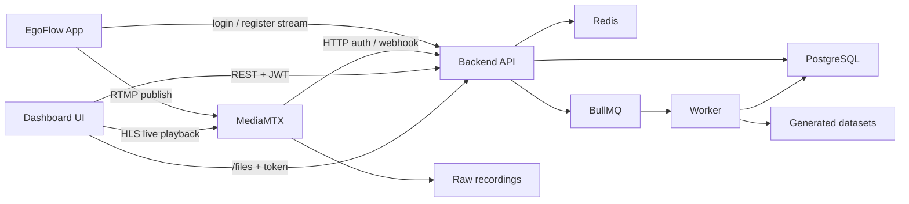

# EgoFlow Server Project Guide

`ego-flow-server`의 현재 구현 상태를 기준으로 정리한 통합 안내 문서다. 참고용 `guide/` 문서와 실제 구현 코드를 함께 확인했지만, 이 문서 세트는 현재 동작하는 구조를 우선 기준으로 삼는다.

## 문서 구성

- [02. project_stack.md](./02.%20project_stack.md): 사용 중인 기술 스택과 전체 문서 구성
- [03. project_runtime.md](./03.%20project_runtime.md): Docker Compose 구성, 포트, 볼륨, 환경 변수, 부팅 순서
- [04. project_architecture.md](./04.%20project_architecture.md): 시스템 전체 구조, 컴포넌트 책임, repository 중심 도메인 모델 요약
- [05. project_backend.md](./05.%20project_backend.md): backend 패키지 구조, 레이어, 책임 정리
- [06. project_frontend.md](./06.%20project_frontend.md): dashboard 패키지 구조, 라우트, 인증 처리, 재생 방식
- [07. project_database.md](./07.%20project_database.md): Prisma/PostgreSQL schema, enum, 테이블, 인덱스, 논리적 관계
- [08. project_authentication.md](./08.%20project_authentication.md): 로그인, JWT, repository 권한, 파일 접근 제어, MediaMTX 인증 구조
- [09. project_streaming.md](./09.%20project_streaming.md): recording session 등록, RTMP publish, active stream 조회, MediaMTX hook, finalize 흐름
- [10. project_processing.md](./10.%20project_processing.md): finalize worker 처리, recording/video 상태 전이, generated file 저장 구조, target directory migration
- [11. project_deploy.md](./11.%20project_deploy.md): local Docker Compose 실행 방식과 EC2 원격 배포 방식 정리

API 문서는 별도 Markdown 파일 대신 런타임 문서를 기준으로 본다.

- Swagger UI: `/api-docs`
- OpenAPI JSON: `/api/v1/openapi.json`

## 한눈에 보는 현재 구조

| 영역 | 현재 역할 |
| --- | --- |
| Backend | Express 5 + TypeScript API. JWT 인증, repository 권한 검사, MediaMTX 연동, `/files` 접근 제어 담당 |
| Worker | BullMQ worker. raw 녹화 파일을 후처리해서 VLM용 영상, dashboard용 영상, thumbnail 생성 |
| Dashboard | TanStack Start + React 19 UI. 로그인, repository 관리, 비디오 조회/재생, live monitor, 관리자 화면 제공 |
| Streaming | MediaMTX가 RTMP ingest, HLS playback, recording segment 생성, external auth/hook 호출 담당 |
| Storage | PostgreSQL은 recording/video 메타데이터, Redis는 live pointer + queue backend, 파일 시스템은 raw 및 generated dataset 저장 |

## 핵심 구현 포인트

- Repository 단위로 스트리밍 등록, 접근 제어, 영상 목록 조회, 생성 파일 저장이 이루어진다.
- RTMP publish는 `POST /api/v1/streams/register` 이후 `POST /api/v1/streams/{recordingSessionId}/publish-ticket`로 받은 short-lived ticket를 사용한다.
- publish가 시작되면 app은 `POST /api/v1/streams/{recordingSessionId}/connections/{connectionId}/heartbeat`로 owner lease를 주기적으로 갱신한다.
- MediaMTX는 RTMP publish/read 요청 시 backend의 `/api/v1/auth/rtmp`를 호출하며, publish는 ticket 기반, playback은 JWT 기반으로 분리 인증한다.
- MediaMTX hook은 `stream-ready`, `stream-not-ready`, `recording-segment-create`, `recording-segment-complete`로 분리되어 recording lifecycle을 반영한다. segment hook은 가능하면 `source_id`를 사용하지만, 값이 없을 때는 live path pointer를 통해 현재 source/session을 복구한다.
- RTMPS listener 설정 surface는 준비되어 있지만 기본 publish base URL은 여전히 `rtmp://.../live`다. 실제 cutover는 `RTMPS_ENCRYPTION_MODE`, cert/key, `PUBLIC_RTMP_BASE_URL`을 함께 바꾸는 운영 작업이다.
- 최종 video 생성은 segment 단위가 아니라 `RecordingSession` 단위 finalize job으로 수행된다.
- 결과 파일은 `{target_directory}/{owner_id}/{repo_name}/` 아래에 저장된다.
- Dashboard와 generated file 접근은 모두 repository 권한 모델(`read` / `maintain` / `admin`)을 따른다.

## 고수준 아키텍처

## 문서 활용 순서

1. 문서 전체 목차와 스택 개요는 [02. project_stack.md](./02.%20project_stack.md)
2. 런타임/Compose는 [03. project_runtime.md](./03.%20project_runtime.md)
3. 시스템 전체 구조는 [04. project_architecture.md](./04.%20project_architecture.md)
4. 구현 패키지 구조는 [05. project_backend.md](./05.%20project_backend.md), [06. project_frontend.md](./06.%20project_frontend.md)
5. 데이터 구조는 [07. project_database.md](./07.%20project_database.md)
6. 인증/스트리밍/후처리 흐름은 [08. project_authentication.md](./08.%20project_authentication.md), [09. project_streaming.md](./09.%20project_streaming.md), [10. project_processing.md](./10.%20project_processing.md)
7. 배포 방식은 [11. project_deploy.md](./11.%20project_deploy.md)
8. API는 Swagger UI(`/api-docs`) 또는 OpenAPI JSON(`/api/v1/openapi.json`)로 본다.

## 참고 자료

- `guide/` 아래 기존 설계/구현 참고 문서
- 실제 구현 코드: `backend/`, `frontend/`, `compose.yml`, `compose.local.yml`, `compose.prod.yml`, `Caddyfile`, `mediamtx.yml`
