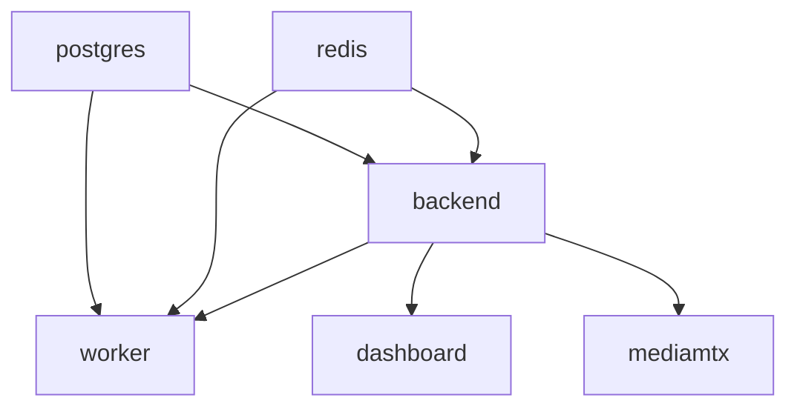

# EgoFlow Server Runtime

이 문서는 현재 `ego-flow-server`의 런타임 구성과 환경 변수 계약을 정리한 문서다. Docker Compose 서비스 구성, 포트, 볼륨, 부팅 순서, 핵심 환경 변수를 포함한다.

## 1. Compose 서비스 구성

| 서비스 | 포트 | 역할 |
| --- | --- | --- |
| `postgres` | `5432` | 메타데이터 저장 |
| `redis` | `6379` | stream session cache, BullMQ backend |
| `backend` | `3000` | REST API, file gateway |
| `worker` | 없음 | video processing worker |
| `dashboard` | `8088` | TanStack Start dashboard |
| `mediamtx` | `1935`, `8888`, `9997` | RTMP ingest, HLS, Control API |

## 2. 볼륨 및 마운트

| 경로 | 용도 |
| --- | --- |
| `postgres_data` | PostgreSQL 데이터 |
| `./data/redis` | Redis append-only 데이터 |
| `./data/raw` | MediaMTX raw recording 저장소 |
| `./data/datasets` | generated dataset 저장소 |
| `./mediamtx.yml` | MediaMTX 설정 파일 |
| `./mediamtx-hooks` | MediaMTX hook wrapper script |

## 3. 서비스별 런타임 역할

### 3.1 backend

- Prisma migration deploy 실행
- seed 실행
- Express API 서버 기동
- `/files/*` 정적 파일 접근 제어 포함

### 3.2 worker

- backend와 같은 이미지 사용
- BullMQ queue를 consume
- video processing 수행

### 3.3 dashboard

- frontend multi-stage build 결과를 Node runtime wrapper로 서빙
- 기본 포트 `8088`

### 3.4 mediamtx

- RTMP 수신
- HLS 출력
- HTTP auth를 backend에 위임
- `./mediamtx-hooks`의 wrapper script를 통해 backend webhook 호출
- `stream-ready`, `stream-not-ready`, `recording-segment-create`, `recording-segment-complete` 실행

## 4. 부팅 순서와 의존성

- `backend`는 `postgres`, `redis`가 healthy 상태가 된 뒤 기동
- `worker`는 `postgres`, `redis`, `backend`가 모두 준비된 뒤 기동
- `dashboard`, `mediamtx`는 `backend` 준비 이후 기동

즉 backend가 시스템 중심 허브 역할을 한다.

## 5. 핵심 환경 변수

| 이름 | 용도 |
| --- | --- |
| `NODE_ENV` | 런타임 모드 |
| `PORT` | backend 포트 |
| `CORS_ORIGIN` | CORS 허용 origin |
| `DATABASE_URL` | PostgreSQL 연결 |
| `REDIS_URL` | Redis 연결 |
| `JWT_SECRET` | JWT 서명 키 |
| `JWT_EXPIRES_IN` | access token 만료 기간 |
| `JWT_REFRESH_THRESHOLD_SECONDS` | 응답 헤더 토큰 갱신 임계값 |
| `ADMIN_DEFAULT_PASSWORD` | 최초 admin seed 비밀번호 |
| `TARGET_DIRECTORY` | generated dataset root |
| `RTMP_BASE_URL` | app에 반환할 RTMP publish base URL |
| `HLS_BASE_URL` | active stream 응답의 HLS base URL |
| `MEDIAMTX_API_URL` | active path 조회용 MediaMTX API |
| `WORKER_CONCURRENCY` | worker 동시 처리 수 |
| `DELETE_RAW_AFTER_PROCESSING` | 처리 완료 후 raw 삭제 여부 |

## 6. 운영상 기억할 점

- backend 컨테이너는 시작할 때 migration과 seed를 수행한다.
- admin 계정은 최초 1회만 seed된다.
- `TARGET_DIRECTORY`가 바뀌면 backend 부팅 시 generated file migration이 수행된다.
- `./scripts/dev.sh up`이 기본 로컬 실행 경로다.
