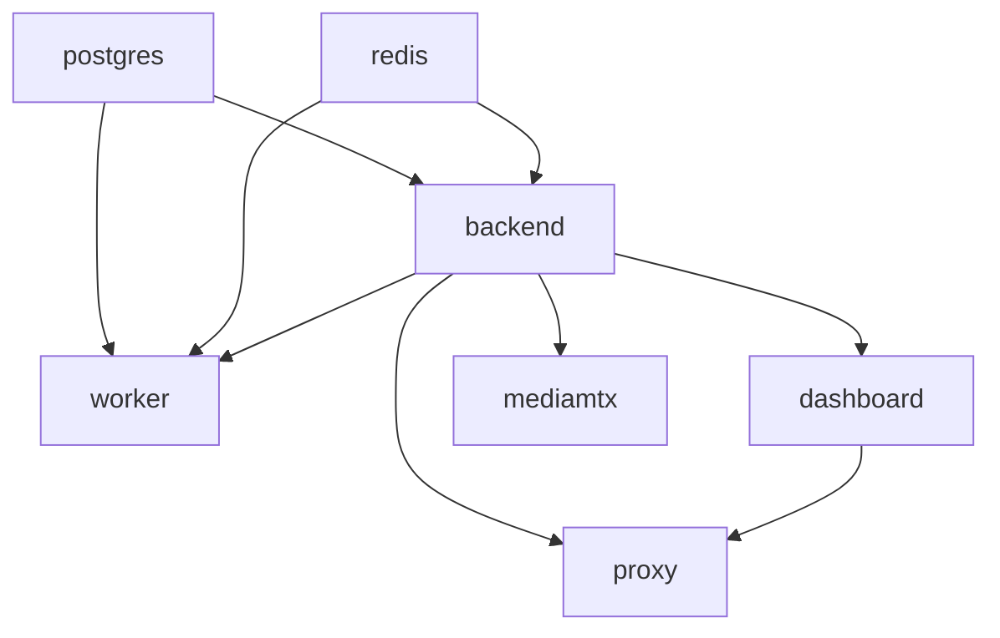

# EgoFlow Server Runtime

이 문서는 현재 `ego-flow-server`의 런타임 구성과 설정 입력 계약을 정리한 문서다. 현재 실행 경로는 `compose.yml` 단일 파일과 `./scripts/run.sh` 기준으로 통일되어 있다.

## 1. Compose 서비스 구성

| 서비스 | 포트 | 역할 |
| --- | --- | --- |
| `postgres` | `5432` | 메타데이터 저장 |
| `redis` | `6379` | stream session cache, BullMQ backend |
| `backend` | `3000` (internal) | REST API, file gateway |
| `worker` | 없음 | video processing worker |
| `dashboard` | `8088` (internal) | TanStack Start dashboard |
| `proxy` | `80` | Caddy reverse proxy, 단일 공개 HTTP entrypoint |
| `mediamtx` | `1935`, `1936`, `8888`, `9997` | RTMP ingest, optional RTMPS ingest, direct HLS playback, Control API |

## 2. 볼륨과 설정 파일

현재 compose는 로컬과 서버 모두 아래 경로를 그대로 사용한다.

| 경로 | 용도 |
| --- | --- |
| `./config.json` | 일반 설정 파일 |
| `./.env` | secret / 연결 문자열 / public URL override |
| `{TARGET_DIRECTORY}/postgres` | PostgreSQL 데이터 |
| `{TARGET_DIRECTORY}/redis` | Redis append-only 데이터 |
| `{TARGET_DIRECTORY}/raw` | MediaMTX raw recording 저장소 |
| `{TARGET_DIRECTORY}/datasets` | generated dataset 저장소 |
| `./Caddyfile` | reverse proxy 정책 |
| `./mediamtx.yml` | MediaMTX 설정 |
| `./mediamtx-hooks` | MediaMTX hook wrapper script |
| `./certs` | RTMPS 활성화 시 server cert/key mount 경로 |

즉 운영 서버도 별도 prod override나 외부 config 디렉토리 없이, 저장소 내부의 `config.json`, `.env`를 기준으로 동작한다. persistent host data는 `TARGET_DIRECTORY` 아래의 `postgres`, `redis`, `raw`, `datasets`에 모인다.

## 3. 서비스별 런타임 역할

### 3.1 backend

- 로컬 소스에서 Docker image build
- Prisma migration deploy 실행
- seed 실행
- Express API 서버 기동
- signed `/files/*` 정적 파일 접근 제어 포함

### 3.2 worker

- backend와 같은 소스에서 Docker image build
- BullMQ queue consume
- video processing 수행

### 3.3 dashboard

- frontend 소스에서 Docker image build
- 내부 포트 `8088`

### 3.4 proxy

- Caddy 기반 reverse proxy
- `/api*`, `/api-docs*`, `/files*`를 backend로 전달
- HLS playback은 Caddy를 거치지 않고 MediaMTX `8888/tcp` direct endpoint를 사용
- 나머지 웹 요청을 dashboard로 전달
- 외부에는 고정 HTTP `80` 하나만 공개

### 3.5 mediamtx

- RTMP 수신
- RTMPS 수신 준비 (`RTMPS_ENCRYPTION_MODE != no`일 때 활성)
- HLS 출력
- HTTP auth를 backend에 위임
- `backend:3000` 내부 DNS와 hook wrapper script를 통해 backend webhook 호출
- `stream-ready`, `stream-not-ready`, `recording-segment-create`, `recording-segment-complete` 실행

## 4. 부팅 순서와 readiness

- `backend`는 `postgres`, `redis`가 healthy 상태가 된 뒤 기동
- `worker`는 `postgres`, `redis`, `backend`가 모두 준비된 뒤 기동
- `dashboard`, `mediamtx`는 `backend` 준비 이후 기동
- `proxy`는 `backend`, `dashboard`가 준비된 뒤 기동

`./scripts/run.sh up`은 아래 기준으로 대기한 뒤 종료한다.

- `postgres`, `redis`, `backend`, `dashboard`, `proxy`: health check 통과 대기
- `worker`, `mediamtx`: running 상태 대기

## 5. 핵심 설정 입력

현재 runtime 설정은 `config.json`과 `.env`로 분리되어 있다. `config.json`은 일반 운영 설정을 담고, `.env`는 secret과 Compose database 설정을 담는다.

| 이름 | 입력원 | 용도 |
| --- | --- | --- |
| `TARGET_DIRECTORY` | `config.json` | host data root. 절대경로 또는 `~/...` shorthand만 허용 |
| `CORS_ORIGIN` | `config.json` | CORS 허용 origin |
| `WORKER_CONCURRENCY` | `config.json` | worker 동시 처리 수 |
| `DELETE_RAW_AFTER_PROCESSING` | `config.json` | 처리 완료 후 raw 삭제 여부 |
| `JWT_EXPIRES_IN` | `config.json` | access token 만료 기간 |
| `JWT_REFRESH_THRESHOLD_SECONDS` | `config.json` | 응답 헤더 토큰 갱신 임계값 |
| `SIGNED_FILE_URL_EXPIRES_IN` | `config.json` | signed `/files/*` playback/download URL 만료 기간 |
| `JWT_SECRET` | `.env` | JWT 서명 키 |
| `ADMIN_DEFAULT_PASSWORD` | `.env` | 최초 admin seed 비밀번호 |
| `POSTGRES_USER` | `.env` | PostgreSQL username |
| `POSTGRES_PASSWORD` | `.env` | PostgreSQL password |
| `POSTGRES_DB` | `.env` | PostgreSQL database name |
| `RTMPS_ENCRYPTION_MODE` | `.env` | MediaMTX RTMP encryption mode (`no`, `optional`, `strict`) |
| `RTMPS_CERT_PATH` | `.env` | MediaMTX RTMPS server certificate path |
| `RTMPS_KEY_PATH` | `.env` | MediaMTX RTMPS server private key path |

## 6. 운영상 기억할 점

- `./scripts/run.sh up`이 현재 지원하는 유일한 스택 실행 경로다.
- 운영 서버도 로컬과 같은 compose와 bind mount 경로를 사용한다.
- RTMP/WHIP publish URL은 server가 반환하지 않는다. app은 backend origin과 publish-ticket 응답의 `stream_path`, `publish_ticket`으로 직접 조립한다.
- live/playback API는 `stream_path`와 playback ticket만 제공한다.
- dashboard와 python client는 `http://{host}:8888/{stream_path}/index.m3u8?ticket=...` 형태의 direct HLS URL을 조립한다.
- 일반 설정 변경은 `config.json` 수정 후 `./scripts/run.sh up` 재실행으로 반영한다.
- secret이나 연결 문자열 변경은 `.env` 수정 후 `./scripts/run.sh up` 재실행으로 반영한다.
- Redis와 MediaMTX control API는 compose 내부 고정 endpoint(`redis://redis:6379`, `http://mediamtx:9997`)를 사용한다.
- `TARGET_DIRECTORY`는 host 절대경로 기준으로 해석된다. `~/...`는 실행 사용자 home으로 확장된다.
- `./scripts/run.sh up`은 현재 target root를 `.run/target-directory`에 기록한다. 이후 `TARGET_DIRECTORY`가 바뀌면 이 값을 이전 host data root로 사용해 migration을 시도한다. `.run/target-directory` state가 없거나 비어 있으면 host data migration은 건너뛴다.
- `./scripts/run.sh doctor`와 `./scripts/run.sh up`은 `.run/target-directory` 기준 이전 target directory를 먼저 출력하고, 이어서 현재 target directory를 출력한다. 첫 부팅처럼 state가 없으면 이전 값은 빈 문자열로 출력된다.
- generated dataset의 내부 기준 경로는 `{TARGET_DIRECTORY}/datasets`다.
- `TARGET_DIRECTORY` 변경은 host data root 이동을 수반할 수 있으므로 운영 변경으로 취급해야 한다.
- `./scripts/run.sh reset`은 파괴적이므로 disposable development/test 환경에서만 사용한다.
- `./scripts/run.sh reset`은 `TARGET_DIRECTORY` 삭제와 함께 `.run/target-directory` state도 비운다. 따라서 다음 `up`은 이전 target directory migration source 없이 시작한다.
