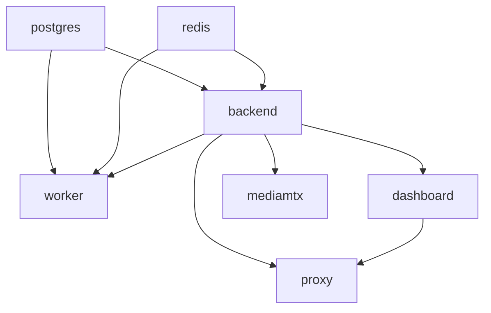

# EgoFlow Server Runtime

이 문서는 현재 `ego-flow-server`의 런타임 구성과 설정 입력 계약을 정리한 문서다. Docker Compose 서비스 구성, 포트, 볼륨, 부팅 순서, 핵심 설정 파일과 환경 변수를 포함한다.

현재 compose 자산은 `compose.yml`을 공통 base로 하고, `compose.local.yml`과 `compose.prod.yml`이 환경별 차이를 덮는 구조다.

## 1. Compose 서비스 구성

| 서비스 | 포트 | 역할 |
| --- | --- | --- |
| `postgres` | `5432` | 메타데이터 저장 |
| `redis` | `6379` | stream session cache, BullMQ backend |
| `backend` | `3000` (internal) | REST API, file gateway |
| `worker` | 없음 | video processing worker |
| `dashboard` | `8088` (internal) | TanStack Start dashboard |
| `proxy` | `PUBLIC_HTTP_PORT` | Caddy reverse proxy, 단일 공개 HTTP entrypoint |
| `mediamtx` | `RTMP_PORT`, `RTMPS_PORT`, `HLS_PORT`, `9997` (internal) | RTMP ingest, optional RTMPS ingest, HLS, Control API |

## 2. 볼륨 및 마운트

host path와 설정 파일 전달은 override가 담당한다. 공통 base는 컨테이너 내부 target 경로와 서비스 계약만 유지한다.

| 경로 | 용도 |
| --- | --- |
| `./data/postgres` | local override의 PostgreSQL 데이터 경로 |
| `${DATA_ROOT}/postgres` | production override의 PostgreSQL 데이터 경로 |
| `./data/redis` | local override의 Redis append-only 데이터 경로 |
| `${DATA_ROOT}/redis` | production override의 Redis append-only 데이터 경로 |
| `./data/raw` | local override의 MediaMTX raw recording 저장소 |
| `${DATA_ROOT}/raw` | production override의 MediaMTX raw recording 저장소 |
| `./data/datasets` | local override의 generated dataset 저장소 |
| `${DATA_ROOT}/datasets` | production override의 generated dataset 저장소 |
| `./Caddyfile` | local/prod override가 proxy에 주입하는 공통 Caddy 설정 파일 |
| `./mediamtx.yml` | local/prod override가 MediaMTX에 주입하는 공통 설정 파일 |
| `./mediamtx-hooks` | local/prod override가 MediaMTX에 주입하는 공통 hook wrapper script |
| `./certs` 또는 `${CONFIG_ROOT}/certs` | RTMPS 활성화 시 MediaMTX server cert/key mount 경로 |

## 3. 서비스별 런타임 역할

### 3.1 backend

- Prisma migration deploy 실행
- seed 실행
- Express API 서버 기동
- `/files/*` 정적 파일 접근 제어 포함

### 3.2 worker

- backend와 같은 이미지 사용
- BullMQ queue를 consume
- video processing 수행

### 3.3 dashboard

- frontend multi-stage build 결과를 Node runtime wrapper로 서빙
- 내부 포트 `8088`

### 3.4 proxy

- Caddy 기반 reverse proxy
- `/api*`, `/api-docs*`, `/files*`를 backend로 전달
- 나머지 웹 요청을 dashboard로 전달
- 외부에는 `PUBLIC_HTTP_PORT` 하나만 공개
- backend는 proxy 뒤 forwarded header를 신뢰하도록 설정된다
### 3.5 mediamtx

- RTMP 수신
- RTMPS 수신 준비 (`RTMPS_ENCRYPTION_MODE != no`일 때 활성)
- HLS 출력
- HTTP auth를 backend에 위임
- `backend:3000` 내부 DNS와 `./mediamtx-hooks`의 wrapper script를 통해 backend webhook 호출
- `stream-ready`, `stream-not-ready`, `recording-segment-create`, `recording-segment-complete` 실행
- hook endpoint는 compose 내부 네트워크 전용 전제를 가진다. public ingress에 직접 노출하지 않는다.

## 4. 부팅 순서와 의존성

- `backend`는 `postgres`, `redis`가 healthy 상태가 된 뒤 기동
- `worker`는 `postgres`, `redis`, `backend`가 모두 준비된 뒤 기동
- `dashboard`, `mediamtx`는 `backend` 준비 이후 기동
- `proxy`는 `backend`, `dashboard`가 준비된 뒤 기동

즉 backend가 시스템 중심 허브 역할을 한다.

## 5. 핵심 설정 입력

현재 runtime 설정은 `config.json`과 `.env`로 분리되어 있다. `config.json`은 일반 운영 설정을 담고, `.env`는 secret과 연결 문자열을 담는다. 일부 값은 compose가 컨테이너 내부 기본값으로 직접 주입한다.

| 이름 | 입력원 | 용도 |
| --- | --- | --- |
| `TARGET_DIRECTORY` | `config.json` | generated dataset root |
| `PUBLIC_HTTP_PORT` | `config.json` | 외부 HTTP 공개 포트 |
| `RTMP_PORT` | `config.json` | RTMP ingest 포트 |
| `RTMPS_PORT` | `config.json` | RTMPS ingest 포트 |
| `HLS_PORT` | `config.json` | HLS playback 포트 |
| `MEDIAMTX_API_PORT` | `config.json` | MediaMTX control API 포트 |
| `CORS_ORIGIN` | `config.json` | CORS 허용 origin |
| `WORKER_CONCURRENCY` | `config.json` | worker 동시 처리 수 |
| `DELETE_RAW_AFTER_PROCESSING` | `config.json` | 처리 완료 후 raw 삭제 여부 |
| `JWT_EXPIRES_IN` | `config.json` | access token 만료 기간 |
| `JWT_REFRESH_THRESHOLD_SECONDS` | `config.json` | 응답 헤더 토큰 갱신 임계값 |
| `JWT_SECRET` | `.env` | JWT 서명 키 |
| `ADMIN_DEFAULT_PASSWORD` | `.env` | 최초 admin seed 비밀번호 |
| `DATABASE_URL` | `.env` | PostgreSQL 연결 |
| `REDIS_URL` | `.env` | Redis 연결 |
| `PUBLIC_RTMP_BASE_URL` | `.env` | app에 반환할 RTMP publish base URL |
| `PUBLIC_HLS_BASE_URL` | `.env` | active stream 응답의 HLS base URL |
| `MEDIAMTX_API_URL` | `.env` | active path 조회용 MediaMTX API |
| `RTMPS_ENCRYPTION_MODE` | `.env` | MediaMTX RTMP encryption mode (`no`, `optional`, `strict`) |
| `RTMPS_CERT_PATH` | `.env` | MediaMTX RTMPS server certificate path |
| `RTMPS_KEY_PATH` | `.env` | MediaMTX RTMPS server private key path |
| `NODE_ENV` | compose environment | 런타임 모드 |
| `PORT` | compose environment | backend 포트 |

## 6. 운영상 기억할 점

- backend 컨테이너는 시작할 때 migration과 seed를 수행한다.
- seed는 admin 계정과 `settings.target_directory` row가 없을 때만 생성하며, 기존 값을 덮어쓰지 않는다.
- `TARGET_DIRECTORY`가 바뀌면 backend 부팅 시 generated file migration이 수행된다.
- production에서 `TARGET_DIRECTORY` 변경은 일반 설정 변경이 아니라 backup과 rollback 계획이 필요한 운영 작업으로 취급해야 한다.
- 일반 설정 변경은 `config.json` 수정 후 재기동으로 반영한다.
- secret이나 연결 문자열 변경은 `.env` 수정 후 재기동으로 반영한다.
- RTMPS는 기본적으로 비활성이다. `RTMPS_ENCRYPTION_MODE=no`이면 운영 cutover 전까지 app이 사용하는 `PUBLIC_RTMP_BASE_URL`은 기존 `rtmp://.../live`를 유지한다.
- RTMPS를 실제로 켤 때는 `RTMPS_ENCRYPTION_MODE`, cert/key mount, `PUBLIC_RTMP_BASE_URL=rtmps://.../live`를 함께 맞춰야 한다.
- MediaMTX hook endpoint는 internal compose network 전제를 둔다. 별도 public ingress로 직접 노출하지 않는다.
- Redis owner/ticket/connection metadata는 fail-closed로 취급한다. Redis 유실 후 in-flight publish는 heartbeat 실패나 reconcile로 종료되고, 새 publish-ticket로만 회복한다.
- 현재 지원하는 로컬 실행 경로는 `./scripts/run.sh up` 하나다.
- 외부 HTTP 접근은 `PUBLIC_HTTP_PORT` 하나만 사용하고, backend/dashboard 포트는 내부 네트워크 전용이다.
- production reset이나 data directory 삭제는 표준 운영 절차가 아니다.
