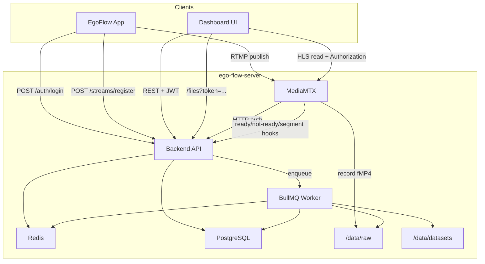
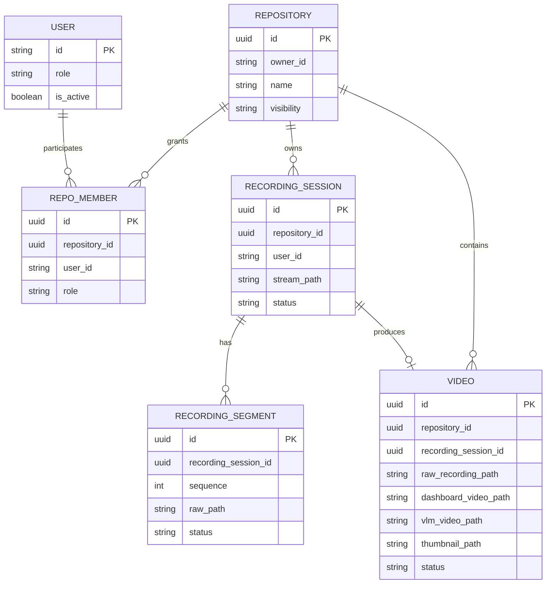

# EgoFlow Server Architecture

이 문서는 현재 `ego-flow-server` 구현의 전체 시스템 구조를 요약한 개요 문서다. 인증, 스트리밍, 후처리 세부 흐름은 별도 문서로 분리한다.

## 1. 전체 시스템 구조

## 2. 런타임 책임 분리

| 컴포넌트 | 책임 |
| --- | --- |
| App | 사용자 로그인 후 RTMP publish 세션 등록, 실제 RTMP 송출 |
| Dashboard | repository/video/live/admin UI 제공 |
| Backend | REST API, JWT 검증, repository access check, MediaMTX auth/hook 처리 |
| MediaMTX | RTMP ingest, HLS remux, recording file 작성, active path 제공 |
| Redis | active stream live pointer, BullMQ backend |
| Worker | recording finalize, metadata probe, 3종 output 생성, DB 상태 업데이트 |
| PostgreSQL | 사용자/권한/repository/recording/video/settings 저장 |

## 3. Repository 중심 도메인 구조

현재 구현에서 repository는 다음을 동시에 대표한다.

- stream registration 대상
- RTMP path 이름
- 권한 제어 단위
- generated dataset 디렉토리 단위
- dashboard 탐색 단위
- recording session의 소속 단위

### 3.1 데이터 모델 관계

### 3.2 Repository 제약

- `(ownerId, name)` 조합은 unique
- owner는 생성 시 자동으로 `repo_members`에 `admin`으로 등록된다
- owner membership은 수정/삭제할 수 없다
- inactive user는 member로 추가할 수 없다
- repository rename/delete는 active stream 존재 시 차단된다

## 4. Dashboard의 repository 중심 탐색 구조

| 흐름 | 설명 |
| --- | --- |
| Repository browsing | `/repositories`에서 접근 가능한 repository 목록 확인 |
| Repository admin | `/repositories/$repoId/settings`에서 metadata 수정, member role 관리, 삭제 |
| Video playback | `/repositories/$repoId/videos/$videoId`에서 dashboard output 재생 |
| Live monitor | `/live`에서 active session 목록과 HLS live stream 재생 |
| Admin ops | `/admin/users`, `/admin/settings` |
| Self-service | `/profile`에서 본인 비밀번호 변경 |

재생 경로는 목적에 따라 나뉜다.

- live 재생: MediaMTX의 HLS URL 직접 사용
- processed video 재생: backend `/files/*` 경유

이 분리는 live와 generated asset의 책임 경계를 명확히 한다.

## 5. 세부 문서 안내

- 인증과 권한 모델: [08. project_authentication.md](./08.%20project_authentication.md)
- stream 등록, publish, hook, finalize: [09. project_streaming.md](./09.%20project_streaming.md)
- worker 처리, 상태 전이, 저장 구조: [10. project_processing.md](./10.%20project_processing.md)

## 6. 구현 읽기 순서

구현 코드를 따라가려면 아래 순서가 가장 빠르다.

1. `backend/src/index.ts`
2. `backend/src/routes/*.ts`
3. `backend/src/services/repository.service.ts`
4. `backend/src/services/stream.service.ts`
5. `backend/src/routes/hooks.routes.ts`
6. `backend/src/services/recording-session.service.ts`
7. `backend/src/workers/recording-finalize.worker.ts`
8. `frontend/src/api/*.ts`
9. `frontend/src/routes/repositories.*`, `frontend/src/routes/live.tsx`
