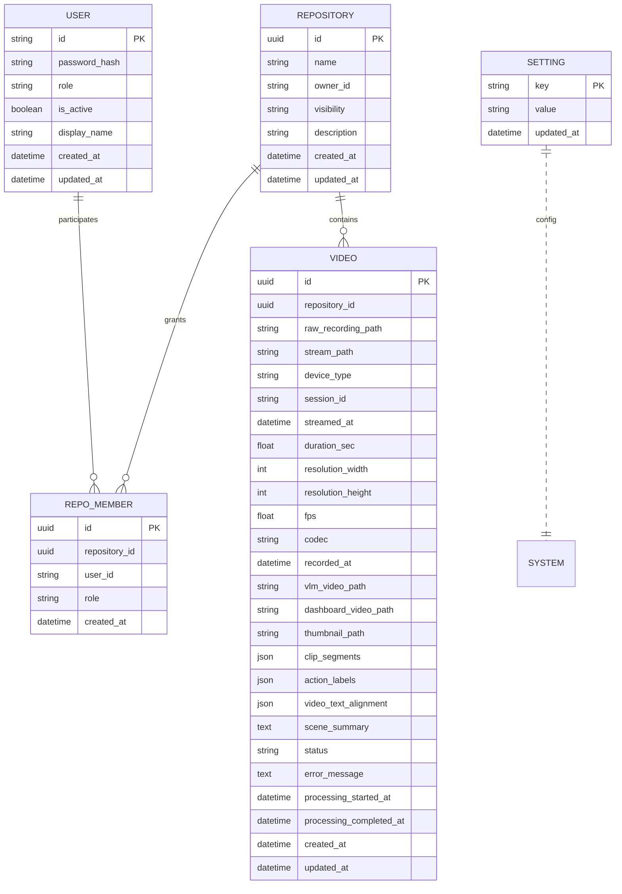

# EgoFlow Server Database

이 문서는 현재 `ego-flow-server`의 데이터베이스 구조를 정리한 문서다. Prisma schema 기준으로 enum, 테이블, 인덱스, 논리적 연관 관계를 설명한다.

## 1. 사용 기술

- DBMS: PostgreSQL
- ORM/Schema: Prisma
- migration 관리: `backend/prisma/migrations/`

## 2. Enum

### 2.1 `UserRole`

| 값 | 의미 |
| --- | --- |
| `admin` | 시스템 관리자 |
| `user` | 일반 사용자 |

### 2.2 `RepoVisibility`

| 값 | 의미 |
| --- | --- |
| `public` | membership이 없어도 read 가능 |
| `private` | member 또는 system admin만 접근 가능 |

### 2.3 `RepoRole`

| 값 | 의미 |
| --- | --- |
| `read` | 조회/재생 권한 |
| `maintain` | 운영 권한 |
| `admin` | repository 관리 권한 |

### 2.4 `VideoStatus`

| 값 | 의미 |
| --- | --- |
| `PENDING` | 대기 |
| `PROCESSING` | 처리 중 |
| `COMPLETED` | 완료 |
| `FAILED` | 실패 |

## 3. 테이블 개요

## 4. 테이블 상세

### 4.1 `users`

계정 테이블이다.

| 컬럼 | 타입 | 설명 |
| --- | --- | --- |
| `id` | `varchar(64)` PK | 사용자 ID |
| `password_hash` | `varchar(255)` | bcrypt hash |
| `role` | `UserRole` | 시스템 역할 |
| `is_active` | `boolean` | 활성 상태 |
| `display_name` | `varchar(255)` nullable | 표시 이름 |
| `created_at` | `timestamp` | 생성 시각 |
| `updated_at` | `timestamp` | 수정 시각 |

특징:

- admin 계정은 seed에서 최초 1회 생성
- 비활성 사용자도 row는 유지된다

### 4.2 `settings`

서버 설정 key-value 저장소다.

| 컬럼 | 타입 | 설명 |
| --- | --- | --- |
| `key` | `varchar(255)` PK | 설정 키 |
| `value` | `text` | 설정 값 |
| `updated_at` | `timestamp` | 수정 시각 |

현재 주로 쓰이는 키:

- `target_directory`

### 4.3 `repositories`

repository 메타데이터 테이블이다.

| 컬럼 | 타입 | 설명 |
| --- | --- | --- |
| `id` | `uuid` PK | repository ID |
| `name` | `varchar(64)` | repository 이름, RTMP path name으로도 사용 |
| `owner_id` | `varchar(64)` | repository owner user id |
| `visibility` | `RepoVisibility` | 공개 범위 |
| `description` | `varchar(500)` nullable | 설명 |
| `created_at` | `timestamp` | 생성 시각 |
| `updated_at` | `timestamp` | 수정 시각 |

제약 및 인덱스:

- unique: `(owner_id, name)`
- index: `owner_id`
- index: `visibility`

### 4.4 `repo_members`

repository별 사용자 권한 매핑 테이블이다.

| 컬럼 | 타입 | 설명 |
| --- | --- | --- |
| `id` | `uuid` PK | row ID |
| `repository_id` | `uuid` | 대상 repository |
| `user_id` | `varchar(64)` | 대상 user |
| `role` | `RepoRole` | repository role |
| `created_at` | `timestamp` | 생성 시각 |

제약 및 인덱스:

- unique: `(repository_id, user_id)`
- index: `repository_id`
- index: `user_id`

특징:

- repository 생성 시 owner가 자동으로 `admin` membership을 가진다
- owner membership은 수정/삭제할 수 없다

### 4.5 `videos`

raw recording과 후처리 결과를 관리하는 핵심 테이블이다.

| 컬럼 | 타입 | 설명 |
| --- | --- | --- |
| `id` | `uuid` PK | video ID |
| `repository_id` | `uuid` | 소속 repository |
| `raw_recording_path` | `varchar(1024)` | raw segment 절대경로 |
| `stream_path` | `varchar(255)` nullable | MediaMTX stream path |
| `device_type` | `varchar(100)` nullable | 등록 시 device type |
| `session_id` | `varchar(255)` nullable | stream session id |
| `streamed_at` | `timestamp` | row 생성 시각 계열 |
| `duration_sec` | `float` nullable | 영상 길이 |
| `resolution_width` | `int` nullable | 가로 해상도 |
| `resolution_height` | `int` nullable | 세로 해상도 |
| `fps` | `float` nullable | frame rate |
| `codec` | `varchar(50)` nullable | codec |
| `recorded_at` | `timestamp` nullable | ffprobe 기반 recorded time |
| `vlm_video_path` | `varchar(1024)` nullable | dataset/VLM mp4 경로 |
| `dashboard_video_path` | `varchar(1024)` nullable | dashboard playback mp4 경로 |
| `thumbnail_path` | `varchar(1024)` nullable | thumbnail jpg 경로 |
| `clip_segments` | `json` nullable | 확장 분석 필드 |
| `action_labels` | `json` nullable | 확장 분석 필드 |
| `video_text_alignment` | `json` nullable | 확장 분석 필드 |
| `scene_summary` | `text` nullable | 확장 분석 필드 |
| `status` | `VideoStatus` | 처리 상태 |
| `error_message` | `text` nullable | 실패 메시지 |
| `processing_started_at` | `timestamp` nullable | 처리 시작 시각 |
| `processing_completed_at` | `timestamp` nullable | 처리 완료 시각 |
| `created_at` | `timestamp` | 생성 시각 |
| `updated_at` | `timestamp` | 수정 시각 |

인덱스:

- index: `status`
- index: `repository_id`
- index: `recorded_at`
- index: `session_id`

## 5. 논리적 관계

### 5.1 User ↔ Repository

직접 relation 필드는 없지만 논리적으로 다음 두 경로가 있다.

- `repositories.owner_id = users.id`
- `repo_members.user_id = users.id`

### 5.2 Repository ↔ Video

- `videos.repository_id = repositories.id`

즉 video는 항상 하나의 repository에 속한다.

### 5.3 Repository ↔ Member

- `repo_members.repository_id = repositories.id`

권한 해석은 이 테이블을 기준으로 수행한다.

## 6. 현재 구현에서 중요한 데이터 규칙

- repository는 스트리밍, 저장, 조회, 권한의 기준 단위다.
- public repository는 membership이 없어도 `read` 권한으로 해석된다.
- active stream 정보는 DB가 아니라 Redis에 저장된다.
- generated file 경로는 DB에 절대경로로 저장된다.
- `settings.target_directory`는 부팅 시 실제 환경 변수와 동기화된다.

## 7. 현재 미사용 또는 확장 예정 성격의 필드

`videos`의 아래 필드는 schema에는 있으나 현재 worker가 채우지 않는다.

- `clip_segments`
- `action_labels`
- `video_text_alignment`
- `scene_summary`
