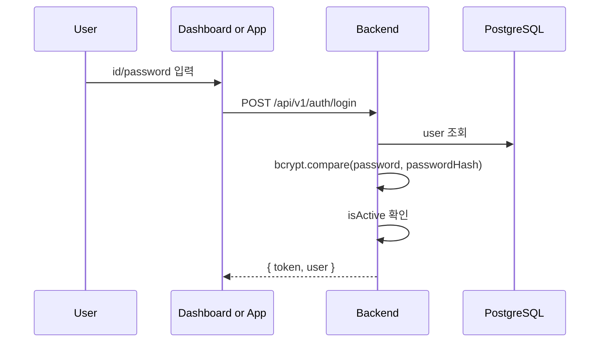
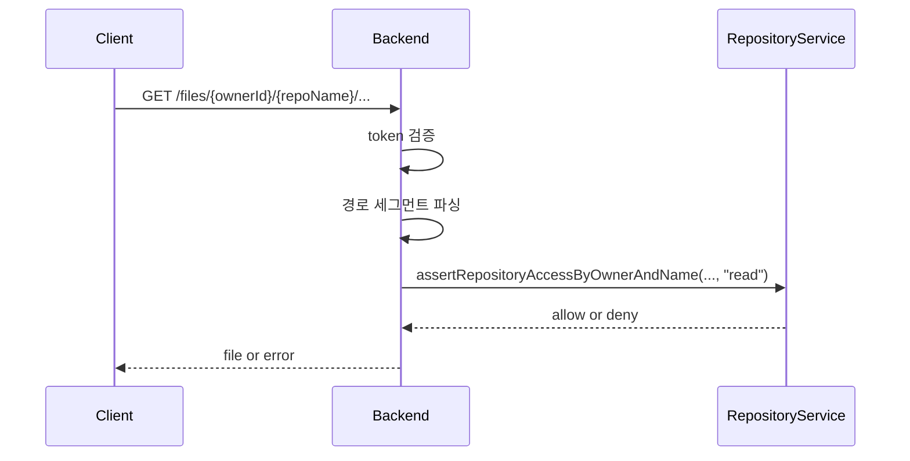
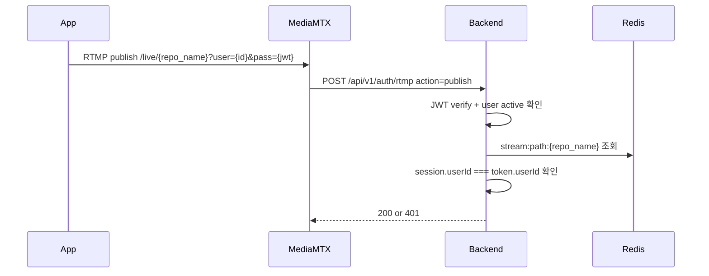
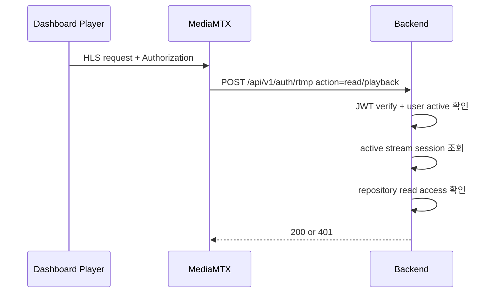

# EgoFlow Server Authentication

이 문서는 현재 `ego-flow-server`의 인증과 인가 구조를 정리한 문서다. 로그인, JWT 검증, repository 권한 해석, generated file 접근 제어, MediaMTX 인증까지 포함한다.

## 1. 인증 개요

현재 구현의 인증 기준은 JWT access token 하나다.

- 로그인 endpoint: `POST /api/v1/auth/login`
- 응답: `{ token, user }`
- 서명 방식: HS256
- refresh token: 없음
- 토큰 갱신: backend가 필요 시 `X-Refreshed-Token` 응답 헤더로 새 토큰 반환

backend는 요청마다 토큰만 믿지 않고, DB에서 사용자의 활성 상태와 실제 role을 다시 확인한다.

## 2. 로그인 흐름

로그인 성공 후 클라이언트는 다음 방식으로 세션을 유지한다.

- remember me 선택 시 `localStorage`
- 미선택 시 `sessionStorage`

## 3. Dashboard 세션 처리

frontend는 `apiClient` interceptor를 통해 토큰을 자동 관리한다.

- request interceptor: 저장된 token을 `Authorization: Bearer ...`로 주입
- response interceptor: `X-Refreshed-Token`이 있으면 저장된 token 교체

즉 dashboard는 별도의 refresh API 없이 일반 API 응답만으로 토큰을 갱신한다.

## 4. API 인증 처리

`requireAuth` 미들웨어는 아래 순서로 동작한다.

1. `Authorization` 헤더에서 bearer token 추출
2. `verifyAccessToken()`으로 JWT 검증
3. `adminService.getAuthenticatedUser()`로 DB에서 활성 사용자 재확인
4. 필요 시 `X-Refreshed-Token` 헤더 설정
5. `req.user`에 `{ userId, role }` 주입

`/files/*`에는 `requireAuthWithQueryToken`이 사용된다.

- bearer token이 없으면 query string의 `token` 또는 `access_token`도 허용
- video/img 태그와 정적 리소스 로드 경로에서 사용하기 위한 구조다

## 5. 권한 모델

### 5.1 시스템 역할

| role | 의미 |
| --- | --- |
| `admin` | 전체 시스템 관리자 |
| `user` | 일반 사용자 |

### 5.2 Repository 역할

| role | 의미 |
| --- | --- |
| `read` | repository 및 video 조회/재생 가능 |
| `maintain` | stream 등록, video 삭제 등 운영 권한 |
| `admin` | repository metadata 수정, 멤버 관리, repository 삭제 가능 |

### 5.3 Visibility

| visibility | 의미 |
| --- | --- |
| `public` | membership이 없어도 `read` 접근 가능 |
| `private` | member 또는 system admin만 접근 가능 |

## 6. Repository 권한 해석 방식

repository 접근 권한은 `repositoryService.getRepositoryAccess()`가 해석한다.

판단 순서는 다음과 같다.

1. repository 존재 여부 확인
2. 요청 사용자가 system admin이면 `admin`
3. 아니면 `repo_members`에서 membership 조회
4. membership이 없더라도 `public`이면 `read`
5. 나머지는 접근 불가

최소 권한 체크는 `assertRepositoryAccess(..., minRole)` 또는 `repoAccess` 미들웨어가 담당한다.

## 7. 파일 접근 제어

generated file은 backend의 `/files/*` 경로로 제공되지만, repository 권한 검사 없이 직접 공개되지 않는다.

경로 제약:

- 최소 3개, 최대 4개 세그먼트만 허용
- `ownerId`, `repositoryName`은 정규식으로 검증
- `.` / `..` / path traversal 성격의 세그먼트는 거부

## 8. MediaMTX 인증

MediaMTX는 `authMethod: http`로 동작하며, publish/read 요청이 들어올 때마다 backend의 `/api/v1/auth/rtmp`를 호출한다.

### 8.1 publish 인증

publish는 "이 사용자가 이 repository에 대해 미리 등록한 세션인가"를 확인한다.

### 8.2 read / playback 인증

live HLS 또는 MediaMTX playback은 repository `read` 권한이 있어야 한다.

`HlsPlayer`는 `hls.js`의 `xhrSetup`을 통해 `Authorization: Bearer ...` 헤더를 붙인다.

## 9. 관리자 및 셀프 서비스 권한

### 9.1 관리자 전용

- `/api/v1/admin/users`
- `/api/v1/admin/settings`

이 경로들은 `requireRole("admin")`으로 보호된다.

### 9.2 사용자 본인 비밀번호 변경

- endpoint: `PUT /api/v1/users/me/password`
- 현재 비밀번호 확인 후 새 비밀번호 hash로 갱신

admin 계정도 같은 경로로 본인 비밀번호를 바꾼다.

## 10. 구현상 주의할 점

- seed는 admin 계정이 없을 때만 생성하며, 기존 admin 비밀번호를 덮어쓰지 않는다.
- token payload의 role과 DB의 실제 role이 다르면 backend는 새 토큰을 내려 role 변화를 반영한다.
- 비활성 사용자(`isActive=false`)는 기존 토큰이 있어도 인증에 실패한다.
