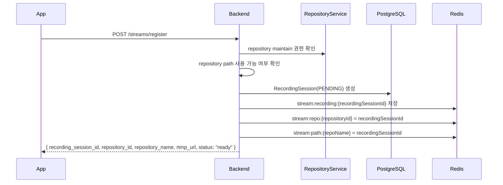
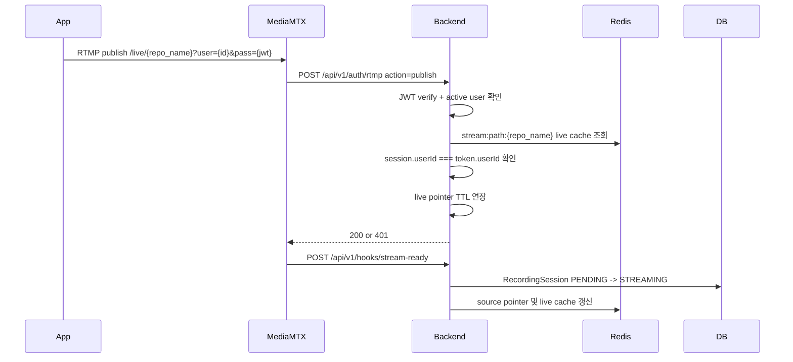
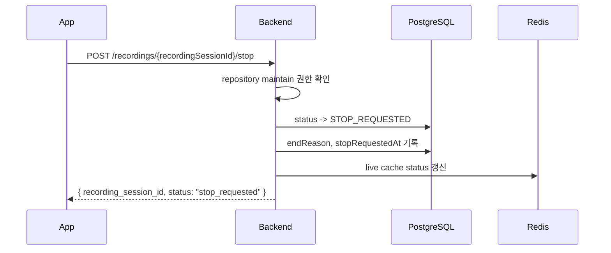
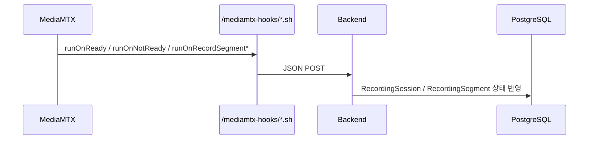
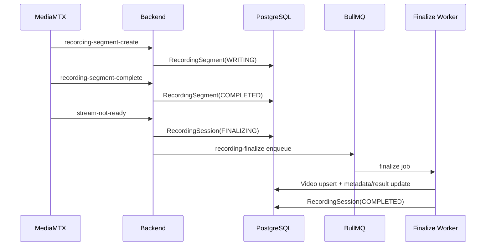

# EgoFlow Server Streaming

이 문서는 현재 `ego-flow-server`의 스트리밍 흐름을 정리한 문서다. 기준 단위는 더 이상 단순한 live stream session이 아니라 `RecordingSession`이다.

## 1. 스트리밍 구조 개요

현재 구현에서 사용자가 앱에서 `Start Streaming`을 누르면 `RecordingSession` 1개가 생성되고, `Stop Streaming` 또는 예기치 않은 송출 종료가 오면 그 recording이 마무리된다. 최종 결과는 `RecordingSession 1개 -> Video 1개`다.

```mermaid
flowchart LR
    App["EgoFlow App"] -->|POST /streams/register| Backend["Backend"]
    App -->|RTMP publish /live/{repo_name}| MediaMTX["MediaMTX"]
    MediaMTX -->|HTTP auth| Backend
    MediaMTX -->|runOnReady / runOnNotReady| Backend
    MediaMTX -->|runOnRecordSegmentCreate / Complete| Backend
    MediaMTX -->|record fMP4| Raw["/data/raw"]
    Backend --> Redis["Redis live pointers"]
    Backend --> Postgres["RecordingSession / Segment / Video"]
    Backend --> Queue["BullMQ recording-finalize"]
    Queue --> Worker["Finalize worker"]
```

핵심 분리:

- Redis: 현재 live publish/read 제어와 active pointer
- PostgreSQL: recording lifecycle, raw segment, final video 메타데이터

## 2. Recording 상태 모델

현재 `RecordingSession`은 아래 상태를 가진다.

- `PENDING`: register는 완료됐지만 실제 stream ready 전
- `STREAMING`: MediaMTX `stream-ready` hook까지 수신한 상태
- `STOP_REQUESTED`: 사용자가 stop 의도를 보낸 상태
- `FINALIZING`: 실제 publish가 종료됐고 마지막 segment flush를 기다리는 상태
- `COMPLETED`: 최종 video 생성 완료
- `FAILED`: finalize 실패 또는 timeout
- `ABORTED`: publish로 이어지지 못한 예약 세션

대표 종료 사유:

- `USER_STOP`
- `GLASSES_STOP`
- `UNEXPECTED_DISCONNECT`
- `REGISTRATION_TIMEOUT`
- `INTERNAL_ERROR`

## 3. Stream 등록

app은 publish 전에 recording session을 먼저 등록해야 한다.

- endpoint: `POST /api/v1/streams/register`
- body: `{ repository_id, device_type? }`
- 권한: repository `maintain` 이상



응답의 `rtmp_url` 형식:

```text
rtmp://<host>:1935/live/{repository_name}?user={userId}&pass={jwt}
```

중요한 점:

- register 응답의 `ready`는 publish 가능 상태라는 의미다
- 실제 live stream으로 확정되는 시점은 MediaMTX `stream-ready` hook 수신 시점이다
- register만 하고 publish하지 않으면 `PENDING` timeout 후 `ABORTED` 처리된다

## 4. Redis 구조

현재 Redis에는 아래 key들이 사용된다.

| key | 의미 |
| --- | --- |
| `stream:repo:{repositoryId}` | repository 기준 현재 live recording session id |
| `stream:path:{repoName}` | RTMP path 기준 현재 live recording session id |
| `stream:source:{sourceId}` | MediaMTX source id 기준 현재 live recording session id |
| `stream:recording:{recordingSessionId}` | live cache payload |

`stream:recording:{recordingSessionId}` payload에는 아래 필드가 포함된다.

- `recordingSessionId`
- `repositoryId`
- `repositoryName`
- `ownerId`
- `userId`
- `deviceType`
- `targetDirectory`
- `status`
- `sourceId?`
- `sourceType?`
- `readyAt?`
- `stopRequestedAt?`

TTL 정책:

- `PENDING`: registration TTL 90초
- `STREAMING`, `STOP_REQUESTED`: active TTL 24시간
- `FINALIZING` 이후에는 live pointer를 제거하고 DB를 source of truth로 사용

## 5. 활성 stream 중복 방지

backend는 동일 repository에서 중복 publish가 생기지 않도록 다음 기준을 같이 사용한다.

1. DB의 `RecordingSession` 활성 상태 존재 여부
2. Redis live pointer 존재 여부
3. MediaMTX Control API(`/v3/paths/list`)에서 실제 active path가 있는지

동작 원칙:

- 실제 active path가 있으면 conflict
- 오래된 `PENDING` 예약은 `ABORTED`로 정리
- `STREAMING` 또는 `STOP_REQUESTED`인데 MediaMTX path가 사라졌으면 `FINALIZING` 전환
- Redis pointer가 사라져도 DB fallback으로 세션을 복구해 후속 hook을 처리한다

## 6. RTMP publish 흐름



publish가 성공하려면 아래 조건을 모두 만족해야 한다.

- 유효한 JWT
- 활성 사용자
- 해당 repository name으로 등록된 live recording session 존재
- token의 사용자와 recording session 사용자 일치

주의:

- publish auth 자체는 DB 상태를 `STREAMING`으로 바꾸지 않는다
- 상태 승격은 `stream-ready` hook이 authoritative 하다

## 7. Live playback 흐름

dashboard의 `/live` 화면은 `GET /api/v1/streams/active`를 polling한다.

응답에는 아래 정보가 포함된다.

- `repository_id`
- `repository_name`
- `owner_id`
- `user_id`
- `device_type`
- `hls_url`
- `registered_at`

`hls_url` 형식:

```text
http://<host>:8888/live/{repository_name}/index.m3u8
```

live playback은 MediaMTX가 직접 제공하고, backend는 active session 목록 계산과 RTMP read/playback auth를 담당한다.

## 8. Active stream 조회 방식

`GET /api/v1/streams/active`는 아래 순서로 동작한다.

1. DB에서 `RecordingSession.status = STREAMING` 목록 조회
2. 각 recording의 repository 접근 권한 확인
3. MediaMTX API에서 실제 active repository name 조회
4. 권한이 있고 실제 active한 recording만 응답에 포함

MediaMTX API 조회가 실패하면 DB의 `STREAMING` 세션을 fallback으로 사용한다.

## 9. Stop 요청

현재 stop은 recording session 기반 endpoint만 사용한다.

- `POST /api/v1/recordings/:recordingSessionId/stop`

권한: recording이 속한 repository `maintain`



중요한 점:

- 이 API는 publisher TCP 연결 자체를 hard-kill 하지는 않는다
- 실제 recording 종료 확인은 `stream-not-ready` hook이 담당한다

## 10. Unexpected disconnect 정리

예기치 않은 종료를 위해 backend는 reconcile loop를 가진다.

- `PENDING`가 90초 내 publish로 이어지지 않으면 `ABORTED`
- `STREAMING` 또는 `STOP_REQUESTED`인데 MediaMTX path가 사라졌으면 `FINALIZING`
- `FINALIZING` 세션은 reconcile loop가 계속 `tryEnqueueFinalize()`를 재시도

이 구조 덕분에 네트워크 단절, 앱 크래시, Redis pointer 유실 후에도 DB 기준으로 recording을 정리할 수 있다.

## 11. MediaMTX hook 흐름

현재 MediaMTX는 아래 hook을 backend에 보낸다.

- `POST /api/v1/hooks/stream-ready`
- `POST /api/v1/hooks/stream-not-ready`
- `POST /api/v1/hooks/recording-segment-create`
- `POST /api/v1/hooks/recording-segment-complete`

`ego-flow-server/mediamtx-hooks/` 아래의 wrapper script가 MediaMTX env를 JSON body로 변환해서 backend에 전달한다.



## 12. Recording finalize 흐름

MediaMTX segment complete는 더 이상 즉시 `videos` row를 만들지 않는다. segment는 `RecordingSegment`로 누적되고, recording이 `FINALIZING` 상태가 된 뒤 finalize worker가 최종 `Video` 1개를 만든다.



## 13. Raw recording 경로

MediaMTX는 raw segment를 아래 패턴으로 기록한다.

```text
/data/raw/%path/%Y-%m-%d_%H-%M-%S-%f
```

실제 repository 기준 예시:

```text
./data/raw/live/{repository_name}/{timestamp}
```

segment가 여러 개 생길 수 있으므로, final worker는 `RecordingSegment.sequence` 순서대로 병합 후 처리할 수 있다.

## 14. FINALIZING timeout 정책

`FINALIZING`은 무기한 유지되지 않는다.

- completed segment가 하나도 없으면 30초 grace 이후 `FAILED`
- `WRITING` segment가 계속 남아 있으면 2분 max wait 이후 `FAILED`

즉 마지막 hook이 끝내 오지 않는 비정상 케이스도 terminal state로 정리된다.

## 15. 구현상 주의할 점

- repository name은 RTMP path 이름으로 직접 사용된다
- register 성공만으로 active stream이 되지 않는다. `stream-ready` hook이 와야 `STREAMING`이다
- stop은 종료 의도이고, 실제 송출 종료 확인은 `stream-not-ready`가 담당한다
- Redis pointer가 사라져도 hook 처리와 stop fallback은 DB 기준으로 복구된다
- 현재 최종 결과물의 기준 단위는 `RecordingSession 1개 -> Video 1개`다
