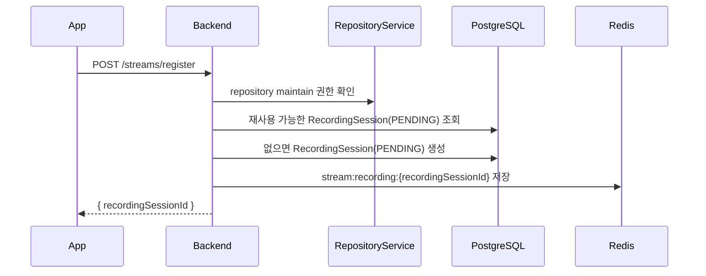
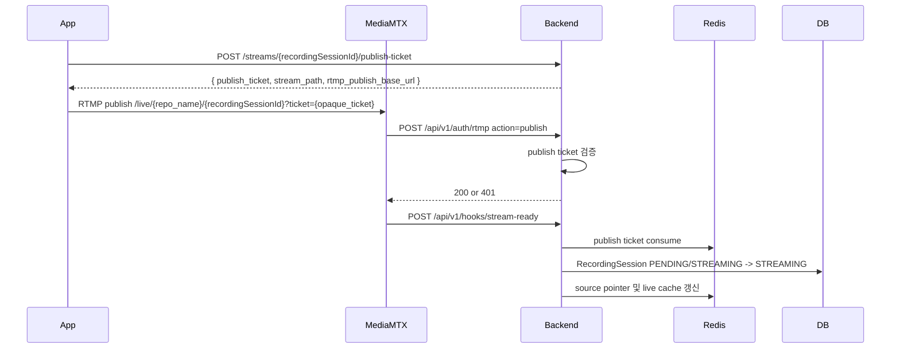
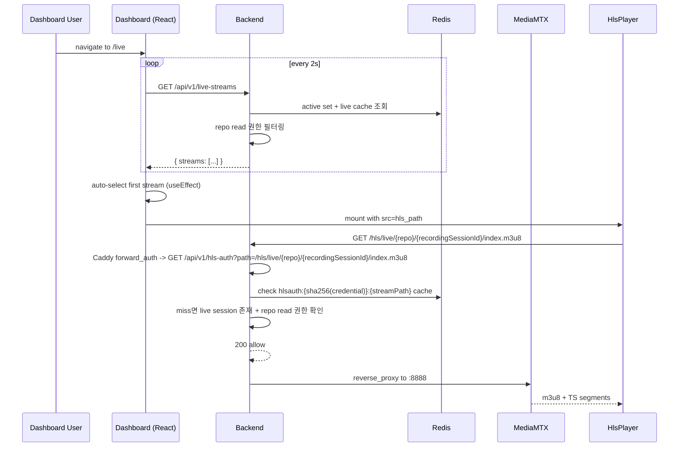
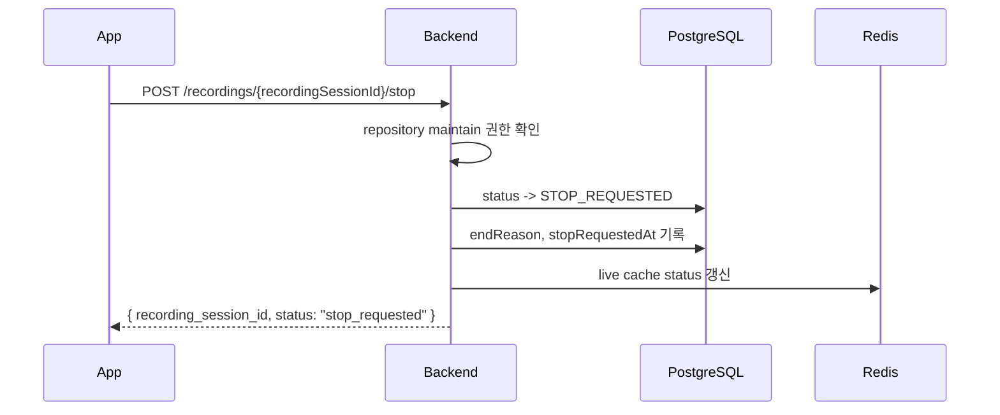
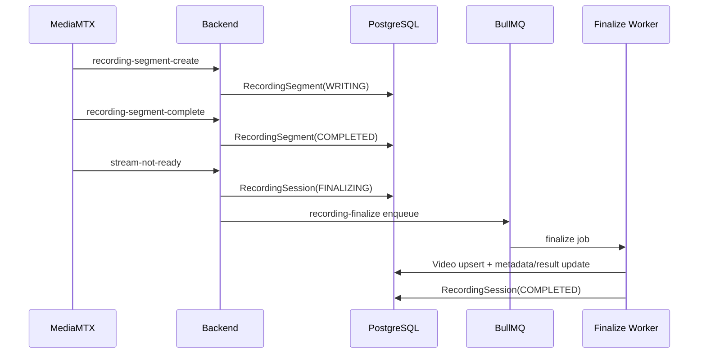

# EgoFlow Server Streaming

이 문서는 현재 `ego-flow-server`의 스트리밍 흐름을 정리한 문서다. 기준 단위는 더 이상 단순한 live stream session이 아니라 `RecordingSession`이다.

## 1. 스트리밍 구조 개요

현재 구현에서 사용자가 앱에서 `Start Streaming`을 누르면 `RecordingSession` 1개가 생성되고, `Stop Streaming` 또는 예기치 않은 송출 종료가 오면 그 recording이 마무리된다. 최종 결과는 `RecordingSession 1개 -> Video 1개`다.

```mermaid
flowchart LR
    App["EgoFlow App"] -->|POST /streams/register| Backend["Backend"]
    App -->|RTMP publish /live/{repo_name}/{recordingSessionId}| MediaMTX["MediaMTX"]
    MediaMTX -->|HTTP auth| Backend
    MediaMTX -->|runOnReady / runOnNotReady| Backend
    MediaMTX -->|runOnRecordSegmentCreate / Complete| Backend
    MediaMTX -->|record fMP4| Raw["/data/raw"]
    Backend --> Redis["Redis live pointers"]
    Backend --> Postgres["RecordingSession / Segment / Video"]
    Backend --> Queue["BullMQ recording-finalize"]
    Queue --> Worker["Finalize worker"]
```

핵심 분리:

- Redis: 현재 live publish/read 제어와 active pointer
- PostgreSQL: recording lifecycle, raw segment, final video 메타데이터

## 2. Recording 상태 모델

현재 `RecordingSession`은 아래 상태를 가진다.

- `PENDING`: register는 완료됐지만 실제 stream ready 전
- `STREAMING`: MediaMTX `stream-ready` hook까지 수신한 상태
- `STOP_REQUESTED`: 사용자가 stop 의도를 보낸 상태
- `FINALIZING`: 실제 publish가 종료됐고 마지막 segment flush를 기다리는 상태
- `COMPLETED`: 최종 video 생성 완료
- `FAILED`: finalize 실패 또는 timeout
- `ABORTED`: publish로 이어지지 못한 예약 세션

대표 종료 사유:

- `USER_STOP`
- `GLASSES_STOP`
- `UNEXPECTED_DISCONNECT`
- `REGISTRATION_TIMEOUT`
- `INTERNAL_ERROR`

## 3. Stream 등록

app은 publish 전에 recording session을 먼저 등록해야 한다.

- endpoint: `POST /api/v1/streams/register`
- body: `{ repositoryId, deviceType? }`
- 권한: repository `maintain` 이상



register 응답 핵심:

- `recordingSessionId`

중요한 점:

- register 응답은 recording reservation 생성만 의미한다
- 실제 publish에는 별도의 publish-ticket 발급이 필요하다
- publish auth는 short-lived publish ticket이 stream path와 일치해야 통과한다
- 실제 live stream으로 확정되는 시점은 MediaMTX `stream-ready` hook 수신 시점이다
- register만 하고 publish하지 않으면 `PENDING` timeout 후 `ABORTED` 처리된다
- 같은 repository 안에서도 여러 RecordingSession이 동시에 publish될 수 있으므로 stream path는 `live/{repository_name}/{recordingSessionId}` 형태를 쓴다

## 3.1 Publish Ticket 발급

- endpoint: `POST /api/v1/streams/{recordingSessionId}/publish-ticket`
- 권한: recording을 등록한 동일 사용자

응답:

- `recording_session_id`
- `repository_id`
- `repository_name`
- `stream_path`
- `publish_ticket`
- `publish_ticket_expires_at`
- `rtmp_publish_base_url`
- `whip_publish_url`

app은 publish 직전에 아래 URL을 조립한다.

```text
rtmp://<host>:1935/live/{repository_name}/{recordingSessionId}?ticket={opaque_ticket}
```

기본 publish base URL은 계속 `rtmp://`다. RTMPS cutover는 별도 운영 작업으로 `RTMPS_ENCRYPTION_MODE`, cert/key, `PUBLIC_RTMP_BASE_URL=rtmps://.../live`를 함께 바꿔야 한다.

`stream-ready`는 path fallback이 아니라 publish ticket를 먼저 검증한 뒤, ticket가 가리키는 `recording_session_id`만 갱신한다. ticket은 이 시점에 `consumed` 상태로 바뀌고 재사용할 수 없다.

## 3.2 Publish Ticket Consume

publish-ticket은 MediaMTX auth 단계에서 먼저 검증되고, `stream-ready` hook에서 한 번 더 검증된 뒤 consume된다.

- 별도 heartbeat endpoint는 없다
- owner lease, connection id, generation 기반 publish ownership은 사용하지 않는다
- `stream-ready`가 오지 않으면 register timeout 또는 reconcile loop가 `PENDING` 세션을 정리한다
- `stream-ready` 이후 연결 종료는 `stream-not-ready` hook 또는 reconcile loop가 처리한다

## 4. Redis 구조

현재 Redis에는 아래 key들이 사용된다.

| key | 의미 |
| --- | --- |
| `stream:ticket:{ticketId}` | publish auth와 stream-ready에서 검증하는 short-lived ticket JSON |
| `stream:source:{sourceId}` | MediaMTX source id 기준 authoritative source mapping JSON |
| `segment:{segmentPath}` | segment file 기준 authoritative segment mapping JSON |
| `stream:recording:{recordingSessionId}` | live cache payload |
| `stream:active:sessions` | active live 목록 조회용 recording session id set |

`stream:recording:{recordingSessionId}` payload에는 아래 필드가 포함된다.

- `recordingSessionId`
- `repositoryId`
- `repositoryName`
- `ownerId`
- `userId`
- `deviceType`
- `targetDirectory`
- `status`
- `sourceId?`
- `sourceType?`
- `publishTicketIssuedAt?`
- `readyAt?`
- `stopRequestedAt?`

`stream:source:{sourceId}` payload:

- `recordingSessionId`
- `repositoryId`
- `sourceId`
- `sourceType`

`segment:{segmentPath}` payload:

- `recordingSessionId`
- `repositoryId`
- `sourceId`
- `segmentPath`

TTL 정책:

- `stream:ticket:{ticketId}`: publish-ticket 발급 직후 60초
- `PENDING`: register 직후 5분. publish-ticket 발급 시 cache가 있으면 같은 TTL 기준으로 cache를 갱신하지만 DB 상태 판단은 reconcile loop가 담당한다
- `STREAMING`, `STOP_REQUESTED`: active TTL 24시간
- `segment:{segmentPath}`: 24시간
- `FINALIZING` 이후에는 live pointer를 제거하고 DB를 source of truth로 사용

## 5. 활성 stream 정합성

backend는 동일 repository의 simultaneous stream을 허용한다. 따라서 중복 publish 방지용 repository 단위 lock은 사용하지 않고, 각 RecordingSession의 고유 stream path를 기준으로 정합성을 맞춘다.

1. DB의 `RecordingSession` 상태
2. Redis live cache/source/segment mapping
3. MediaMTX Control API(`/v3/paths/list`)에서 실제 active path가 있는지

동작 원칙:

- register에서 같은 사용자/repository/deviceType의 기존 `PENDING` 세션이 있으면 재사용한다
- 오래된 `PENDING` 예약은 reconcile loop가 `ABORTED`로 정리한다
- `STREAMING` 또는 `STOP_REQUESTED`인데 MediaMTX path가 사라졌으면 `FINALIZING` 전환
- live session 목록 조회는 Redis active set과 live cache만 사용한다
- `stream-not-ready`와 segment hook은 path/latest-session fallback 없이 authoritative mapping만 사용한다

## 6. RTMP publish 흐름



publish가 성공하려면 아래 조건을 모두 만족해야 한다.

- 유효한 publish ticket
- ticket status가 `active`
- ticket의 stream path와 실제 publish path 일치
- ticket가 가리키는 recording session metadata와 stream-ready hook metadata 일치
- `stream-ready` 시점에 ticket consume이 성공해야만 DB/live cache/source pointer가 갱신된다

주의:

- publish auth 자체는 DB 상태나 live cache를 mutate하지 않는다
- 상태 승격은 `stream-ready` hook이 authoritative 하다
- ticket consume이 거부되면 `stream-ready`는 fail-closed로 끝나고, half-updated `STREAMING` 상태를 남기지 않는다

## 7. Live playback 흐름

dashboard의 `/live` 화면과 Python package는 **동일한 canonical live playback API `/api/v1/live-streams*`** 를 사용한다. 두 경로의 차이는 selection UX뿐이다.

- dashboard: list가 로드되면 첫 stream을 auto-select해 즉시 재생
- Python: list만 반환하고 caller가 명시적으로 선택해 `/playback`을 호출

Live playback 자체는 MediaMTX가 HLS로 직접 서빙한다. backend는 아래 세 가지를 담당한다.

1. 접근 가능한 active stream 목록 계산 (권한 + Redis active set/live cache 기반)
2. 선택된 stream에 대한 HLS path 제공 + ephemeral bearer token 발급
3. MediaMTX가 각 HLS 요청에서 forward한 `authHTTPAddress` hook에서 token 검증

### Endpoints

| Method | Path | Auth | 역할 |
| --- | --- | --- | --- |
| GET | `/api/v1/live-streams` | `requireDashboardOrAppOrPython` | 접근 가능한 active stream 목록 + `hls_path` |
| GET | `/api/v1/live-streams/:streamId` | `requireDashboardOrAppOrPython` | 단일 stream 상세 + `playback_ready` |
| GET | `/api/v1/hls-auth?path=...` | `requireDashboardOrAppOrPython` | Caddy `forward_auth`용 internal HLS authorization gate |

여기서 `streamId`는 `RecordingSession.id` 값이다. `requireDashboardOrAppOrPython`는 dashboard session cookie, app JWT, `ef_` static token을 모두 받아준다.

### Dashboard 기준 전체 동작



### 단계별 상세

**Step 1 — `/live` 진입 및 list polling**

dashboard는 `/live` 페이지에 들어오면 `useQuery(['live-streams'])`로
`GET /api/v1/live-streams`를 호출하고 2초 간격으로 refetch한다.

backend `streamService.listLiveStreams()`는:
1. 요청자의 accessible repository id set 계산
2. Redis `stream:active:sessions` set에서 active recording session id 목록 조회
3. 각 id에 대응하는 `stream:recording:{id}` live cache를 `MGET`으로 복원
4. `status === "STREAMING"`이고 접근 가능한 repository에 속한 entry만 남김
5. `registeredAt desc` 정렬 후 metadata를 반환

응답 필드:

- `stream_id` (= recording_session_id)
- `repository_id`, `repository_name`
- `owner_id`, `user_id`
- `device_type`
- `registered_at`
- `status: "live"`
- `hls_path`

이 단계의 응답에는 playback token이 없고, client가 그대로 사용할 `hls_path`만 포함된다.
목록 조회는 DB/MediaMTX를 직접 조회하지 않는 Redis read-only 경로다.

**Step 2 — 선택 (auto-select)**

dashboard `LivePage` ([frontend/src/routes/live.tsx](../frontend/src/routes/live.tsx))는 현재 선택된 `selectedStreamId`가 목록에 없을 때 `setSelectedStreamId(streams[0].streamId)`로 첫 항목을 자동 선택한다. 사용자가 좌측 aside의 카드를 클릭해도 같은 state update가 발생한다. Python package는 이 auto-select 로직을 갖지 않으며 caller가 streamId를 직접 지정한다.

**Step 3 — HLS playback 요청 시작**

선택이 바뀌면 dashboard는 추가 playback endpoint를 호출하지 않고, 선택된 stream의 `hls_path`를 그대로 `HlsPlayer`에 넘긴다.

dashboard `HlsPlayer` 컴포넌트는 hls.js를 사용해 HLS playlist를 로드한다.
`xhrSetup`에서는 `xhr.withCredentials = true`만 설정해 dashboard session cookie가 `/hls/*` 요청에 함께 가도록 한다.

이 요청은 Caddy proxy(`/hls` prefix)를 통해 MediaMTX HLS listener(`:8888`)로 도달한다.
HLS `hls_path` 포맷은 다음과 같다.

```text
/hls/live/{repository_name}/{recordingSessionId}/index.m3u8
```

**Step 4 — Caddy `forward_auth`**

Caddy는 `/hls/*` 요청마다 backend `GET /api/v1/hls-auth?path=...`를 subrequest로 호출한다.

backend `hlsAuthService.authorize()`는:
1. `path`에서 repository name과 stream path 추출
2. `sha256(rawCredential)`와 stream path로 `hlsauth:{hash}:{streamPath}` cache key 계산
3. Redis cache hit면 즉시 allow
4. miss면 `streamService.findLiveSessionByStreamPath("live/{repo}/{recordingSessionId}")`로 활성 session 확인
5. `repositoryService.getRepositoryAccess()`로 read 권한 확인
6. 성공 시 30초 TTL로 cache 저장 후 200 반환

`requireDashboardOrAppOrPython`에서 인증 자체가 실패하면 401, 인증은 됐지만 stream이 없거나 repo read 권한이 없으면 404로 응답한다.

**Step 5 — MediaMTX read/playback 우회**

`mediamtx.yml`은 아래처럼 `read`, `playback` action을 `authHTTPExclude`로 제외한다.

```yaml
authHTTPExclude:
  - action: read
  - action: playback
```

즉 HLS 재생 시점에는 MediaMTX가 backend `/api/v1/auth/rtmp`를 다시 호출하지 않는다.
`/api/v1/auth/rtmp`는 publish ticket 검증만 맡고, HLS playback은 Caddy `forward_auth`가 유일한 게이트다.

allow를 받은 요청만 MediaMTX가 실제 m3u8 playlist와 TS segment를 response로 반환하고, `HlsPlayer`가 재생을 시작한다.

### 권한 매트릭스

| 대상 | 필요 권한 |
| --- | --- |
| `GET /live-streams` | `requireDashboardOrAppOrPython` (JWT 또는 `ef_`) + 각 repo read 권한으로 필터링 |
| `GET /live-streams/:streamId` | `requireDashboardOrAppOrPython` + 해당 repo read 권한 (없으면 404) |
| `GET /hls-auth?path=...` | `requireDashboardOrAppOrPython` + 활성 stream 존재 + 해당 repo read 권한 |
| MediaMTX HLS 읽기 | Caddy `forward_auth`가 200을 준 요청만 통과 |

private repo는 read 권한이 없으면 list에서 숨겨지고 detail 또는 HLS auth gate는 403이 아닌 **404**로 응답해 존재 여부를 숨긴다.

### Python package 연동 메모

Python package는 `GET /api/v1/live-streams`로 목록을 받고, 선택한 stream의 `hls_path`를 그대로 사용해 HLS를 요청하면 된다.
이때 별도 playback token 발급은 없고, python static token(`ef_...`) 또는 다른 기존 credential이 Caddy `forward_auth`를 통과하면 dashboard와 같은 HLS 경로를 읽을 수 있다.

### 관련 로그

- `[live-streams.list] generated`: list 응답 시 `streamCount`와 요청자 정보
- `[rtmp-auth] allowed` / `[rtmp-auth] denied`: publish 시 MediaMTX authHTTPAddress hook의 allow/deny 및 사유
- `[startup] runtime playback config`: 부팅 시 `RTMP_PORT`, `HLS_PORT`, `HLS_PATH_PREFIX`, `MEDIAMTX_API_URL`
- `[rtmp-register] ...`, `[rtmp-state] ...`, `[rtmp-segment] ...`, `[rtmp-finalize] ...`, `[rtmp-reconcile] ...`: publish-side lifecycle prefix는 7.1 참고

### 7.1 운영 로그 계약

Task5 기준으로 운영에서 우선 보는 join field는 아래와 같다.

- `recordingSessionId`
- `repositoryId`
- `repositoryName`
- `sourceId`
- `ticketId`
- `reason`

원칙:

- prefix는 역할별 그룹으로 고정한다.
- 메시지 텍스트보다 payload field를 기준으로 해석한다.
- `stream-ready`, `stream-not-ready`, segment mapping miss 같은 no-op 경로도 표준 prefix로 남긴다.
- Android diagnostics와 조인 가능한 필드 이름을 그대로 사용한다.

주요 prefix별 의미:

- `[rtmp-register]`: register 권한 실패 cleanup, PENDING 재사용, 예약 발급
- `[rtmp-ticket]`: publish-ticket issue/consume/reject
- `[rtmp-auth]`: MediaMTX auth allow/deny
- `[rtmp-state]`: DB 상태 전환과 live pointer 정리
- `[rtmp-segment]`: segment authoritative mapping과 segment row 진행
- `[rtmp-finalize]`: finalize enqueue와 후처리 결과
- `[rtmp-reconcile]`: reconcile loop가 만든 정리 동작

### 7.2 권장 카운터와 지연 메트릭

현재 구현은 별도 metrics backend를 두지 않는다. 운영에서는 우선 로그 기반 집계를 가정한다.

권장 카운터:

- publish-ticket issue count
- publish-ticket reject count
- publish-ticket consume count
- stream-ready ticket mismatch count
- source mapping missing count
- pending registration timeout count
- finalize enqueue count
- finalize timeout/failure count

권장 지연 메트릭:

- `publishTicketIssuedAt -> readyAt`
- `notReadyAt -> finalize completion`
- `register createdAt -> ABORTED(registration timeout)`

## 8. Active stream 조회 방식

`GET /api/v1/live-streams`는 아래 순서로 동작한다.

1. 요청자의 accessible repository id set 계산
2. Redis `stream:active:sessions` set 조회
3. 각 id에 대응하는 `stream:recording:{id}` live cache를 `MGET`으로 복원
4. `status === STREAMING`이면서 접근 가능한 repository에 속한 session만 남김
5. `registeredAt desc`로 정렬 후 `hls_path`와 함께 응답

이 경로는 DB와 MediaMTX API를 직접 조회하지 않는 read-only Redis 기반 조회다.

## 9. Stop 요청

현재 stop은 recording session 기반 endpoint만 사용한다.

- `POST /api/v1/recordings/:recordingSessionId/stop`

권한: recording이 속한 repository `maintain`



## 10. Known Limitations

현재 구현에서 명시적으로 받아들이는 제약은 아래와 같다.

- hook endpoint는 compose/internal network only 전제를 둔다. public ingress에 노출하지 않는다.
- Redis ticket/source/live metadata는 fail-closed다. Redis 유실 후 in-flight publish를 투명 복구하지 않는다.
- publish ticket miss, ticket 만료, stream path mismatch는 현재 publish attempt를 거부하고 새 publish-ticket 기반 reconnect를 요구한다.
- observability는 현재 structured logs 중심이다. 별도 Prometheus/OpenTelemetry export는 아직 없다.

중요한 점:

- 이 API는 publisher TCP 연결 자체를 hard-kill 하지는 않는다
- 실제 recording 종료 확인은 `stream-not-ready` hook 또는 reconcile이 담당한다

## 10. Unexpected disconnect 정리

예기치 않은 종료를 위해 backend는 reconcile loop를 가진다.

- register 후 5분 내 publish auth가 없으면 `ABORTED + REGISTRATION_TIMEOUT`
- publish-ticket가 발급됐지만 registration timeout 안에 `stream-ready`가 오지 않으면 `ABORTED + REGISTRATION_TIMEOUT`
- `STREAMING` 또는 `STOP_REQUESTED`인데 MediaMTX path가 사라지거나 source mapping이 없으면 `FINALIZING`
- `FINALIZING` 세션은 reconcile loop가 계속 `tryEnqueueFinalize()`를 재시도

이 구조 덕분에 네트워크 단절, 앱 크래시, hook 누락이 있어도 recording session 상태와 MediaMTX active path 기준으로 recording을 정리할 수 있다.

## 11. MediaMTX hook 흐름

현재 MediaMTX는 아래 hook을 backend에 보낸다.

- `POST /api/v1/hooks/stream-ready`
- `POST /api/v1/hooks/stream-not-ready`
- `POST /api/v1/hooks/recording-segment-create`
- `POST /api/v1/hooks/recording-segment-complete`

`ego-flow-server/mediamtx-hooks/` 아래의 wrapper script가 MediaMTX env를 JSON body로 변환해서 backend에 전달한다. `recording-segment-create`와 `recording-segment-complete`는 `source_id`가 비어 있거나 아예 전달되지 않을 수 있으므로, backend는 `path -> live cache -> source mapping` 순서로 복구를 시도한다.


hook 처리 원칙:

- `stream-ready`: publish ticket를 검증/consume한 뒤에만 DB/Redis를 갱신한다
- `stream-not-ready`: `stream:source:{sourceId}` 매핑이 가리키는 recording session만 FINALIZING으로 전환한다
- `recording-segment-create`: 우선 `stream:source:{sourceId}` 매핑을 사용하고, `source_id`가 없으면 stream path의 recordingSessionId로 live cache를 복구한 뒤 `segment:{segmentPath}`를 저장한다
- `recording-segment-complete`: 우선 `segment:{segmentPath}`를 사용하고, create hook이 누락된 경우에는 같은 `path -> live cache -> source mapping` 복구 경로를 한 번 더 시도한다
- mapping miss는 잘못 귀속하지 않고 no-op + 경고 로그로 끝낸다
- hook endpoint는 external client용 API가 아니며, compose 내부 네트워크 전용 전제를 가진다

## 12. Recording finalize 흐름

MediaMTX segment complete는 더 이상 즉시 `videos` row를 만들지 않는다. segment는 `RecordingSegment`로 누적되고, recording이 `FINALIZING` 상태가 된 뒤 finalize worker가 최종 `Video` 1개를 만든다.



## 13. Raw recording 경로

MediaMTX는 raw segment를 아래 패턴으로 기록한다.

```text
/data/raw/%path/%Y-%m-%d_%H-%M-%S-%f
```

실제 repository 기준 예시:

```text
./data/raw/live/{repository_name}/{recordingSessionId}/{timestamp}
```

segment가 여러 개 생길 수 있으므로, final worker는 `RecordingSegment.sequence` 순서대로 병합 후 처리할 수 있다.

## 14. FINALIZING timeout 정책

`FINALIZING`은 무기한 유지되지 않는다.

- completed segment가 하나도 없으면 30초 grace 이후 `FAILED`
- `WRITING` segment가 계속 남아 있으면 2분 max wait 이후 `FAILED`

예외:

- `USER_STOP` 또는 `GLASSES_STOP`으로 끝난 매우 짧은 attempt에서 completed segment가 끝내 0개면 에러로 보지 않고 `ABORTED`로 정리한다.
- 이 경우 backend는 `failed-missing-completed-segments` 경고 대신 info 수준의 `empty-session-aborted` 로그만 남긴다.

즉 마지막 hook이 끝내 오지 않는 비정상 케이스도 terminal state로 정리된다.

## 15. 구현상 주의할 점

- repository name은 RTMP path 이름으로 직접 사용된다
- register 성공만으로 active stream이 되지 않는다. `stream-ready` hook이 와야 `STREAMING`이다
- stop은 종료 의도이고, 실제 송출 종료 확인은 `stream-not-ready`가 담당한다
- `stream-not-ready`와 segment hook은 Redis authoritative mapping miss를 DB/path fallback으로 보정하지 않는다. miss는 no-op로 남기고 reconcile이 후속 정리를 맡는다
- 현재 최종 결과물의 기준 단위는 `RecordingSession 1개 -> Video 1개`다
