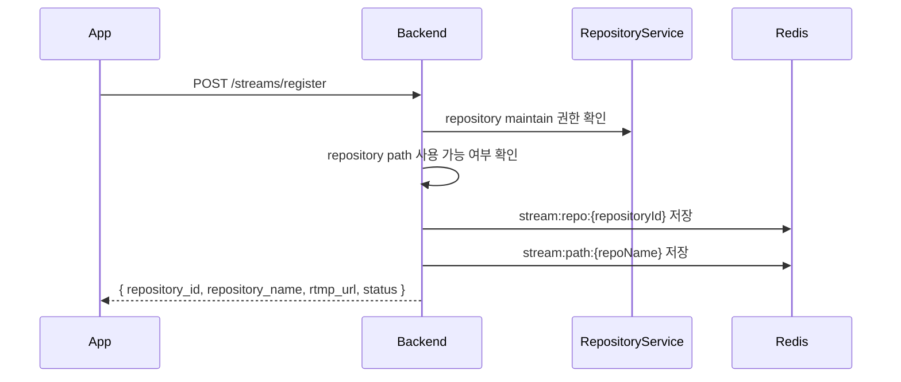
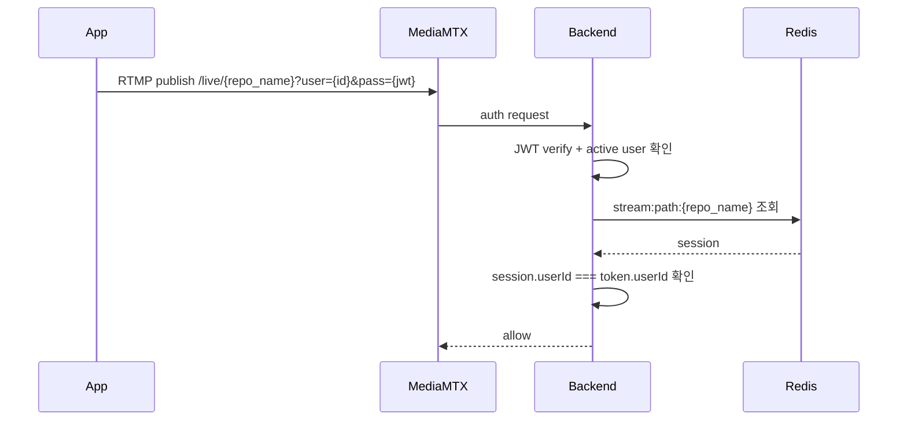
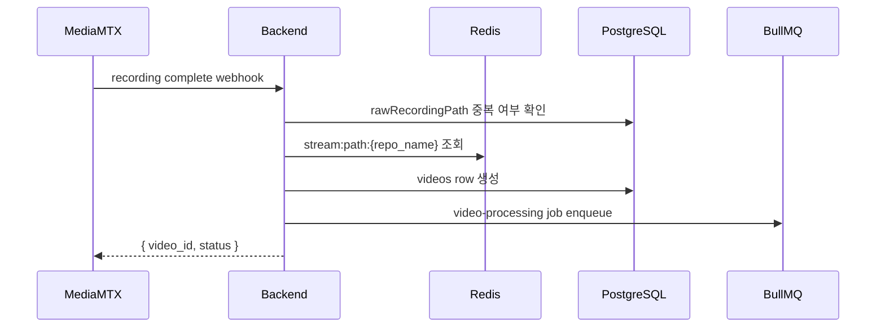

# EgoFlow Server Streaming

이 문서는 현재 `ego-flow-server`의 스트리밍 흐름을 정리한 문서다. stream 등록, RTMP publish, active stream 조회, recording complete webhook까지 포함한다.

## 1. 스트리밍 구조 개요

현재 구현에서 스트리밍은 repository 단위로 관리된다.

- stream 등록 단위: repository
- RTMP path 이름: repository name
- live 재생 접근 제어 단위: repository
- recording 후 video row가 귀속되는 단위: repository

```mermaid
flowchart LR
    App["EgoFlow App"] -->|POST /streams/register| Backend["Backend"]
    App -->|RTMP publish /live/{repo_name}| MediaMTX["MediaMTX"]
    MediaMTX -->|HTTP auth| Backend
    MediaMTX -->|record segment| Raw["/data/raw"]
    MediaMTX -->|recording complete hook| Backend
    Backend --> Redis["Redis stream session"]
    Backend --> Postgres["PostgreSQL videos"]
    Backend --> Queue["BullMQ"]
```

## 2. Stream 등록

app은 publish 전에 먼저 session을 등록해야 한다.

- endpoint: `POST /api/v1/streams/register`
- body: `{ repository_id, device_type? }`
- 권한: repository `maintain` 이상



응답의 `rtmp_url` 형식:

```text
rtmp://<host>:1935/live/{repository_name}?user={userId}&pass={jwt}
```

## 3. Redis 세션 구조

stream 등록 시 Redis에 두 종류의 key가 저장된다.

| key | 의미 |
| --- | --- |
| `stream:repo:{repositoryId}` | repository 기준 active session |
| `stream:path:{repoName}` | RTMP path name에서 session key로 역조회 |

session payload에는 아래 필드가 포함된다.

- `userId`
- `repositoryId`
- `repositoryName`
- `ownerId`
- `deviceType`
- `targetDirectory`
- `registeredAt`
- `sessionId`
- `stoppedAt?`

TTL은 24시간이다.

## 4. 활성 stream 중복 방지

backend는 동일 repository에서 중복 publish가 생기지 않도록 다음 두 기준을 같이 사용한다.

1. Redis에 session key가 이미 남아 있는지
2. MediaMTX Control API(`/v3/paths/list`)에 실제 active path가 있는지

이 구조는 stale Redis key가 남아 있는 경우를 감안한 방어 로직이다.

## 5. RTMP publish 흐름



publish가 성공하려면 아래 조건을 모두 만족해야 한다.

- 유효한 JWT
- 활성 사용자
- 해당 repository name으로 등록된 stream session 존재
- token의 사용자와 session 사용자 일치

## 6. Live playback 흐름

dashboard의 `/live` 화면은 `GET /api/v1/streams/active`를 5초 간격으로 polling한다.

응답에는 아래 정보가 포함된다.

- `repository_id`
- `repository_name`
- `owner_id`
- `user_id`
- `device_type`
- `hls_url`
- `registered_at`

`hls_url`은 다음 형식으로 생성된다.

```text
http://<host>:8888/live/{repository_name}/index.m3u8
```

live playback은 MediaMTX에서 직접 제공되며, dashboard의 `HlsPlayer`가 인증 헤더를 붙여 접근한다.

## 7. Active stream 조회 방식

`GET /api/v1/streams/active`는 아래 순서로 동작한다.

1. Redis에서 `stream:repo:*` key 전체 조회
2. 각 session에 대해 요청 사용자의 repository 접근 권한 확인
3. MediaMTX API에서 실제 active repository name 조회
4. 권한이 있고 실제 active한 session만 응답에 포함

MediaMTX API 조회가 실패하면 fallback으로 Redis session만 기준으로 목록을 구성한다.

## 8. Stream stop 요청

- endpoint: `DELETE /api/v1/streams/:repositoryId`
- 권한: repository `maintain` 이상

현재 구현에서 이 API는 publisher를 강제로 종료하지 않는다.

- Redis session에 `stoppedAt`을 기록
- 응답은 `{ repository_id, status: "stopping" }`

실제 active 여부는 여전히 MediaMTX path list 기준이 더 강하다.

## 9. Recording complete webhook

MediaMTX는 녹화 segment가 완료되면 backend에 webhook을 호출한다.

설정 위치:

- `mediamtx.yml`
- `runOnRecordSegmentComplete`

호출 형식:

```text
/api/v1/hooks/recording-complete?path=$MTX_PATH&recording_path=$MTX_SEGMENT_PATH
```



생성되는 `videos` row의 초기 상태는 `PENDING`이다.

## 10. Raw recording 경로

MediaMTX는 raw segment를 아래 패턴으로 기록한다.

```text
/data/raw/%path/%Y-%m-%d_%H-%M-%S-%f
```

실제 repository 기준으로 보면 다음과 같은 형태가 된다.

```text
./data/raw/live/{repository_name}/{timestamp}
```

## 11. 구현상 주의할 점

- repository name은 RTMP path 이름으로 직접 사용된다.
- stream 등록 없이 publish하면 MediaMTX auth 단계에서 거부된다.
- recording webhook은 raw file 경로 기준 중복 체크를 수행하므로 같은 segment가 다시 들어와도 중복 video row를 만들지 않는다.
