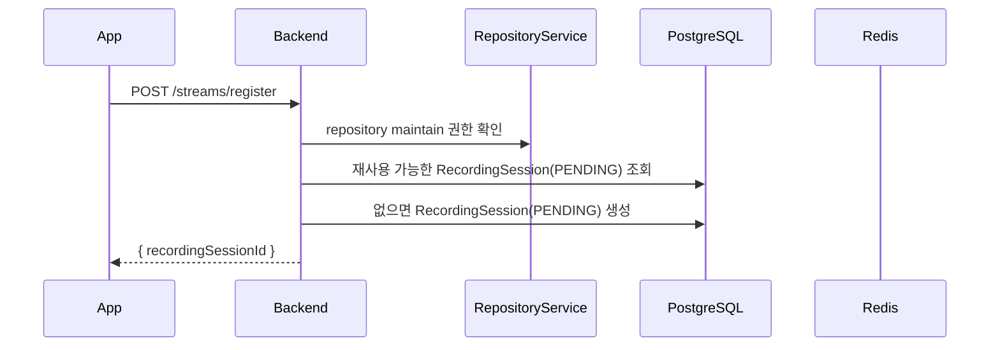
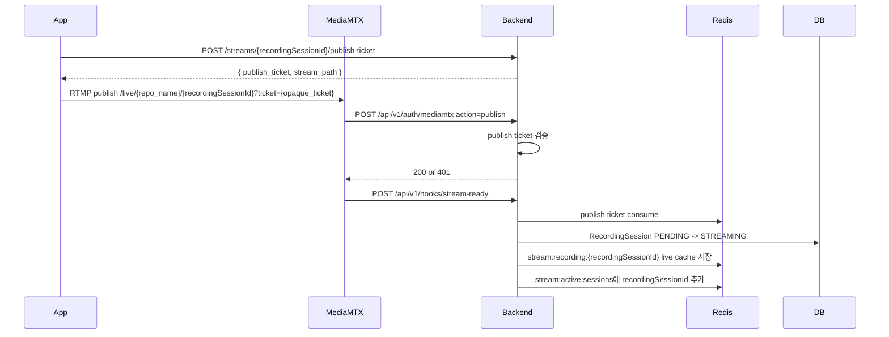
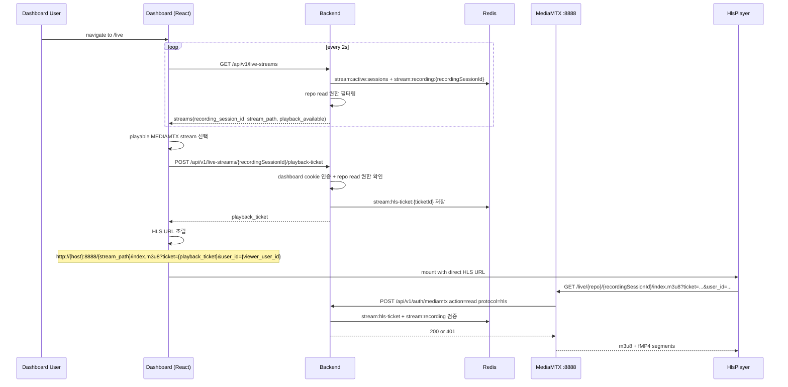
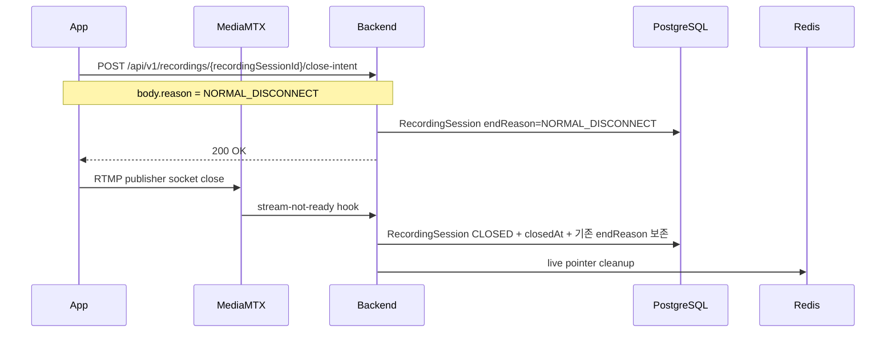
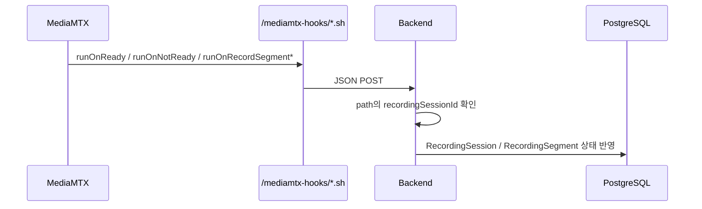
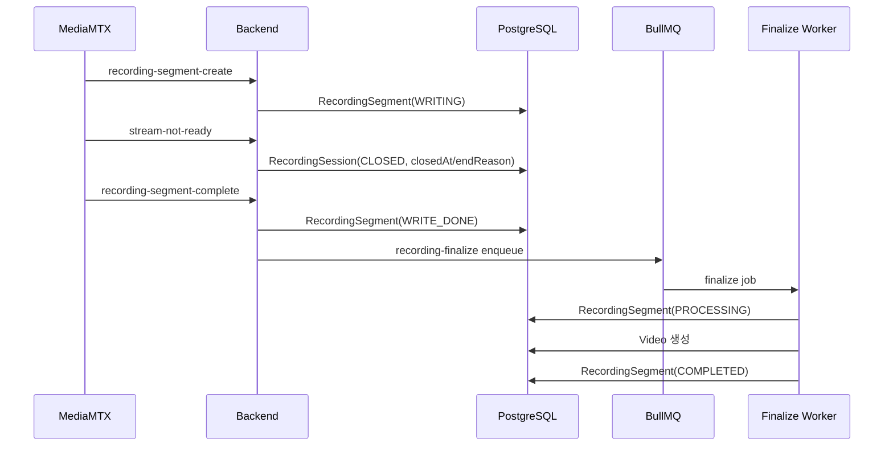

# EgoFlow Server Streaming

이 문서는 현재 `ego-flow-server`의 스트리밍 흐름을 정리한 문서다. 기준 단위는 더 이상 단순한 live stream session이 아니라 `RecordingSession`이다.

## 1. 스트리밍 구조 개요

현재 구현에서 사용자가 앱에서 `Start Streaming`을 누르면 `RecordingSession` 1개가 생성되고, `Stop Streaming` 또는 예기치 않은 송출 종료가 오면 그 recording이 마무리된다. 최종 결과는 `RecordingSession 1개 -> Video 1개`다.

```mermaid
flowchart LR
    App["EgoFlow App"] -->|POST /streams/register| Backend["Backend"]
    App -->|RTMP publish /live/{repo_name}/{recordingSessionId}| MediaMTX["MediaMTX"]
    MediaMTX -->|HTTP auth| Backend
    MediaMTX -->|runOnReady / runOnNotReady| Backend
    MediaMTX -->|runOnRecordSegmentCreate / Complete| Backend
    MediaMTX -->|record fMP4| Raw["/data/raw"]
    Backend --> Redis["Redis ticket/live cache"]
    Backend --> Postgres["RecordingSession / Segment / Video"]
    Backend --> Queue["BullMQ recording-finalize"]
    Queue --> Worker["Finalize worker"]
```

핵심 분리:

- Redis: 현재 live publish/read 제어와 active pointer
- PostgreSQL: recording lifecycle, raw segment, final video 메타데이터

## 2. Recording 상태 모델

현재 `RecordingSession`은 streaming session 자체의 상태만 가진다.

- `PENDING`: register는 완료됐지만 실제 stream ready 전
- `STREAMING`: MediaMTX `stream-ready` hook까지 수신한 상태
- `CLOSED`: streaming session lifecycle이 끝난 상태

raw segment 및 후처리 상태는 `RecordingSegment.status`가 담당한다.

- `WRITING`: MediaMTX가 raw segment 작성 중
- `WRITE_DONE`: raw segment 작성 완료, worker 처리 대기
- `PROCESSING`: worker 후처리 중
- `COMPLETED`: 최종 video 생성에 반영 완료
- `FAILED`: segment 후처리 실패

`Video.status`는 최종 산출물의 결과만 표현한다.

- `COMPLETED`: 최종 video 생성 완료
- `FAILED`: 최종 video 생성 실패

대표 종료 사유:

- `NORMAL_DISCONNECT`
- `UNEXPECTED_DISCONNECT`
- `ACCESS_FORBIDDEN`
- `REPOSITORY_DELETED`
- `INTERNAL_ERROR`

## 3. Stream 등록

app은 publish 전에 recording session을 먼저 등록해야 한다.

- endpoint: `POST /api/v1/streams/register`
- body: `{ repositoryId, deviceType? }`
- 권한: repository `maintain` 이상



register 응답 핵심:

- `recordingSessionId`

중요한 점:

- register 응답은 recording reservation 생성만 의미한다
- 실제 publish에는 별도의 publish-ticket 발급이 필요하다
- publish auth는 short-lived publish ticket이 stream path와 일치해야 통과한다
- 실제 live stream으로 확정되는 시점은 MediaMTX `stream-ready` hook 수신 시점이다
- register 직후 Redis PENDING cache는 5분 TTL을 가지며, cache가 만료된 old `PENDING` row는 publish-ticket 발급이 거부된다
- register 권한 검증이 `FORBIDDEN`으로 실패하면 동일 repository/user/deviceType의 PENDING session을 `CLOSED + ACCESS_FORBIDDEN`으로 정리한다
- register 대상 repository가 없어 `NOT_FOUND`로 실패하면 동일 repository/user/deviceType의 PENDING session을 `CLOSED + REPOSITORY_DELETED`로 정리한다
- 같은 repository 안에서도 여러 RecordingSession이 동시에 publish될 수 있으므로 stream path는 `live/{repository_name}/{recordingSessionId}` 형태를 쓴다

## 3.1 Publish Ticket 발급

- endpoint: `POST /api/v1/streams/{recordingSessionId}/publish-ticket`
- 권한: recording을 등록한 동일 사용자

응답:

- `stream_path`
- `publish_ticket`

app은 publish 직전에 아래 URL을 조립한다.

```text
rtmp://<host>:1935/live/{repository_name}/{recordingSessionId}?ticket={opaque_ticket}
{backend_origin}/live/{repository_name}/{recordingSessionId}/whip?ticket={opaque_ticket}
```

RTMP scheme은 `rtmp://`, port는 `1935`로 고정한다. WHIP은 backend origin과 같은 HTTP origin을 사용한다. RTMPS cutover는 별도 운영 작업으로 `RTMPS_ENCRYPTION_MODE`, cert/key, app URL 조립 규칙을 함께 맞춰야 한다.

`stream-ready`는 source id가 아니라 publish ticket를 먼저 검증한 뒤, ticket가 가리키는 `recording_session_id`만 갱신한다. ticket은 이 시점에 `consumed` 상태로 바뀌고 재사용할 수 없다.

## 3.2 Publish Ticket Consume

publish-ticket은 MediaMTX auth 단계에서 먼저 검증되고, `stream-ready` hook에서 한 번 더 검증된 뒤 consume된다.

- 별도 heartbeat endpoint는 없다
- owner lease, connection id, generation 기반 publish ownership은 사용하지 않는다
- `stream-ready`가 오지 않으면 Redis PENDING cache만 TTL로 만료되고 DB의 `PENDING` row는 다음 register 재사용 대상이 될 수 있다
- `stream-ready` 이후 연결 종료는 `stream-not-ready` hook 또는 reconcile loop가 처리한다

## 4. Redis 구조

현재 Redis에는 아래 key들이 사용된다.

| key | 의미 |
| --- | --- |
| `stream:ticket:{ticketId}` | publish auth와 stream-ready에서 검증하는 short-lived ticket JSON. 만료는 Redis TTL만 사용 |
| `stream:recording:{recordingSessionId}` | register 직후 PENDING cache, MediaMTX live metadata, HTTP upload 진행 상태 JSON |
| `stream:active:sessions` | dashboard live 목록 조회용 active recording session id set. MediaMTX live와 HTTP upload가 모두 들어간다 |
| `stream:http-upload-lock:{recordingSessionId}` | HTTP chunk append serialize lock. TTL 10초 |

`stream:recording:{recordingSessionId}` payload:

- `repositoryId`
- `repositoryName`
- `userId`
- `ingestType`: `MEDIAMTX`, `HTTP`
- `deviceType` optional
- `status`: `PENDING`, `STREAMING`
- HTTP STREAMING cache only: `rawPath`, `bytesReceived`, `lastSequence`, `lastChunkAt`

TTL 정책:

- `stream:ticket:{ticketId}`: publish-ticket 발급 직후 60초. publish auth 검증 성공 시 TTL을 60초로 갱신한다. stream-ready consume 시에는 남은 TTL을 유지한다
- `stream:recording:{recordingSessionId}`: register 직후 PENDING cache는 5분, MediaMTX stream-ready 또는 HTTP start 이후 active cache는 2시간. HTTP chunk마다 TTL을 2시간으로 refresh한다
- `stream:active:sessions`: set 자체에는 TTL을 두지 않고 stream-not-ready/reconcile에서 member를 제거한다
- `stream:http-upload-lock:{recordingSessionId}`: HTTP chunk append 중 10초 TTL로만 유지한다

## 5. 활성 stream 정합성

backend는 동일 repository의 simultaneous stream을 허용한다. 따라서 중복 publish 방지용 repository 단위 lock은 사용하지 않고, 각 RecordingSession의 고유 stream path를 기준으로 정합성을 맞춘다.

1. DB의 `RecordingSession` 상태
2. Redis `stream:recording:{recordingSessionId}` live/pending cache 및 active set
3. MediaMTX ingest는 MediaMTX Control API(`/v3/paths/list`)에서 실제 active path가 있는지
4. HTTP ingest는 Redis `lastChunkAt` 기준 10초 timeout 여부

동작 원칙:

- register에서 같은 사용자/repository/deviceType/ingestType의 기존 `PENDING` 세션이 있으면 재사용한다
- 오래된 `PENDING` 예약을 별도로 `CLOSED` 정리하는 reconcile loop는 없다. publish-ticket은 Redis PENDING cache가 살아 있는 경우에만 발급된다
- `MEDIAMTX + STREAMING`인데 MediaMTX path가 사라졌으면 `CLOSED + closedAt/endReason`으로 보정하고, segment complete 확정 이후 `RecordingSegment` 후처리를 시작한다
- `HTTP + STREAMING`인데 10초 이상 chunk가 없으면 reconcile이 `CLOSED + UNEXPECTED_DISCONNECT`로 닫는다. raw file이 존재하고 non-empty이며 Redis `bytesReceived`와 file size가 같으면 `WRITE_DONE`으로 복구해 finalize한다. file missing/0 byte/size mismatch면 `RecordingSegment=FAILED`와 `Video=FAILED` row를 남긴다
- live session 목록 조회는 Redis active set으로 후보 id를 좁힌 뒤 `stream:recording:{recordingSessionId}` metadata를 조회한다
- `stream-not-ready`, segment create, segment complete는 모두 stream path의 recordingSessionId를 사용한다

## 6. RTMP publish 흐름



publish가 성공하려면 아래 조건을 모두 만족해야 한다.

- 유효한 publish ticket
- ticket가 가리키는 recording session 상태가 `PENDING`
- ticket status가 `active`
- ticket의 stream path와 실제 publish path 일치
- ticket가 가리키는 recording session metadata와 DB row 일치
- `stream-ready` 시점에 ticket consume이 성공해야만 DB 상태, live cache, active set이 갱신된다

주의:

- publish auth 자체는 DB 상태, live cache, active set을 mutate하지 않는다
- 상태 승격은 `stream-ready` hook이 authoritative 하다
- ticket consume이 거부되면 `stream-ready`는 fail-closed로 끝나고, half-updated `STREAMING` 상태를 남기지 않는다

## 7. Live playback 흐름

dashboard의 `/live` 화면과 Python package는 동일한 live stream 목록 API를 사용하지만, HLS bytes는 기존 Caddy HLS proxy가 아니라 MediaMTX `:8888` HLS listener에서 직접 받는다.

backend는 아래 네 가지를 담당한다.

1. 접근 가능한 active stream 목록 계산
2. 선택된 stream detail과 `playback_ready` 계산
3. dashboard cookie 또는 Python static token 기반 playback ticket 발급
4. MediaMTX HLS read auth callback에서 Redis ticket 검증

### Endpoints

| Method | Path | Auth | 역할 |
| --- | --- | --- | --- |
| GET | `/api/v1/live-streams` | `requireDashboardOrAppOrPython` | 접근 가능한 active stream 목록. `recording_session_id`, `stream_path`, `playback_available` 포함 |
| GET | `/api/v1/live-streams/:recordingSessionId` | `requireDashboardOrAppOrPython` | 단일 stream 상세 + `playback_ready` |
| POST | `/api/v1/live-streams/:recordingSessionId/playback-ticket` | `requireDashboardOrPython` | HLS playback ticket 발급. App JWT는 허용하지 않는다 |
| POST | `/api/v1/auth/mediamtx` | MediaMTX internal | publish auth와 HLS read auth를 action/protocol 기준으로 분기 |

public API 명칭은 `recordingSessionId`로 통일한다. HLS playback ticket 발급 권한은 repository `read` 이상이다.

### Dashboard 기준 전체 동작



### 단계별 상세

**Step 1 — `/live` 진입 및 list polling**

dashboard는 `/live` 페이지에서 `GET /api/v1/live-streams`를 호출하고 2초 간격으로 refetch한다.

backend `streamService.listLiveStreams()`는:
1. 요청자의 accessible repository id set 계산
2. Redis `stream:active:sessions` set에서 active recording session id 목록 조회
3. Redis `stream:recording:{recordingSessionId}` cache를 `MGET`
4. active set membership을 live 후보로 보고 cache가 존재하는 entry만 사용
5. 접근 가능한 repository에 속한 entry만 반환

응답 필드:

- `recording_session_id`
- `repository_id`, `repository_name`
- `user_id`
- `device_type`
- `ingest_type`: `MEDIAMTX` 또는 `HTTP`
- `stream_path`: `live/{repositoryName}/{recordingSessionId}`
- `status: "live"`
- `playback_available`
- HTTP upload 진행률 필드: `bytes_received`, `last_sequence`, `last_chunk_at`

목록 응답은 HLS URL이나 playback ticket을 반환하지 않는다. client는 `stream_path`와 별도 playback ticket으로 direct HLS URL을 조립한다.

**Step 2 — 선택**

dashboard `LivePage` ([frontend/src/routes/live.tsx](../frontend/src/routes/live.tsx))는 현재 선택된 `recordingSessionId`가 목록에 없으면 첫 항목을 선택한다. Python package는 auto-select를 강제하지 않고 caller가 `recordingSessionId`를 선택한다.

**Step 3 — playback ticket 발급**

dashboard 또는 Python client는 선택한 stream을 재생하기 전에 `POST /api/v1/live-streams/{recordingSessionId}/playback-ticket`을 호출한다.

이 endpoint는 `requireDashboardOrPython`만 허용한다. dashboard cookie와 Python static token(`ef_...`)은 가능하지만 App JWT는 playback ticket 발급에 쓰지 않는다.

backend는 Redis live cache에서 stream이 `STREAMING`, `ingestType=MEDIAMTX`인지 확인하고, DB repository read 권한을 확인한 뒤 Redis에 HLS playback ticket을 저장한다.

Redis key:

```text
stream:hls-ticket:{ticketId}
```

value:

- `recordingSessionId`
- `repositoryId`
- `userId`
- `ingestType: "MEDIAMTX"`
- `streamPath`
- `status: "active"`

TTL은 10분이다. MediaMTX HLS auth callback에서 검증에 성공할 때마다 같은 TTL로 refresh한다.

**Step 4 — direct HLS URL 구성**

client는 list/detail에서 받은 `stream_path`와 playback ticket으로 HLS URL을 직접 구성한다.

```text
http://{server_host}:8888/{stream_path}/index.m3u8?ticket={playback_ticket}&user_id={viewer_user_id}
```

dashboard `HlsPlayer`는 Authorization header를 쓰지 않는다. 대신 hls.js playlist/segment 요청 URL에 initial HLS URL의 `ticket`과 `user_id` query를 유지한다.

MediaMTX auth callback은 query `ticket`으로 playback ticket을, query `user_id`로 viewer user id를 받는다.

**Step 5 — MediaMTX HLS read auth**

MediaMTX는 HLS playlist와 segment 요청마다 `POST /api/v1/auth/mediamtx`를 호출한다. backend는 `action=read` 및 `protocol=hls` 조합을 HLS playback auth로 처리한다.

hot path 검증은 Redis만 사용한다.

1. `stream:hls-ticket:{ticketId}` 존재 여부와 `status=active`
2. ticket `userId`와 query `user_id` 일치
3. 요청 path와 ticket `streamPath` 일치
4. `stream:recording:{recordingSessionId}` 존재 여부
5. live cache `status=STREAMING`
6. live cache repository id와 ticket repository id 일치

검증 성공 시 ticket TTL을 10분으로 갱신하고 200을 반환한다. 실패 시 MediaMTX에는 빈 401 응답만 반환한다.

### 권한 매트릭스

| 대상 | 필요 권한 |
| --- | --- |
| `GET /live-streams` | dashboard/app/python 인증 + 각 repo read 권한으로 필터링 |
| `GET /live-streams/:recordingSessionId` | dashboard/app/python 인증 + 해당 repo read 권한 |
| `POST /live-streams/:recordingSessionId/playback-ticket` | dashboard 또는 Python 인증 + 해당 repo read 권한 |
| MediaMTX HLS read | Redis playback ticket + Redis active live cache |

private repo는 read 권한이 없으면 list에서 숨겨지고 detail/playback-ticket 발급은 404로 응답해 존재 여부를 숨긴다.

### Python package 연동 메모

Python package는 `GET /api/v1/live-streams`로 목록을 받고, 선택한 `recording_session_id`에 대해 `POST /api/v1/live-streams/{recordingSessionId}/playback-ticket`을 호출한다. 그 뒤 `stream_path`와 playback ticket으로 direct HLS URL을 구성한다.

### 관련 로그

- `[live-streams.list] generated`: list 응답 시 `streamCount`와 요청자 정보
- `[hls-ticket] issued`: playback ticket 발급
- `[hls-auth] allowed` / `[hls-auth] denied`: MediaMTX HLS read auth allow/deny 및 사유
- `[publish-auth] allowed` / `[publish-auth] denied`: MediaMTX publish auth allow/deny 및 사유
- `[startup] runtime playback config`: 부팅 시 `rtmpPort`, `rtmpsPort`, `hlsPort`, 고정 MediaMTX API URL
- `[rtmp-register] ...`, `[rtmp-state] ...`, `[rtmp-segment] ...`, `[rtmp-finalize] ...`, `[rtmp-reconcile] ...`: publish-side lifecycle prefix는 7.1 참고

### 7.1 운영 로그 계약

Task5 기준으로 운영에서 우선 보는 join field는 아래와 같다.

- `recordingSessionId`
- `repositoryId`
- `repositoryName`
- `ticketId`
- `reason`

원칙:

- prefix는 역할별 그룹으로 고정한다.
- 메시지 텍스트보다 payload field를 기준으로 해석한다.
- `stream-ready`, `stream-not-ready`, segment session miss 같은 no-op 경로도 표준 prefix로 남긴다.
- Android diagnostics와 조인 가능한 필드 이름을 그대로 사용한다.

주요 prefix별 의미:

- `[rtmp-register]`: register 권한 실패 cleanup, PENDING 재사용, 예약 발급
- `[rtmp-ticket]`: publish-ticket issue/consume/reject
- `[publish-auth]`: MediaMTX publish auth allow/deny
- `[rtmp-state]`: DB 상태 전환과 live pointer 정리
- `[rtmp-segment]`: segment authoritative mapping과 segment row 진행
- `[rtmp-finalize]`: finalize enqueue와 후처리 결과
- `[rtmp-reconcile]`: reconcile loop가 만든 정리 동작

### 7.2 권장 카운터와 지연 메트릭

현재 구현은 별도 metrics backend를 두지 않는다. 운영에서는 우선 로그 기반 집계를 가정한다.

권장 카운터:

- publish-ticket issue count
- publish-ticket reject count
- publish-ticket consume count
- stream-ready ticket mismatch count
- hook path session missing count
- stale pending publish-ticket reject count
- finalize enqueue count
- video finalize failure count

권장 지연 메트릭:

- `publishTicketIssuedAt -> readyAt`
- `stream-not-ready/reconcile closure -> finalize enqueue`
- `register updatedAt -> publish-ticket issue`

## 8. Active stream 조회 방식

`GET /api/v1/live-streams`는 아래 순서로 동작한다.

1. 요청자의 accessible repository id set 계산
2. Redis `stream:active:sessions` set 조회
3. Redis `stream:recording:{recordingSessionId}` cache를 `MGET`
4. `STREAMING` 상태이면서 접근 가능한 repository에 속한 session만 남김
5. `stream_path`, `playback_available`, HTTP upload 진행률과 함께 응답

이 경로는 MediaMTX API와 recording session DB metadata를 직접 조회하지 않고, Redis active set과 live cache를 조합해 조회한다.

## 9. Stream 종료 정책

App은 종료 버튼을 눌렀을 때 `close-intent` API로 정상 종료 의도만 먼저 기록하고, 200 OK를 받은 뒤 RTMP publisher socket을 close한다. `close-intent`는 `RecordingSession.status`나 `closedAt`을 변경하지 않는다. 실제 publisher connection 종료 확정은 MediaMTX `stream-not-ready` hook 또는 reconcile이 담당한다.



## 10. Known Limitations

현재 구현에서 명시적으로 받아들이는 제약은 아래와 같다.

- hook endpoint는 compose/internal network only 전제를 둔다. public ingress에 노출하지 않는다.
- Redis publish ticket, recording live cache, active set은 fail-closed다. Redis 유실 후 in-flight publish를 투명 복구하지 않는다.
- publish ticket miss, ticket 만료, stream path mismatch는 현재 publish attempt를 거부한다. 사용자는 새 register/publish-ticket 흐름으로 새 recording session을 시작해야 한다.
- observability는 현재 structured logs 중심이다. 별도 Prometheus/OpenTelemetry export는 아직 없다.

중요한 점:

- stop API는 사용하지 않는다. 종료 버튼은 `close-intent` 기록 후 RTMP socket close로 표현한다
- publisher 종료 사실은 `stream-not-ready` hook 또는 reconcile이 `RecordingSession.status = CLOSED`로 기록한다
- 실제 raw recording 저장 완료와 finalize 시작은 `recording-segment-complete` hook이 담당한다
- 현재 MediaMTX `stream-not-ready` hook payload만으로 정상 종료, timeout, 비정상 종료를 정확히 구분하지 않는다
- `close-intent`가 먼저 기록된 경우 `stream-not-ready`는 `NORMAL_DISCONNECT`를 보존한다
- `close-intent` 없이 `stream-not-ready` 또는 active path missing reconcile이 발생하면 `UNEXPECTED_DISCONNECT`로 기록한다

## 11. Unexpected disconnect 정리

예기치 않은 종료를 위해 backend는 reconcile loop를 가진다.

- register 후 5분 내 publish-ticket이 없으면 Redis PENDING cache가 만료된다. DB의 `PENDING` row를 별도로 `CLOSED` 정리하는 reconcile loop는 없다
- publish-ticket은 Redis PENDING cache가 만료된 old `PENDING` row에 대해 `412 PRECONDITION_FAILED`를 반환한다
- `STREAMING`인데 MediaMTX path가 사라지면 `CLOSED + closedAt/endReason`으로 보정한 뒤 segment complete를 기다림
- `STREAMING` 보정으로 session이 닫히는 경우에는 finalize enqueue를 한 번 시도한다. 별도의 enqueue retry reconcile은 두지 않는다

이 구조 덕분에 네트워크 단절, 앱 크래시, hook 누락이 있어도 recording session 상태와 MediaMTX active path 기준으로 recording을 정리할 수 있다.

## 12. MediaMTX hook 흐름

현재 MediaMTX는 아래 hook을 backend에 보낸다.

- `POST /api/v1/hooks/stream-ready`
- `POST /api/v1/hooks/stream-not-ready`
- `POST /api/v1/hooks/recording-segment-create`
- `POST /api/v1/hooks/recording-segment-complete`

`ego-flow-server/mediamtx-hooks/` 아래의 wrapper script가 MediaMTX env를 JSON body로 변환해서 backend에 전달한다. `stream-ready`는 `path`, `ticket`만 전달하며 source id/type을 사용하지 않는다. `recording-segment-create`와 `recording-segment-complete`도 `path`, `segment_path`만 전달하고, backend는 stream path의 recordingSessionId를 기준으로 세션을 복구한다.



hook 처리 원칙:

- `stream-ready`: publish ticket를 검증/consume한 뒤에만 DB, live cache, active set을 갱신한다
- `stream-not-ready`: stream path의 recordingSessionId가 가리키는 session을 `CLOSED`로 닫고, closedAt/endReason을 기록한 뒤 live pointer를 제거한다
- `recording-segment-create`: stream path의 recordingSessionId로 세션을 찾고 session 단일 `RecordingSegment`를 `WRITING`으로 만든다
- `recording-segment-complete`: stream path의 recordingSessionId로 세션을 복구하고 단일 `RecordingSegment`를 `WRITE_DONE`으로 전환한다
- reconcile: `CLOSED + WRITING` segment가 충분한 grace 이후에도 complete되지 않으면 raw file 상태를 확인해 non-empty stable file은 `WRITE_DONE`으로 복구하고, empty/missing file은 `FAILED` video로 정리한다
- stream path 복구가 실패하면 잘못 귀속하지 않고 no-op + 경고 로그로 끝낸다
- hook endpoint는 external client용 API가 아니며, compose 내부 네트워크 전용 전제를 가진다

## 13. Recording finalize 흐름

MediaMTX `stream-not-ready`는 publisher connection 종료를 확정하는 authoritative event이며, backend는 이때 `RecordingSession`을 `CLOSED`로 닫는다. MediaMTX segment complete는 session에 귀속된 단일 raw segment 저장 완료를 확정하는 authoritative event다. backend는 segment를 `WRITE_DONE`으로 전환하고, session이 이미 `CLOSED`이며 단일 segment가 `WRITE_DONE`이면 finalize worker가 segment를 `PROCESSING`으로 claim하고 최종 `Video` 1개를 생성한다.



## 14. Raw recording 경로

MediaMTX는 raw segment를 아래 패턴으로 기록한다.

```text
/data/raw/%path/%Y-%m-%d_%H-%M-%S-%f
```

실제 repository 기준 예시:

```text
./data/raw/live/{repository_name}/{recordingSessionId}/{timestamp}
```

현재 정책상 recording session 하나는 raw segment 하나만 가진다. final worker는 `RecordingSegment.rawPath`를 그대로 입력으로 사용하며 segment 병합은 수행하지 않는다.

## 15. Connection closure와 finalize enqueue 정책

publisher 종료 확정은 `stream-not-ready` hook이 담당한다. 정상 종료는 그 직전에 app이 `close-intent`로 `endReason=NORMAL_DISCONNECT`를 남긴 경우로 판단한다. app crash, network timeout, close-intent 누락 상태에서 MediaMTX가 publisher path를 not-ready로 판단하면 backend는 해당 `RecordingSession`을 `CLOSED + UNEXPECTED_DISCONNECT`로 닫고 live pointer를 제거한다. hook이 누락되면 reconcile loop가 MediaMTX active path 목록과 DB를 비교해 같은 보정을 수행한다.

segment complete는 session 상태를 변경하지 않는다. 단일 `RecordingSegment`를 `WRITE_DONE`으로 전환하고 아래 조건이 모두 만족될 때만 finalize job을 enqueue한다.

- `RecordingSession.status = CLOSED`
- `RecordingSegment.status = WRITE_DONE`

즉 connection lifecycle은 `RecordingSession`, raw write/후처리 lifecycle은 `RecordingSegment`가 담당한다.

## 16. 구현상 주의할 점

- repository name은 RTMP path 이름으로 직접 사용된다
- register 성공만으로 active stream이 되지 않는다. `stream-ready` hook이 와야 `STREAMING`이다
- `close-intent`는 종료 의도만 기록하고, publisher 종료 사실은 `stream-not-ready`가 담당한다
- finalize 시작은 마지막 `recording-segment-complete` 이후에만 가능하다
- `stream-not-ready`와 segment complete는 stream path의 recordingSessionId로 세션을 찾는다
- 현재 최종 결과물의 기준 단위는 `RecordingSession 1개 -> Video 1개`다
