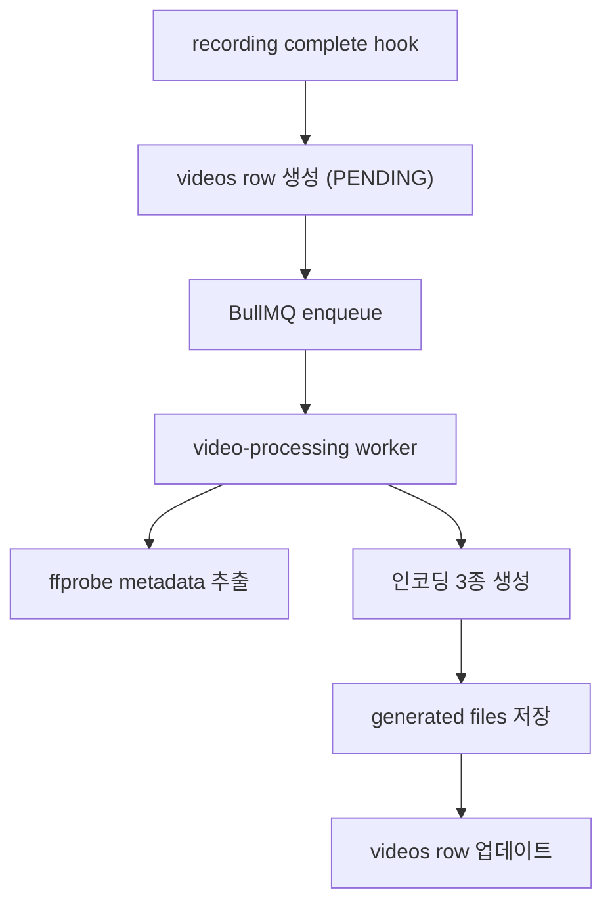
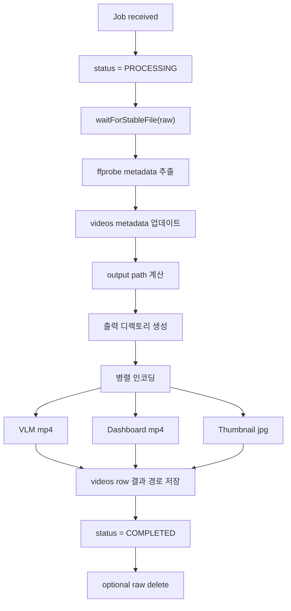

# EgoFlow Server Processing

이 문서는 현재 `ego-flow-server`의 video processing 파이프라인과 저장 구조를 정리한 문서다. worker 처리 단계, 상태 전이, 생성 파일 경로, target directory migration을 포함한다.

## 1. 처리 파이프라인 개요

recording complete webhook이 video row를 만들고 job을 enqueue하면 worker가 후처리를 수행한다.



## 2. Worker 처리 단계

worker는 job 하나를 아래 순서로 처리한다.



### 2.1 안정화 대기

worker는 raw file이 아직 쓰이는 중일 수 있으므로 `waitForStableFile()`로 파일 크기가 안정화될 때까지 잠시 대기한다.

### 2.2 메타데이터 추출

`ffprobe`로 다음 필드를 채운다.

- `durationSec`
- `resolutionWidth`
- `resolutionHeight`
- `fps`
- `codec`
- `recordedAt`

### 2.3 결과 파일 생성

worker는 아래 3종 파일을 병렬로 생성한다.

| 필드 | 설명 |
| --- | --- |
| `vlmVideoPath` | dataset/VLM 용도 mp4 |
| `dashboardVideoPath` | dashboard 재생용 mp4 |
| `thumbnailPath` | 썸네일 jpg |

## 3. Video 상태 전이

| 상태 | 의미 |
| --- | --- |
| `PENDING` | video row 생성 완료, worker 대기 중 |
| `PROCESSING` | 후처리 진행 중 |
| `COMPLETED` | 결과 파일 생성 및 DB 반영 완료 |
| `FAILED` | 후처리 실패, `errorMessage` 기록 |

Dashboard 상세 화면은 `PENDING` 또는 `PROCESSING`일 때 상태 API를 polling한다.

## 4. 생성 파일 저장 구조

현재 구현에서 generated dataset은 repository 기준 디렉토리 아래 저장된다.

```text
{TARGET_DIRECTORY}/{owner_id}/{repo_name}/
├── {video_uuid}.mp4
├── .dashboard/
│   └── {video_uuid}.mp4
└── .thumbnails/
    └── {video_uuid}.jpg
```

규칙:

- repository가 디렉토리 단위다
- owner와 repository name이 경로 namespace를 만든다
- 루트 mp4는 VLM 용도다
- dashboard/thumbnails는 숨김 디렉토리 아래 저장된다
- 파일명은 모두 `video_uuid` 기반이다

## 5. Raw recording과 generated file의 분리

### 5.1 Raw recording

```text
./data/raw/live/{repository_name}/{timestamp}
```

- MediaMTX가 직접 생성
- processing 입력 파일 역할
- `DELETE_RAW_AFTER_PROCESSING=true`이면 완료 후 삭제

### 5.2 Generated files

```text
{TARGET_DIRECTORY}/{owner_id}/{repo_name}/...
```

- worker가 생성
- dashboard 재생과 dataset export의 기준 파일
- backend `/files/*`를 통해 접근

## 6. DB 업데이트 내용

worker가 완료되면 `videos` row에 아래 값이 반영된다.

- `vlmVideoPath`
- `dashboardVideoPath`
- `thumbnailPath`
- `status`
- `processingCompletedAt`
- 앞서 추출한 메타데이터 필드

실패 시에는 아래를 기록한다.

- `status = FAILED`
- `errorMessage`
- `processingCompletedAt`

## 7. Target directory migration

backend 부팅 시 `initializeTargetDirectory()`가 `TARGET_DIRECTORY`와 DB의 `settings.target_directory`를 비교한다.

다를 경우 아래 작업을 수행한다.

1. 기존 generated file 디렉토리 내용을 새 경로로 이동
2. `videos` 테이블의 `vlmVideoPath`, `dashboardVideoPath`, `thumbnailPath`를 새 절대경로로 재작성
3. `settings.target_directory`를 새 값으로 저장

즉 generated dataset 경로는 런타임 API로 수정하는 구조가 아니라, 서버 재기동 시 migration되는 구조다.

## 8. Repository rename과 파일 경로

repository 이름이 바뀌면 repository 디렉토리 이름도 함께 바뀐다.

이때 backend는 다음을 수행한다.

1. active stream이 없는지 확인
2. repository 디렉토리 rename
3. 해당 repository에 속한 video row들의 managed path 재작성

## 9. Repository delete와 파일 정리

repository 삭제 시 backend는 다음 순서로 정리한다.

1. active stream 여부 확인
2. 관련 raw/generated file 삭제
3. `repo_members`, `videos`, `repository` DB row 삭제

즉 repository 삭제는 메타데이터 삭제만이 아니라 저장된 파일 정리까지 포함한다.

## 10. 분석 필드의 현재 상태

`videos` 테이블에는 아래 확장 필드가 존재한다.

- `clipSegments`
- `actionLabels`
- `videoTextAlignment`
- `sceneSummary`

현재 worker는 메타데이터 추출과 인코딩까지만 수행하며, 위 분석 필드를 채우는 별도 파이프라인은 구현되어 있지 않다.

## 11. 구현상 주의할 점

- job progress는 BullMQ job progress 값으로 관리된다.
- raw file이 아직 안정화되지 않은 상태면 worker가 잠시 대기한다.
- `DELETE_RAW_AFTER_PROCESSING`가 켜져 있으면 성공 후 raw file은 삭제되지만, 실패 시에는 남을 수 있다.
