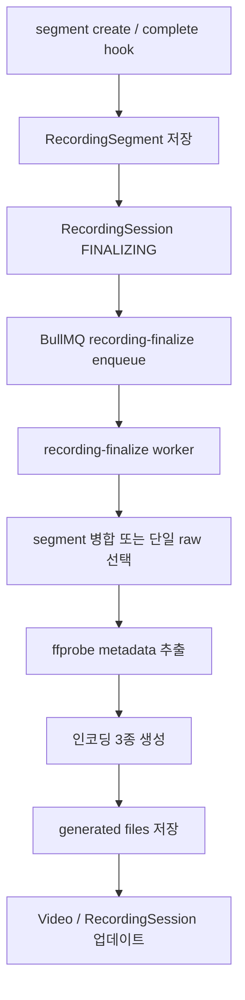
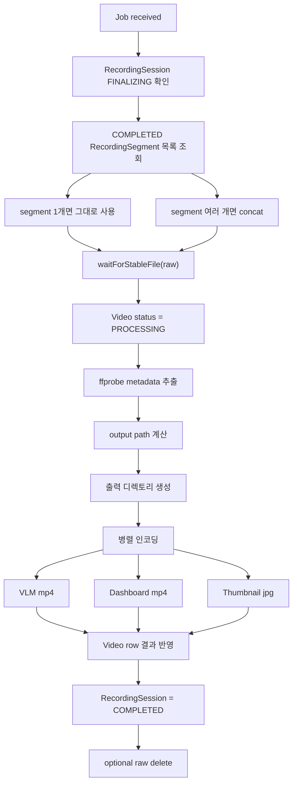

# EgoFlow Server Processing

이 문서는 현재 `ego-flow-server`의 recording finalize 파이프라인과 저장 구조를 정리한 문서다. 기준 단위는 `RecordingSession 1개 -> Video 1개`다.

## 1. 처리 파이프라인 개요

segment complete hook이 바로 `videos` row를 만들지 않는다. segment는 먼저 `RecordingSegment`로 저장되고, recording이 `FINALIZING` 상태가 되면 finalize job이 enqueue된다.



## 2. Worker 처리 단계

recording finalize worker는 job 하나를 아래 순서로 처리한다.



### 2.1 segment 병합

recording에 segment가 2개 이상이면 worker가 `ffmpeg concat`으로 임시 merged raw 파일을 만든 뒤 후처리한다.

### 2.2 메타데이터 추출

`ffprobe`로 다음 필드를 채운다.

- `durationSec`
- `resolutionWidth`
- `resolutionHeight`
- `fps`
- `codec`
- `recordedAt`

### 2.3 결과 파일 생성

worker는 아래 3종 파일을 병렬로 생성한다.

| 필드 | 설명 |
| --- | --- |
| `vlmVideoPath` | dataset/VLM 용도 mp4 |
| `dashboardVideoPath` | dashboard 재생용 mp4 |
| `thumbnailPath` | 썸네일 jpg |

## 3. 상태 전이

### 3.1 RecordingSession

| 상태 | 의미 |
| --- | --- |
| `PENDING` | register 완료, stream ready 전 |
| `STREAMING` | 송출 중 |
| `STOP_REQUESTED` | 사용자 종료 의도 수신 |
| `FINALIZING` | 실제 송출 종료 후 마지막 flush 대기 |
| `COMPLETED` | 최종 video 생성 완료 |
| `FAILED` | finalize 실패 |
| `ABORTED` | publish로 이어지지 못함 |

### 3.2 Video

| 상태 | 의미 |
| --- | --- |
| `PENDING` | finalize 대상 video row 준비 완료 |
| `PROCESSING` | 후처리 진행 중 |
| `COMPLETED` | 결과 파일 생성 및 DB 반영 완료 |
| `FAILED` | 후처리 실패, `errorMessage` 기록 |

Dashboard 상세 화면은 `Video.status`가 `PENDING` 또는 `PROCESSING`일 때 상태 API를 polling한다.

## 4. 생성 파일 저장 구조

현재 구현에서 generated dataset은 repository 기준 디렉토리 아래 저장된다.

```text
{TARGET_DIRECTORY}/{owner_id}/{repo_name}/
├── {video_uuid}.mp4
├── .dashboard/
│   └── {video_uuid}.mp4
└── .thumbnails/
    └── {video_uuid}.jpg
```

규칙:

- repository가 디렉토리 단위다
- owner와 repository name이 경로 namespace를 만든다
- 루트 mp4는 VLM 용도다
- dashboard/thumbnails는 숨김 디렉토리 아래 저장된다
- 파일명은 모두 `video_uuid` 기반이다

## 5. Raw recording과 generated file의 분리

### 5.1 Raw recording

```text
./data/raw/live/{repository_name}/{timestamp}
```

- MediaMTX가 직접 생성
- `RecordingSegment.rawPath`로 추적
- finalize 입력 파일 역할
- `DELETE_RAW_AFTER_PROCESSING=true`이면 성공 후 삭제

### 5.2 Generated files

```text
{TARGET_DIRECTORY}/{owner_id}/{repo_name}/...
```

- finalize worker가 생성
- dashboard 재생과 dataset export의 기준 파일
- backend `/files/*`를 통해 접근

## 6. DB 업데이트 내용

finalize worker는 다음을 반영한다.

- `Video.rawRecordingPath`
  - 단일 segment면 원본 raw path
  - 다중 segment면 merged raw path
- `Video.vlmVideoPath`
- `Video.dashboardVideoPath`
- `Video.thumbnailPath`
- `Video.status`
- `Video.processingStartedAt`
- `Video.processingCompletedAt`
- `Video` 메타데이터 필드
- `RecordingSession.status = COMPLETED`
- `RecordingSession.finalizedAt`

실패 시에는 아래를 기록한다.

- `Video.status = FAILED`
- `Video.errorMessage`
- `RecordingSession.status = FAILED`
- `RecordingSession.finalizedAt`

## 7. FINALIZING timeout 정책

recording은 `FINALIZING` 상태로 무기한 남지 않는다.

- completed segment가 끝내 0개면 30초 grace 이후 `FAILED`
- `WRITING` segment가 계속 남아 있으면 2분 max wait 이후 `FAILED`

이 timeout 판단은 reconcile loop와 `tryEnqueueFinalize()`가 함께 수행한다.

## 8. Target directory migration

backend 부팅 시 `initializeTargetDirectory()`가 `TARGET_DIRECTORY`와 DB의 `settings.target_directory`를 비교한다.

다를 경우 아래 작업을 수행한다.

1. 기존 generated file 디렉토리 내용을 새 경로로 이동
2. `videos` 테이블의 `vlmVideoPath`, `dashboardVideoPath`, `thumbnailPath`를 새 절대경로로 재작성
3. `settings.target_directory`를 새 값으로 저장

즉 generated dataset 경로는 런타임 API로 수정하는 구조가 아니라, 서버 재기동 시 migration되는 구조다.

운영상 주의:

- source와 destination이 nested 관계면 migration이 실패한다.
- destination에 이미 파일이 있으면 migration이 중단된다.
- production에서는 `TARGET_DIRECTORY` 변경 전 DB/filesystem backup이 필요하다.

## 9. Repository rename과 파일 경로

repository 이름이 바뀌면 repository 디렉토리 이름도 함께 바뀐다.

이때 backend는 다음을 수행한다.

1. active stream이 없는지 확인
2. repository 디렉토리 rename
3. 해당 repository에 속한 video row들의 managed path 재작성

## 10. Repository delete와 파일 정리

repository 삭제 시 backend는 다음 순서로 정리한다.

1. active stream 여부 확인
2. 관련 raw/generated file 삭제
3. `repo_members`, `videos`, `repository` DB row 삭제

즉 repository 삭제는 메타데이터 삭제만이 아니라 저장된 파일 정리까지 포함한다.

운영상 주의:

- repository rename/delete는 파일 시스템 변경을 동반하므로 data retention 정책과 함께 검토해야 한다.
- production에서는 active stream 여부뿐 아니라 backup 필요 여부도 함께 확인하는 편이 안전하다.

## 11. 구현상 주의할 점

- final video 생성 기준은 segment 하나가 아니라 recording 전체다
- raw file이 아직 안정화되지 않은 상태면 worker가 잠시 대기한다
- `DELETE_RAW_AFTER_PROCESSING`가 켜져 있으면 성공 후 raw file은 삭제되지만, 실패 시에는 남을 수 있다
