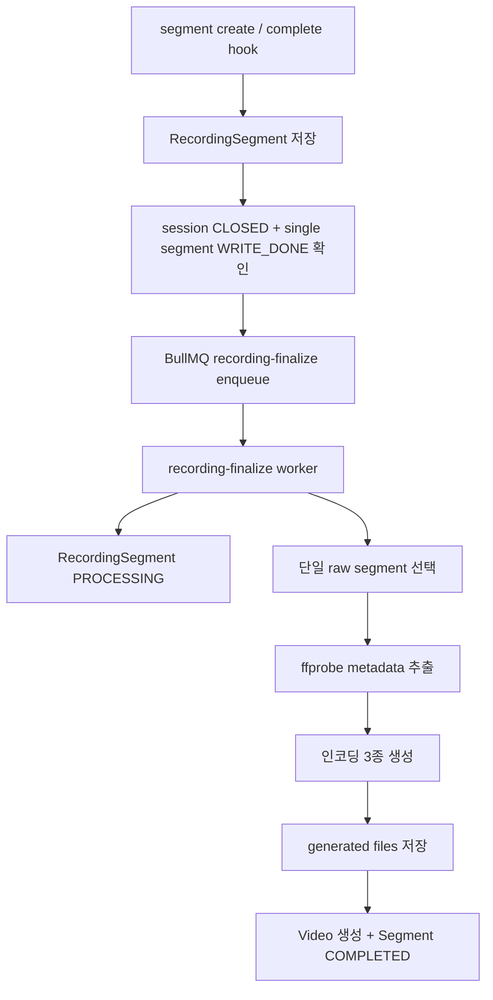
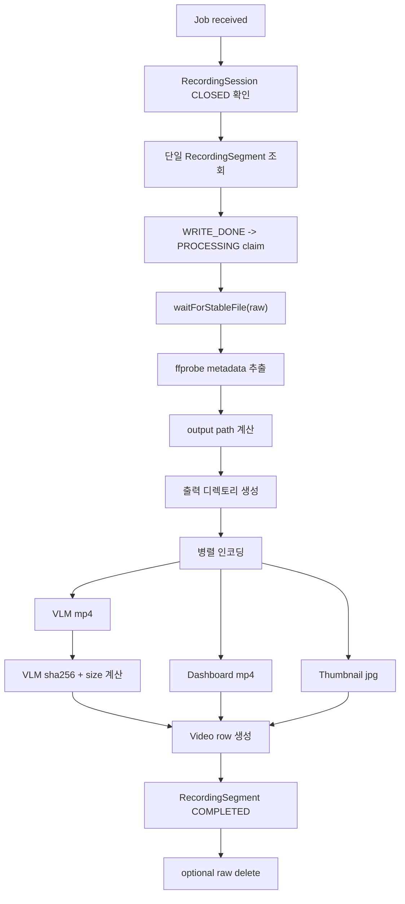

# EgoFlow Server Processing

이 문서는 현재 `ego-flow-server`의 recording finalize 파이프라인과 저장 구조를 정리한 문서다. 기준 단위는 `RecordingSession 1개 -> Video 1개`다.

## 1. 처리 파이프라인 개요

`stream-not-ready` hook은 publisher connection 종료를 확정하고 `RecordingSession`을 `CLOSED`로 닫는다. segment complete hook은 session에 귀속된 단일 raw segment 저장 완료를 확정한다. backend는 `RecordingSegment`를 `WRITE_DONE`으로 저장하고, session이 이미 `CLOSED`이며 단일 segment가 `WRITE_DONE`일 때 finalize job을 enqueue한다. worker는 `WRITE_DONE` segment만 `PROCESSING`으로 claim하고, 최종 video 생성이 끝나면 segment를 `COMPLETED`로 전환한다.



## 2. Worker 처리 단계

recording finalize worker는 job 하나를 아래 순서로 처리한다.



### 2.1 단일 segment 입력

recording session 하나는 raw segment 하나만 가진다. worker는 `RecordingSegment.rawPath`를 그대로 finalize 입력 파일로 사용하며, segment concat 경로는 사용하지 않는다. claim 전이는 `WRITE_DONE -> PROCESSING`만 허용한다. `PROCESSING`은 중복 enqueue 처리 대상이 아니라, claim 이후 worker retry가 발생했을 때 재개 가능한 상태로만 취급한다.

### 2.2 메타데이터 추출

`ffprobe`로 다음 필드를 채운다.

- `durationSec`
- `resolutionWidth`
- `resolutionHeight`
- `fps`
- `codec`
- `recordedAt`

`recordedAt`은 우선 ffprobe의 `creation_time`을 사용한다. 이 값이 없으면 finalize 시점에 `RecordingSession.readyAt`, 그것도 없으면 `RecordingSession.createdAt`으로 fallback 저장한다.

### 2.3 결과 파일 생성

worker는 아래 3종 파일을 병렬로 생성한다.

| 필드 | 설명 |
| --- | --- |
| `vlmVideoPath` | dataset/VLM 용도 mp4 |
| `dashboardVideoPath` | dashboard 재생용 mp4 |
| `thumbnailPath` | 썸네일 jpg |

VLM mp4가 생성된 뒤에는 추가 streaming pass 1회로 아래 메타데이터를 계산한다.

- `vlmSizeBytes`
- `vlmSha256`

이 계산은 dashboard mp4나 thumbnail에는 적용하지 않는다.

## 3. 상태 전이

### 3.1 RecordingSession

| 상태 | 의미 |
| --- | --- |
| `PENDING` | register 완료, stream ready 전 |
| `STREAMING` | 송출 중 |
| `CLOSED` | streaming session lifecycle 종료 |

### 3.2 RecordingSegment

| 상태 | 의미 |
| --- | --- |
| `WRITING` | MediaMTX가 raw segment 작성 중 |
| `WRITE_DONE` | raw segment 작성 완료, worker 처리 대기 |
| `PROCESSING` | worker가 후처리 중 |
| `COMPLETED` | 최종 video 생성에 반영 완료 |
| `FAILED` | worker 후처리 실패 |

### 3.3 Video

| 상태 | 의미 |
| --- | --- |
| `COMPLETED` | 최종 산출물 생성 완료 |
| `FAILED` | 최종 산출물 생성 실패, `errorMessage` 기록 |

## 4. 생성 파일 저장 구조

현재 구현에서 generated dataset은 repository 기준 디렉토리 아래 저장된다.

```text
{TARGET_DIRECTORY}/datasets/{owner_id}/{repo_name}/
├── {video_uuid}.mp4
├── .dashboard/
│   └── {video_uuid}.mp4
└── .thumbnails/
    └── {video_uuid}.jpg
```

규칙:

- repository가 디렉토리 단위다
- owner와 repository name이 경로 namespace를 만든다
- 루트 mp4는 VLM 용도다
- dashboard/thumbnails는 숨김 디렉토리 아래 저장된다
- 파일명은 모두 `video_uuid` 기반이다

## 5. Raw recording과 generated file의 분리

### 5.1 Raw recording

```text
{TARGET_DIRECTORY}/raw/live/{repository_name}/{recordingSessionId}/{timestamp}
```

- MediaMTX가 직접 생성
- `RecordingSegment.rawPath`로 추적
- finalize 입력 파일 역할
- `DELETE_RAW_AFTER_PROCESSING=true`이면 성공 후 삭제

### 5.2 Generated files

```text
{TARGET_DIRECTORY}/datasets/{owner_id}/{repo_name}/...
```

- finalize worker가 생성
- dashboard 재생과 dataset export의 기준 파일
- backend signed `/files/*`를 통해 접근

## 6. DB 업데이트 내용

finalize worker는 다음을 반영한다.

- `Video.rawRecordingPath`
  - 단일 `RecordingSegment.rawPath`
- `Video.vlmVideoPath`
- `Video.dashboardVideoPath`
- `Video.thumbnailPath`
- `Video.vlmSizeBytes`
- `Video.vlmSha256`
- `Video.status`
- `Video.processingStartedAt`
- `Video.processingCompletedAt`
- `Video` 메타데이터 필드
- 성공/실패 여부는 `Video.status`와 `Video.errorMessage`가 표현한다.
- 성공 시 처리 대상 `RecordingSegment.status = COMPLETED`

실패 시에는 아래를 기록한다.

- `Video.status = FAILED`
- `Video.errorMessage`
- 처리 대상 `RecordingSegment.status = FAILED`

## 7. Connection closure와 segment completion 정책

recording session 종료는 `stream-not-ready` hook 또는 reconcile loop가 담당한다. 이 단계에서 `RecordingSession.status = CLOSED`가 되고 live pointer가 정리된다.

segment complete는 session을 닫지 않는다. 단일 `RecordingSegment.status = WRITE_DONE`만 확정하고, 아래 조건이 만족될 때 finalize job을 enqueue한다.

- `RecordingSession.status = CLOSED`
- 단일 `RecordingSegment.status = WRITE_DONE`

`stream-not-ready` 이후에도 segment-complete hook이 오지 않아 `CLOSED + WRITING`으로 남은 경우 reconcile loop가 충분한 grace를 둔 뒤 raw file을 확인한다. non-empty이고 mtime이 안정된 파일은 `WRITE_DONE`으로 복구하고, 파일이 없거나 비어 있으면 `RecordingSegment.status = FAILED`와 `Video.status = FAILED`로 정리한다.

MediaMTX timeout에 의해 connection이 끊긴 경우도 같은 흐름을 탄다. app은 단일 streaming을 30분으로 제한하므로 정상 정책에서는 2시간 segment rollover를 사용하지 않는다.

## 8. Target directory migration

backend 부팅 시 `initializeTargetDirectory()`가 `{TARGET_DIRECTORY}/datasets`와 DB의 `settings.target_directory`를 비교한다.

현재 Docker 실행 경로에서는 `./scripts/run.sh up`도 backend 기동 전에 host 기준 data root를 준비한다. 스크립트는 마지막으로 성공적으로 사용한 host data root를 `.run/target-directory`에 기록하고, `TARGET_DIRECTORY`가 바뀌면 이 값을 source로 사용해 새 absolute target으로 먼저 옮긴다. `.run/target-directory` state가 없거나 비어 있으면 host data migration은 수행하지 않는다. 같은 filesystem이 아니거나 일부 bind-mount 디렉터리 권한 때문에 일반 `mv`가 실패하는 경우에는 Docker-assisted copy로 이어서 옮긴다. 이 migration은 managed 하위 디렉터리(`postgres`, `redis`, `raw`, `datasets`)를 만들기 전에 수행되며, destination에 이미 실제 데이터가 있으면 자동 이동을 건너뛴다.

다를 경우 아래 작업을 수행한다.

1. 기존 generated file 디렉토리 내용을 새 경로로 이동
2. `videos` 테이블의 `vlmVideoPath`, `dashboardVideoPath`, `thumbnailPath`를 새 절대경로로 재작성
3. `settings.target_directory`를 새 값으로 저장

즉 generated dataset 경로는 런타임 API로 수정하는 구조가 아니라, 서버 재기동 시 migration되는 구조다.

운영상 주의:

- source와 destination이 nested 관계면 migration이 실패한다.
- destination에 이미 파일이 있으면 migration이 중단된다.
- production에서는 `TARGET_DIRECTORY` 변경 전 DB/filesystem backup이 필요하다.

## 9. Repository rename과 파일 경로

repository 이름이 바뀌면 repository 디렉토리 이름도 함께 바뀐다.

이때 backend는 다음을 수행한다.

1. active stream이 없는지 확인
2. repository 디렉토리 rename
3. 해당 repository에 속한 video row들의 managed path 재작성

## 10. Repository delete와 파일 정리

repository 삭제 시 backend는 다음 순서로 정리한다.

1. active stream 여부 확인
2. 관련 raw/generated file 삭제
3. `repo_members`, `videos`, `repository` DB row 삭제

즉 repository 삭제는 메타데이터 삭제만이 아니라 저장된 파일 정리까지 포함한다.

운영상 주의:

- repository rename/delete는 파일 시스템 변경을 동반하므로 data retention 정책과 함께 검토해야 한다.
- production에서는 active stream 여부뿐 아니라 backup 필요 여부도 함께 확인하는 편이 안전하다.

## 11. 구현상 주의할 점

- final video 생성 기준은 segment 하나가 아니라 recording 전체다
- raw file이 아직 안정화되지 않은 상태면 worker가 잠시 대기한다
- `DELETE_RAW_AFTER_PROCESSING`가 켜져 있으면 성공 후 raw file은 삭제되지만, 실패 시에는 남을 수 있다
