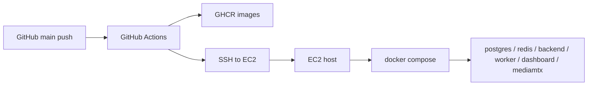

# EgoFlow Server Deploy

이 문서는 현재 `ego-flow-server`의 배포 방식을 정리한 문서다. 현재 프로젝트에는 두 가지 운영 경로가 있다.

- Local deployment: 개발자 로컬 머신에서 `ego-flow-server/scripts/dev.sh`로 Docker Compose 스택을 띄우는 방식
- Remote deployment: EC2 서버에 배포하는 방식. 실제 자산은 `ego-flow/deploy/ec2/` 아래에 있고, 현재는 GitHub Actions가 이를 사용해 배포한다

이 문서는 두 경로를 분리해서 설명하고, Docker 준비, SSH 접속, 파일 위치, 실행 순서까지 포함한다.

## 1. 배포 방식 요약

| 구분 | 목적 | 기준 자산 |
| --- | --- | --- |
| Local deployment | 개발/테스트/로컬 재현 | `ego-flow-server/docker-compose.yml`, `ego-flow-server/mediamtx.yml`, `ego-flow-server/scripts/dev.sh` |
| Remote deployment | 실제 운영 서버 배포 | `deploy/ec2/docker-compose.yml`, `deploy/ec2/mediamtx.yml`, `deploy/ec2/deploy.sh`, `.github/workflows/deploy-ec2.yml` |

## 2. Local Deployment

### 2.1 목적

local deployment는 개발자가 자신의 머신에서 전체 스택을 한 번에 올려서 기능을 확인하는 용도다.

올라오는 서비스:

- PostgreSQL
- Redis
- backend
- worker
- dashboard
- MediaMTX

### 2.2 사용 파일

| 파일 | 역할 |
| --- | --- |
| `ego-flow-server/scripts/dev.sh` | 로컬 실행용 진입 스크립트 |
| `ego-flow-server/docker-compose.yml` | 로컬 Compose 정의 |
| `ego-flow-server/mediamtx.yml` | 로컬 MediaMTX 설정 |

### 2.3 사전 준비

로컬 머신에 아래가 필요하다.

- Docker Engine 또는 Docker Desktop
- Docker Compose v2 plugin

Ubuntu 계열에서 Docker가 없다면 프로젝트는 `install-docker` helper를 제공한다.

```bash
cd ego-flow-server
./scripts/dev.sh install-docker
```

### 2.4 기본 실행 순서

```bash
cd ego-flow-server
./scripts/dev.sh doctor
./scripts/dev.sh up
```

`doctor`는 다음을 확인한다.

- `docker` 명령 존재 여부
- `docker compose` 사용 가능 여부
- compose file 존재 여부
- Docker daemon 접근 가능 여부

`up`는 다음을 수행한다.

1. prerequisites 확인
2. `docker compose up -d --build --remove-orphans`
3. `postgres`, `redis`, `backend`, `dashboard` health check 대기
4. `worker`, `mediamtx` running 상태 대기

### 2.5 로컬에서 확인할 주소

기본 포트 기준:

- Backend health: `http://127.0.0.1:3000/api/v1/health`
- Swagger UI: `http://127.0.0.1:3000/api-docs`
- OpenAPI JSON: `http://127.0.0.1:3000/api/v1/openapi.json`
- Dashboard: `http://127.0.0.1:8088`
- RTMP ingest: `rtmp://127.0.0.1:1935/live`
- HLS output: `http://127.0.0.1:8888`

### 2.6 로컬 운영 명령

```bash
./scripts/dev.sh ps
./scripts/dev.sh logs {service}
./scripts/dev.sh logs backend
./scripts/dev.sh down
./scripts/dev.sh reset
```

각 명령의 의미:

- `ps`: 서비스 상태 확인
- `logs [service]`: 전체 또는 특정 서비스 로그 추적
- `down`: 컨테이너 종료 및 제거
- `reset`: 컨테이너/볼륨 삭제 후 `data/redis` bind mount 정리

### 2.7 로컬 저장 경로

로컬에서는 프로젝트 작업 디렉토리 아래가 그대로 사용된다.

- `ego-flow-server/data/raw`
- `ego-flow-server/data/datasets`
- `ego-flow-server/data/redis`

PostgreSQL은 named volume을 사용한다.

### 2.8 로컬 Compose의 특징

- backend와 worker는 로컬 소스에서 Docker image를 build한다
- backend는 시작할 때 migration과 seed를 수행한다
- dashboard도 로컬 frontend 소스에서 build된다
- MediaMTX는 `host.docker.internal:3000`을 통해 backend auth/webhook에 연결된다

### 2.9 로컬에서 자주 보는 문제

#### Docker daemon 접근 불가

`./scripts/dev.sh doctor`에서 실패하면 Docker가 꺼져 있거나 현재 사용자 권한이 부족할 수 있다.

Linux에서는 보통 다음이 필요하다.

```bash
sudo systemctl enable --now docker
sudo usermod -aG docker $USER
```

그 후 터미널 세션을 다시 열어야 한다.

#### 포트 충돌

다른 프로세스가 `3000`, `8088`, `1935`, `8888`, `5432`, `6379`를 사용 중이면 Compose가 실패할 수 있다.

#### RTMP publish가 안 됨

app에서 RTMP 송출 전에 반드시 backend에 stream 등록을 먼저 해야 한다.

## 3. Remote Deployment

### 3.1 목적

remote deployment는 실제 운영용 EC2 서버에 backend, worker, dashboard, MediaMTX를 띄우는 방식이다.

현재 구현은 Docker image를 EC2에서 build하지 않고, GitHub Actions가 GHCR에 push한 image를 EC2에서 pull해서 실행하는 구조다.

### 3.2 사용 파일

| 파일 | 역할 |
| --- | --- |
| `deploy/ec2/docker-compose.yml` | 운영 서버용 Compose 정의 |
| `deploy/ec2/mediamtx.yml` | 운영 서버용 MediaMTX 설정 |
| `deploy/ec2/deploy.sh` | EC2에서 실제 pull/up 수행 |
| `.github/workflows/deploy-ec2.yml` | GitHub Actions 자동 배포 workflow |
| `deploy/ec2/.env.prod` | 운영용 환경 변수 파일. workflow가 렌더링 후 업로드 |

### 3.3 현재 운영 구조



핵심 아이디어:

1. GitHub Actions가 backend/dashboard 이미지를 build
2. GHCR에 push
3. EC2에 SSH 접속
4. `.env.prod` 업로드
5. EC2에서 `deploy/ec2/deploy.sh` 실행

### 3.4 EC2 서버 전제 조건

현재 배포 스크립트가 기대하는 조건은 다음과 같다.

- EC2에 Docker가 설치되어 있어야 함
- deploy 사용자로 Docker를 실행할 수 있어야 함
- 서버에 저장소가 이미 clone되어 있어야 함
- 저장소 위치: `/opt/egoflow/repo`
- persistent data root: `/opt/egoflow/data`

즉 EC2는 빈 서버에 즉석 배포하는 방식이 아니라, 1회 초기 세팅된 서버를 계속 업데이트하는 방식이다.

### 3.5 EC2 디렉토리 구조

운영 서버에서 중요한 경로는 다음이다.

```text
/opt/egoflow/
├── repo/                 # 이 Git 저장소 clone
│   └── deploy/ec2/
│       ├── docker-compose.yml
│       ├── mediamtx.yml
│       ├── deploy.sh
│       └── .env.prod
└── data/
    ├── postgres/
    ├── redis/
    ├── raw/
    └── datasets/
```

### 3.6 SSH 접속 방식

GitHub Actions는 `EC2_SSH_KEY` secret으로 SSH private key를 받아 접속한다.

수동 접속 시에는 일반적으로 아래 형태가 된다.

```bash
ssh -i ~/.ssh/<your-key>.pem <EC2_USER>@<EC2_HOST>
```

또는 이미 `~/.ssh/config`를 잡아뒀다면:

```bash
ssh <host-alias>
```

SSH로 접속해서 가장 먼저 확인할 것:

```bash
whoami
docker ps
cd /opt/egoflow/repo
git status
```

### 3.7 운영용 환경 변수 파일 `.env.prod`

workflow는 `deploy/ec2/.env.prod`를 렌더링해 EC2로 업로드한다. 현재 실제로 들어가는 값은 아래와 같다.

| 변수 | 의미 |
| --- | --- |
| `POSTGRES_USER` | PostgreSQL 사용자 |
| `POSTGRES_PASSWORD` | PostgreSQL 비밀번호 |
| `POSTGRES_DB` | PostgreSQL DB 이름 |
| `JWT_SECRET` | JWT 서명 키 |
| `ADMIN_DEFAULT_PASSWORD` | 최초 admin 비밀번호 |
| `CORS_ORIGIN` | backend CORS 허용 origin |
| `PUBLIC_RTMP_BASE_URL` | 외부 클라이언트가 사용할 RTMP base URL |
| `PUBLIC_HLS_BASE_URL` | 외부 클라이언트가 사용할 HLS base URL |
| `WORKER_CONCURRENCY` | worker 동시 처리 수 |
| `DELETE_RAW_AFTER_PROCESSING` | raw 삭제 여부 |
| `BACKEND_IMAGE` | GHCR backend image tag |
| `DASHBOARD_IMAGE` | GHCR dashboard image tag |
| `DATA_ROOT` | 운영 데이터 루트. 현재 `/opt/egoflow/data` |

이 값들은 모두 GitHub Secrets에서만 오는 것은 아니다. 현재 workflow 기준 출처는 아래처럼 나뉜다.

#### GitHub Secrets에서 오는 값

| 항목 | source |
| --- | --- |
| `POSTGRES_PASSWORD` | `secrets.POSTGRES_PASSWORD` |
| `JWT_SECRET` | `secrets.JWT_SECRET` |
| `ADMIN_DEFAULT_PASSWORD` | `secrets.ADMIN_DEFAULT_PASSWORD` |

#### GitHub Variables에서 오는 값

| 항목 | source |
| --- | --- |
| `CORS_ORIGIN` | `vars.CORS_ORIGIN` |
| `PUBLIC_RTMP_BASE_URL` | `vars.PUBLIC_RTMP_BASE_URL` |
| `PUBLIC_HLS_BASE_URL` | `vars.PUBLIC_HLS_BASE_URL` |
| `WORKER_CONCURRENCY` | `vars.WORKER_CONCURRENCY` 또는 기본값 `2` |
| `DELETE_RAW_AFTER_PROCESSING` | `vars.DELETE_RAW_AFTER_PROCESSING` 또는 기본값 `true` |

#### Workflow 내부에서 고정 또는 계산되는 값

| 항목 | source |
| --- | --- |
| `POSTGRES_USER` | workflow에서 고정값 `postgres` |
| `POSTGRES_DB` | workflow에서 고정값 `egoflow` |
| `BACKEND_IMAGE` | workflow env의 `ghcr.io/${{ github.repository_owner }}/ego-flow-backend:main` |
| `DASHBOARD_IMAGE` | workflow env의 `ghcr.io/${{ github.repository_owner }}/ego-flow-dashboard:main` |
| `DATA_ROOT` | workflow에서 고정값 `/opt/egoflow/data` |

일부 값은 GitHub Secrets에 등록되어 있지만, `.env.prod` 전체가 Secrets만으로 구성되지는 않는다.

### 3.8 운영 Compose의 특징

local과 달리 remote deployment는 source build가 아니라 image pull 기반이다.

차이점:

- backend: `${BACKEND_IMAGE}`
- worker: `${BACKEND_IMAGE}`
- dashboard: `${DASHBOARD_IMAGE}`
- persistent volume은 `${DATA_ROOT}` 아래 host path를 직접 사용
- MediaMTX는 `backend:3000`을 내부 DNS로 참조

즉 운영 서버에서는 GHCR image가 핵심 배포 단위다.

#### remote deployment에서 실제로 build되는 것과 build되지 않는 것

현재 운영 배포에서 GitHub Actions가 build해서 GHCR에 push하는 것은 두 개뿐이다.

- backend image (backend)
- dashboard image (frontend)

반면 아래 서비스는 EC2에서 source build를 하지 않는다.

- `postgres`: `postgres:16-alpine` 공식 image 사용
- `redis`: `redis:7-alpine` 공식 image 사용
- `mediamtx`: `bluenviron/mediamtx:latest-ffmpeg` 공식 image 사용

즉 remote deployment는 "모든 서비스를 함께 build"하는 방식이 아니다.

- backend, dashboard: GitHub Actions에서 build 후 GHCR push
- postgres, redis, mediamtx: compose가 지정한 공개 image를 그대로 pull해서 사용
- worker: 별도 image를 build하지 않고 backend image를 재사용

### 3.9 GitHub Actions 자동 배포 순서

현재 workflow `.github/workflows/deploy-ec2.yml`의 동작은 다음 순서다.

1. `main` 브랜치 push 감지
2. repository checkout
3. GHCR 로그인
4. backend image build 후 GHCR push
5. dashboard image build 후 GHCR push
6. SSH key 설정 및 `known_hosts` 등록
7. `deploy/ec2/.env.prod` 생성
8. EC2에 SSH 접속해서 `/opt/egoflow/repo` 최신화
9. `.env.prod`를 EC2로 업로드
10. EC2에서 `deploy/ec2/deploy.sh` 실행

### 3.10 `deploy.sh`가 하는 일

EC2에서 `deploy/ec2/deploy.sh`는 다음을 수행한다.

1. `docker`, `git` 명령 존재 여부 확인
2. `deploy/ec2/.env.prod` 존재 여부 확인
3. `/opt/egoflow/data/raw`, `/opt/egoflow/data/datasets`, `/opt/egoflow/data/redis`, `/opt/egoflow/data/postgres` 생성
4. 필요하면 GHCR 로그인
5. `docker compose --env-file .env.prod -f deploy/ec2/docker-compose.yml pull`
6. `docker compose --env-file .env.prod -f deploy/ec2/docker-compose.yml up -d --remove-orphans`
7. 오래된 image prune

즉 deploy script는 "운영 파일 준비 + 최신 image pull + stack 재기동" 역할이다.

### 3.11 수동 원격 배포 방법

GitHub Actions 없이 수동으로도 동일 흐름을 수행할 수 있다.

#### 1. EC2 접속

```bash
ssh -i ~/.ssh/<your-key>.pem <EC2_USER>@<EC2_HOST>
```

#### 2. 저장소 최신화

```bash
cd /opt/egoflow/repo
git fetch origin main
git checkout main
git pull --ff-only origin main
```

#### 3. 운영 env 파일 준비

서버에 `deploy/ec2/.env.prod`가 없으면 만들어야 한다.

예시:

```dotenv
POSTGRES_USER=postgres
POSTGRES_PASSWORD=...
POSTGRES_DB=egoflow
JWT_SECRET=...
ADMIN_DEFAULT_PASSWORD=...
CORS_ORIGIN=https://<your-dashboard-origin>
PUBLIC_RTMP_BASE_URL=rtmp://<your-domain-or-ip>:1935/live
PUBLIC_HLS_BASE_URL=http://<your-domain-or-ip>:8888
WORKER_CONCURRENCY=2
DELETE_RAW_AFTER_PROCESSING=true
BACKEND_IMAGE=ghcr.io/<owner>/ego-flow-backend:main
DASHBOARD_IMAGE=ghcr.io/<owner>/ego-flow-dashboard:main
DATA_ROOT=/opt/egoflow/data
```

#### 4. GHCR 로그인

private package를 pull하려면 GHCR read token이 필요할 수 있다.

```bash
echo "$GHCR_READ_TOKEN" | docker login ghcr.io -u "$GHCR_USERNAME" --password-stdin
```

#### 5. deploy script 실행

```bash
cd /opt/egoflow/repo
chmod +x deploy/ec2/deploy.sh
GHCR_USERNAME="$GHCR_USERNAME" GHCR_TOKEN="$GHCR_READ_TOKEN" deploy/ec2/deploy.sh
```

### 3.12 수동 점검 명령

운영 서버에서 배포 직후 자주 쓰는 확인 명령:

```bash
cd /opt/egoflow/repo
docker compose --env-file deploy/ec2/.env.prod -f deploy/ec2/docker-compose.yml ps
docker compose --env-file deploy/ec2/.env.prod -f deploy/ec2/docker-compose.yml logs -f backend
docker compose --env-file deploy/ec2/.env.prod -f deploy/ec2/docker-compose.yml logs -f worker
docker compose --env-file deploy/ec2/.env.prod -f deploy/ec2/docker-compose.yml logs -f dashboard
```

HTTP 확인:

- backend health: `http://<EC2_HOST>:3000/api/v1/health`
- Swagger UI: `http://<EC2_HOST>:3000/api-docs`
- dashboard: `http://<EC2_HOST>:8088`
- HLS: `http://<EC2_HOST>:8888`
- RTMP: `rtmp://<EC2_HOST>:1935/live`

### 3.13 보안과 운영상 주의점

#### SSH key

- private key는 GitHub Secret 또는 운영자의 로컬 보안 저장소에만 둔다
- EC2 서버에 private key를 남기지 않는 편이 좋다

#### Docker 권한

- deploy user가 `docker` 그룹에 있어야 root 없이 deploy가 가능하다
- 그렇지 않으면 script 실행마다 `sudo`가 필요해진다

#### GHCR 인증

- EC2에서 private image를 pull할 수 있어야 한다
- `GHCR_USERNAME`, `GHCR_READ_TOKEN`은 read 권한이 맞아야 한다

#### 퍼블릭 포트

운영 Compose는 아래 포트를 외부로 연다.

- `3000` backend
- `8088` dashboard
- `1935` RTMP
- `8888` HLS

EC2 security group과 방화벽에서 이 포트들이 실제로 허용되어야 한다.

### 3.14 local과 remote의 핵심 차이

| 항목 | Local | Remote |
| --- | --- | --- |
| 이미지 소스 | 로컬 build | GHCR pull |
| 데이터 경로 | 프로젝트 내부 `data/` | `/opt/egoflow/data` |
| 실행 진입점 | `./scripts/dev.sh` | `deploy/ec2/deploy.sh` |
| MediaMTX backend 연결 | `host.docker.internal:3000` | `backend:3000` |
| 대상 | 개발자 머신 | EC2 운영 서버 |

## 4. 권장 확인 순서

### Local

1. `./scripts/dev.sh doctor`
2. `./scripts/dev.sh up`
3. `http://127.0.0.1:3000/api/v1/health`
4. `http://127.0.0.1:3000/api-docs`
5. `http://127.0.0.1:8088`

### Remote

1. EC2 SSH 접속
2. `/opt/egoflow/repo` 위치 확인
3. `deploy/ec2/.env.prod` 확인
4. `deploy/ec2/deploy.sh` 실행 또는 GitHub Actions 실행 여부 확인
5. compose `ps` 및 `logs` 확인
6. health/dashboard/HLS/RTMP 엔드포인트 확인
