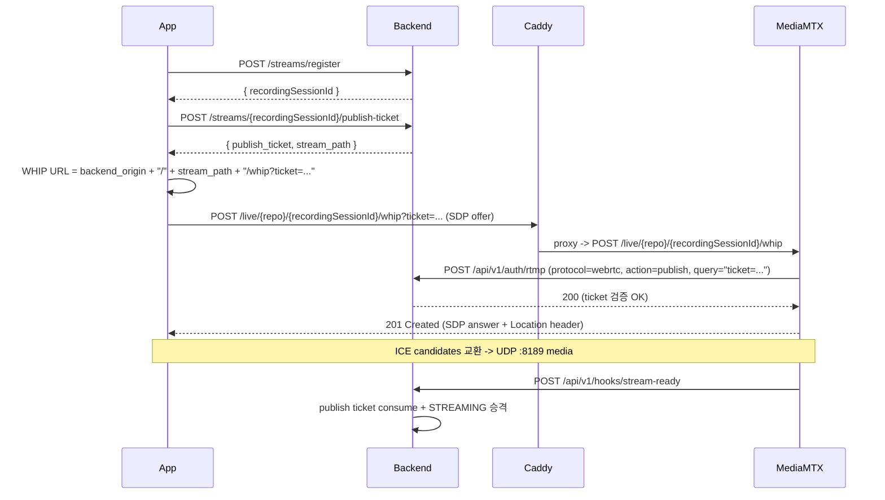
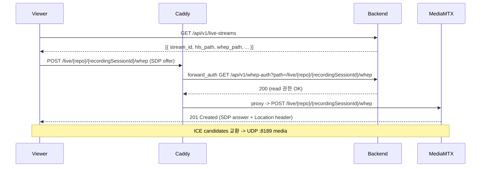

# EgoFlow Server HTTP Streaming (WHIP / WHEP)

이 문서는 `ego-flow-server`에 추가된 **HTTP 기반 스트리밍 경로**를 정리한 문서다.
기존 RTMP publish + HLS playback 흐름은 [`09. project_streaming.md`](./09.%20project_streaming.md)를 그대로 따르고, 이 문서는 그 위에 얹힌 **WebRTC over HTTP** 경로만 다룬다.

요약:

- Publish: **WHIP** (WebRTC-HTTP Ingestion Protocol) — RTMP의 대체 경로로 같은 ticket를 그대로 사용한다.
- Playback: **WHEP** (WebRTC-HTTP Egress Protocol) — HLS의 대체 경로로 같은 forward_auth gate 패턴을 따른다.

RecordingSession 모델, publish ticket, hook lifecycle, finalize 흐름은 RTMP와 완전히 동일하다.
달라지는 것은 **transport와 ingress URL**뿐이다.

## 1. 구조 개요

```mermaid
flowchart LR
    App["EgoFlow App"] -->|POST /streams/register| Backend["Backend"]
    App -->|POST /streams/.../publish-ticket| Backend
    App -->|WHIP POST /live/{repo}/{recordingSessionId}/whip?ticket=...| Caddy
    Viewer["Dashboard / Python"] -->|WHEP /live/{repo}/{recordingSessionId}/whep| Caddy
    Caddy -->|proxy native /live/{repo}/{recordingSessionId}/whip| MediaMTX
    Caddy -->|forward_auth /api/v1/whep-auth| Backend
    Caddy -->|proxy native /live/{repo}/{recordingSessionId}/whep| MediaMTX
    MediaMTX -->|HTTP auth /api/v1/auth/rtmp| Backend
    MediaMTX -->|hooks: stream-ready / segment-*| Backend
    MediaMTX -->|record fMP4| Raw["/data/raw"]
```

핵심 분리:

- **WHIP signaling**: Caddy → MediaMTX `:8889` (TCP).
- **WHIP media**: 클라이언트 ↔ MediaMTX UDP `:8189` (혹은 STUN 우회 후 direct).
- **WHEP signaling/media**: signaling은 Caddy → MediaMTX `:8889`, media는 WHIP과 동일한 UDP 경로.
- **STUN**: `stun:stun.l.google.com:19302` (public). 사내망 운영으로 옮길 경우 별도 STUN/TURN 지정 필요.

## 2. Network ports

| Port | Protocol | 노출 위치 | 용도 |
| --- | --- | --- | --- |
| `1935` | TCP | host | RTMP publish (기존) |
| `1936` | TCP | host | RTMPS publish (기존, optional) |
| `80/443` | TCP | host (Caddy) | HLS / WHIP / WHEP / API |
| `8189` | **UDP** | host | WebRTC ICE media |
| `8888` | TCP | internal only | MediaMTX HLS |
| `8889` | TCP | internal only | MediaMTX WebRTC signaling |
| `9997` | TCP | internal only | MediaMTX control API |

새로 열린 것은 **UDP 8189** 하나다. 방화벽/SG 변경 시 이 포트를 inbound로 허용해야 NAT 뒤의 모바일/글래스 클라이언트가 ICE를 성공시킬 수 있다.

## 3. Publish (WHIP)

### 3.1 클라이언트 흐름



### 3.2 publish-ticket 응답

`POST /api/v1/streams/{recordingSessionId}/publish-ticket` 응답은 publish에 필요한 최소 식별자와 ticket만 반환한다.

```json
{
  "stream_path": "live/myrepo/2b42c60f-8e94-4c85-933f-182c6496e620",
  "publish_ticket": "opaque-ticket"
}
```

- 같은 ticket로 RTMP 또는 WHIP 중 **하나만** 골라 publish하면 된다. ticket은 `stream-ready`에서 consume되며 재사용할 수 없다.
- 별도 publish heartbeat endpoint는 없다. publish-ticket은 stream path에 묶인 짧은 TTL의 일회성 인증 값이다.
- WHIP endpoint는 app이 `backend_origin + "/" + stream_path + "/whip?ticket=" + encodeURIComponent(publish_ticket)`로 조립한다.
- MediaMTX가 `Location: /live/{repo}/{recordingSessionId}/whip/{sessionId}`를 반환하므로, 클라이언트의 후속 `PATCH`/`DELETE`도 같은 public path로 동작한다.

### 3.3 인증

- MediaMTX `authHTTPAddress`는 RTMP/WebRTC 구분 없이 동일한 `POST /api/v1/auth/rtmp`를 호출하고 `protocol` 필드만 다르다.
- backend는 `query`에서 `ticket=`만 보고 ticket id를 추출해 publish ticket을 검증한다.
- ticket query 외의 legacy credential(`password`, `token`, `pass`)은 RTMP와 동일하게 거부된다.

### 3.4 고정 포트

MediaMTX WebRTC signaling port는 internal `8889`로 고정이고, ICE UDP port는 host `8189/udp`로 고정 expose한다.

## 4. Playback (WHEP)

### 4.1 클라이언트 흐름



### 4.2 live-streams 응답 변화

`GET /api/v1/live-streams` 응답의 각 항목에 `whep_path`가 추가된다. 기존 `hls_path`는 그대로 유지된다.

```json
{
  "stream_id": "...",
  "repository_id": "...",
  "repository_name": "myrepo",
  "owner_id": "...",
  "user_id": "...",
  "device_type": null,
  "registered_at": "...",
  "status": "live",
  "hls_path": "/hls/live/myrepo/2b42c60f-8e94-4c85-933f-182c6496e620/index.m3u8",
  "whep_path": "/live/myrepo/2b42c60f-8e94-4c85-933f-182c6496e620/whep"
}
```

dashboard/Python/app 모두 같은 응답을 받고, viewer가 선호하는 protocol을 선택해 재생하면 된다. 둘 중 하나만 써도 되고, 둘 다 동시에 띄워도 무방하다 (MediaMTX는 동일 source를 여러 reader로 fan-out 한다).
WHEP endpoint도 MediaMTX native path(`/live/{repo}/{recordingSessionId}/whep`)를 그대로 노출한다. MediaMTX가 `Location: /live/{repo}/{recordingSessionId}/whep/{sessionId}`를 반환하므로, 클라이언트의 후속 `PATCH`/`DELETE`도 같은 public path로 동작한다.

### 4.3 인증

- WHEP gate는 HLS gate와 1:1로 같은 패턴이다.
- Caddy가 `/live/{repo}/{recordingSessionId}/whep`와 `/live/{repo}/{recordingSessionId}/whep/{sessionId}` 요청에 대해 backend `GET /api/v1/whep-auth?path=...`를 forward_auth subrequest로 호출한다.
- `whepAuthService.authorize()`는 다음 순서로 동작한다.
  1. path에서 repository name과 stream path 추출 (`/live/{repo}/{recordingSessionId}/whep` 또는 `/live/{repo}/{recordingSessionId}/whep/{sessionId}`)
  2. `sha256(rawCredential)` × `streamPath`로 `whepauth:{hash}:{streamPath}` cache key 계산
  3. cache hit면 즉시 allow
  4. miss면 `streamService.findLiveSessionByStreamPath("live/{repo}/{recordingSessionId}")`로 활성 session 확인
  5. `repositoryService.getRepositoryAccess()`로 read 권한 확인
  6. 성공 시 30초 TTL로 cache 저장 후 200

`requireDashboardOrAppOrPython` 인증 자체가 실패하면 401, 인증은 됐지만 stream/권한 문제면 **404**로 통일 (HLS와 동일하게 존재 여부를 숨김).

### 4.4 MediaMTX auth 우회

`mediamtx.yml`의 `authHTTPExclude`는 그대로다.

```yaml
authHTTPExclude:
  - action: read
  - action: playback
```

WebRTC read도 `action: read`/`action: playback`에 해당되므로 MediaMTX는 backend를 호출하지 않고 바로 응답한다. Caddy forward_auth가 유일한 gate다.

### 4.5 URL 조립

WHEP 응답은 origin-relative `/live/{repo}/{recordingSessionId}/whep` path를 사용한다. 클라이언트는 dashboard/backend origin 기준으로 resolve한다.

## 5. MediaMTX 설정

`mediamtx.yml`에 새로 추가된 항목:

```yaml
webrtc: yes
webrtcAddress: :8889
webrtcLocalUDPAddress: :8189
webrtcICEServers2:
  - url: stun:stun.l.google.com:19302
```

- `webrtcAddress`는 signaling(TCP). Caddy `mediamtx:8889`로 internal proxy.
- `webrtcLocalUDPAddress`는 ICE media listener. host에 `8189/udp`로 expose 되어 있어야 NAT 뒤 클라이언트가 STUN 도움으로 reach 가능.
- public TURN이 필요한 환경(대칭형 NAT, 모바일 캐리어 등)에서는 `webrtcICEServers2`에 TURN 항목을 추가해야 한다.

## 6. Compose / Caddy 변경 요약

`compose.yml` (mediamtx 서비스):

```yaml
ports:
  - "1935:1935"
  - "1936:1936"
  - "8189:8189/udp"
```

`Caddyfile`:

```caddyfile
@whip path_regexp whip ^/live/[^/]+/[^/]+/whip(?:/.*)?$
handle @whip {
    reverse_proxy mediamtx:8889
}

@whep path_regexp whep ^/live/[^/]+/[^/]+/whep(?:/.*)?$
handle @whep {
    forward_auth backend:3000 {
        uri /api/v1/whep-auth?path={http.request.orig_uri.path}
        copy_headers Cookie Authorization
    }
    reverse_proxy mediamtx:8889
}
```

## 7. RTMP / WHIP 운영 정책

- 클라이언트는 환경에 따라 RTMP 또는 WHIP 중 **하나만 선택**해 사용한다 (예: 글래스 = RTMP, 모바일 = WHIP).
- publish-ticket은 protocol-agnostic이지만 일회성이다. 먼저 `stream-ready`에 도달한 publish가 ticket을 consume한다.
- repository 단위 동시 stream은 허용되며, 각 RecordingSession은 `live/{repositoryName}/{recordingSessionId}`처럼 고유 stream path를 사용한다.

## 8. 운영 로그 / 디버깅 포인트

- WHIP publish 거부: 기존 RTMP와 동일하게 `[rtmp-auth] denied` prefix가 남는다 (`protocol: "webrtc"` 필드로 구분).
- WHEP gate 실패: backend access log에서 `GET /api/v1/whep-auth` 404 응답을 확인.
- ICE 실패: MediaMTX 컨테이너 로그에서 `webrtc` 관련 메시지를 본다. UDP 8189가 host로 열려 있는지, STUN reachable한지가 가장 흔한 원인.

## 9. Known Limitations

- WebRTC media는 UDP 8189를 host에 expose하는 구성만 검증되어 있다. ICE-TCP fallback은 현재 활성화되어 있지 않다 (`webrtcLocalTCPAddress` 미설정).
- public TURN은 제공하지 않는다. 대칭형 NAT 환경에서는 별도 TURN을 `webrtcICEServers2`에 추가하는 운영 작업이 필요하다.
- WHIP publish URL은 server가 advertise하지 않는다. 클라이언트는 자신이 사용하는 backend origin을 기준으로 URL을 조립한다.
- ticket scope는 protocol-agnostic이지만, 한 RecordingSession 당 동시에 둘 이상의 protocol에서 publish하는 시나리오는 지원하지 않는다. ticket consume 이후 다른 protocol에서 같은 ticket을 재사용할 수 없다.

## 10. 추가 운영 정리: ICE public host 설정

현재 compose 구성은 MediaMTX 컨테이너의 UDP `8189`를 host에 publish한다.
하지만 Docker/NAT/방화벽 뒤에서 운영할 때는 포트 publish만으로 충분하지 않을 수 있다.
WebRTC handshake 과정에서 MediaMTX가 클라이언트에게 ICE candidate를 전달하는데, 이 candidate에 컨테이너 내부 IP나 외부에서 접근할 수 없는 LAN IP가 들어가면 클라이언트는 signaling에는 성공해도 media peer connection을 맺지 못한다.

운영 환경에서는 `mediamtx.yml`에 public DNS 또는 public IP를 `webrtcAdditionalHosts`로 명시하는 구성을 권장한다.

```yaml
webrtcAdditionalHosts:
  - stream.example.com
  # 또는 public IP
  # - 203.0.113.10
```

이 값은 클라이언트가 UDP `8189`로 접근할 수 있는 host여야 한다.
같은 서버를 내부망과 외부망에서 모두 쓰는 경우에는 LAN IP와 public DNS/IP를 함께 둘 수 있다.

```yaml
webrtcAdditionalHosts:
  - 192.168.0.10
  - stream.example.com
```

배포 체크리스트:

1. app의 backend origin은 클라이언트가 접근하는 실제 HTTP/HTTPS origin이어야 한다. 예: `https://stream.example.com`
2. host UDP `8189` inbound를 방화벽/보안 그룹에서 허용한다.
3. `webrtcAdditionalHosts`에는 클라이언트가 실제로 도달 가능한 DNS/IP를 넣는다.
4. 모바일 캐리어망/대칭형 NAT에서 여전히 실패하면 TURN 서버를 `webrtcICEServers2`에 추가한다.

증상별 판단:

- WHIP/WHEP `POST`가 201을 반환하지만 영상이 안 붙는다: ICE candidate host 문제 또는 UDP 차단 가능성이 높다.
- MediaMTX 로그에 WebRTC session은 생기지만 곧 종료된다: UDP `8189` reachability와 `webrtcAdditionalHosts`를 먼저 확인한다.
- 특정 네트워크에서만 실패한다: 해당 네트워크가 UDP를 막거나 대칭형 NAT일 수 있으므로 TURN이 필요할 수 있다.
