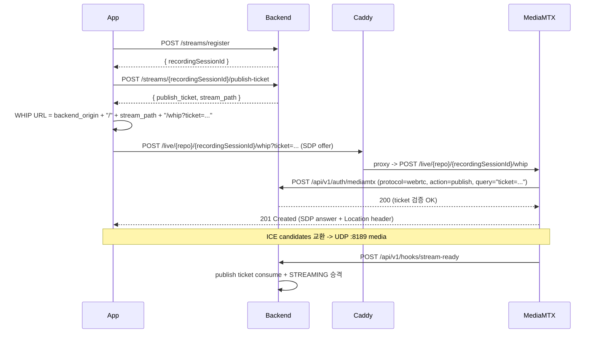

# EgoFlow Server HTTP Streaming

이 문서는 `ego-flow-server`의 **HTTP 기반 publish 경로**를 정리한 문서다.
기존 RTMP publish + HLS playback 흐름은 [`09. project_streaming.md`](./09.%20project_streaming.md)를 그대로 따르고, 이 문서는 그 위에 얹힌 두 가지 HTTP 계열 ingest를 다룬다.

요약:

- Publish: **WHIP** — MediaMTX를 거치는 WebRTC publish 경로로, RTMP와 같은 publish ticket를 사용한다.
- Upload: **HTTP chunk upload** — MediaMTX를 거치지 않고 backend가 binary chunk를 append해 raw recording file을 만든다.
- Playback: **HLS only** — live playback은 기존 HLS 경로만 유지한다.

`RecordingSession.ingestType`은 `MEDIAMTX` 또는 `HTTP`이다. App은 register request에서 이 값을 필수로 보낸다. 서버는 default ingest type을 추론하지 않는다.

## 1. 구조 개요

```mermaid
flowchart LR
    App["EgoFlow App"] -->|POST /streams/register| Backend["Backend"]
    App -->|POST /streams/.../publish-ticket| Backend
    App -->|WHIP POST /live/{repo}/{recordingSessionId}/whip?ticket=...| Caddy
    Viewer["Dashboard / Python"] -->|POST /live-streams/{recordingSessionId}/playback-ticket| Backend
    Viewer -->|HLS native /live/{repo}/{recordingSessionId}/index.m3u8?ticket=...&user_id=...| MediaMTX
    Caddy -->|proxy native /live/{repo}/{recordingSessionId}/whip| MediaMTX
    MediaMTX -->|HTTP auth /api/v1/auth/mediamtx| Backend
    MediaMTX -->|hooks: stream-ready / segment-*| Backend
    MediaMTX -->|record fMP4| Raw["/data/raw"]
```

핵심 분리:

- **WHIP signaling**: Caddy -> MediaMTX `:8889` (TCP).
- **WHIP media**: 클라이언트 -> MediaMTX UDP `:8189` (혹은 STUN 우회 후 direct).
- **HLS playback**: dashboard/Python -> backend playback-ticket -> direct MediaMTX `:8888` HLS. HLS auth hot path는 Redis ticket 검증만 수행한다.
- **STUN**: `stun:stun.l.google.com:19302` (public). 사내망 운영으로 옮길 경우 별도 STUN/TURN 지정 필요.
- **HTTP chunk upload**: backend API가 직접 raw file append와 lifecycle 전이를 수행한다. live playback은 제공하지 않지만 dashboard Live tab 목록에는 표시된다.

## 2. Network ports

| Port | Protocol | 노출 위치 | 용도 |
| --- | --- | --- | --- |
| `1935` | TCP | host | RTMP ingest endpoint for publisher connections |
| `1936` | TCP | host | RTMPS ingest endpoint for encrypted publisher connections |
| `80` | TCP | host (Caddy) | API / dashboard / WHIP signaling proxy |
| `8189` | UDP | host | WHIP WebRTC ICE media |
| `8888` | TCP | host | Direct MediaMTX HLS playback |
| `8889` | TCP | internal only | MediaMTX WebRTC signaling |
| `9997` | TCP | internal only | MediaMTX control API used by backend to inspect active paths and service state |

새로 열린 것은 **UDP 8189** 하나다. 방화벽/SG 변경 시 이 포트를 inbound로 허용해야 NAT 뒤의 모바일/글래스 클라이언트가 WHIP media path를 성공시킬 수 있다.

## 3. Publish (WHIP)

### 3.1 클라이언트 흐름



### 3.2 publish-ticket 응답

`POST /api/v1/streams/{recordingSessionId}/publish-ticket` 응답은 publish에 필요한 최소 식별자와 ticket만 반환한다.

```json
{
  "stream_path": "live/myrepo/2b42c60f-8e94-4c85-933f-182c6496e620",
  "publish_ticket": "opaque-ticket"
}
```

- 같은 ticket로 RTMP 또는 WHIP 중 **하나만** 골라 publish하면 된다. ticket은 `stream-ready`에서 consume되며 재사용할 수 없다.
- 별도 publish heartbeat endpoint는 없다. publish-ticket은 stream path에 묶인 짧은 TTL의 일회성 인증 값이다.
- WHIP endpoint는 app이 `backend_origin + "/" + stream_path + "/whip?ticket=" + encodeURIComponent(publish_ticket)`로 조립한다.
- MediaMTX가 `Location: /live/{repo}/{recordingSessionId}/whip/{sessionId}`를 반환하므로, 클라이언트의 후속 `PATCH`/`DELETE`도 같은 public path로 동작한다.

### 3.3 인증

- MediaMTX `authHTTPAddress`는 RTMP/WebRTC publish와 HLS playback 모두 동일한 `POST /api/v1/auth/mediamtx`를 호출하고 `action`, `protocol` 필드로 구분한다.
- backend는 `query`에서 `ticket=`만 보고 ticket id를 추출해 publish ticket을 검증한다.
- ticket query 외의 legacy credential(`password`, `token`, `pass`)은 RTMP와 동일하게 거부된다.

### 3.4 고정 포트

MediaMTX WebRTC signaling port는 internal `8889`로 고정이고, ICE UDP port는 host `8189/udp`로 고정 expose한다.

## 4. Playback

Live playback은 HLS만 유지한다.

- `GET /api/v1/live-streams` 응답은 `recording_session_id`, `ingest_type`, `stream_path`, `playback_available`을 제공한다.
- `MEDIAMTX` stream은 `playback_available=true`이며 client가 `stream_path`와 playback ticket으로 HLS URL을 직접 조립한다.
- `HTTP` stream은 `playback_available=false`이고, 선택 후 detail 조회에서 upload progress를 표시한다.
- Dashboard live tab은 `playback_available=true`인 항목만 `HlsPlayer`에 전달한다.
- Dashboard/Python client는 재생 전에 `POST /api/v1/live-streams/{recordingSessionId}/playback-ticket`으로 HLS playback ticket을 발급받는다.
- HLS URL 형식은 `http://{host}:8888/{stream_path}/index.m3u8?ticket={playback_ticket}&user_id={viewer_user_id}`이다.
- MediaMTX HLS read auth callback은 `/api/v1/auth/mediamtx`가 처리하며 Redis `stream:hls-ticket:{ticketId}`, `query.user_id`, `stream:recording:{recordingSessionId}`만 검증한다.

상세 HLS playback 흐름은 [`.mermaid/PLAYBACK/hls-playback.mmd`](../.mermaid/PLAYBACK/hls-playback.mmd)를 참고한다.

## 4.1 HTTP chunk upload ingest

HTTP upload ingest는 실시간 playback보다 안정적인 video data 전송과 저장을 우선하는 경로다. MediaMTX hook 대신 backend API가 직접 `stream-ready`, `segment-create`, `segment-complete`, `stream-not-ready`에 해당하는 lifecycle 처리를 수행한다.

### API 흐름

1. `POST /api/v1/streams/register`
   - body: `repositoryId`, optional `deviceType`, required `ingestType: "HTTP"`
   - DB: `RecordingSession(PENDING, ingestType=HTTP)` 생성 또는 재사용
   - Redis: `stream:recording:{recordingSessionId}` PENDING cache 저장, TTL 300초

2. `POST /api/v1/streams/{recordingSessionId}/publish-ticket`
   - Redis: `stream:ticket:{ticketId}` 저장
   - ticket value: `recordingSessionId`, `repositoryId`, `userId`, `ingestType=HTTP`, `streamPath`, `status=active`
   - TTL 60초

3. `POST /api/v1/http-streams/{recordingSessionId}/start`
   - body: `publish_ticket`
   - ticket은 `ingestType=HTTP`로 검증하고 consume한다
   - DB: `RecordingSession PENDING -> STREAMING`
   - DB: 단일 `RecordingSegment(WRITING)` 생성
   - raw file path: `/data/raw/http/{repositoryName}/{recordingSessionId}/recording.mp4`
   - `/data/raw`는 backend, worker, MediaMTX가 공유하는 raw volume mount root이다
   - Redis: `stream:recording:{recordingSessionId}`를 STREAMING upload cache로 갱신하고 `stream:active:sessions`에 등록

4. `POST /api/v1/http-streams/{recordingSessionId}/chunks`
   - headers: `X-Chunk-Sequence`, `X-Chunk-Offset`
   - content-type: `application/octet-stream`
   - body: append 가능한 muxed media bytes
   - hot path에서는 DB를 조회하지 않는다. JWT는 서명/만료만 확인하고 user row lookup은 하지 않는다
   - Redis cache로 `ingestType=HTTP`, `status=STREAMING`, owner, sequence, offset을 검증한다
   - 요청마다 raw file open -> append -> close를 수행한다
   - Redis cache의 `bytesReceived`, `lastSequence`, `lastChunkAt`을 갱신하고 TTL을 7200초로 refresh한다

5. `POST /api/v1/http-streams/{recordingSessionId}/finish`
   - body: `total_bytes`
   - Redis `bytesReceived == total_bytes` 검증
   - 실제 raw file size가 `total_bytes`와 같은지 검증
   - DB: `RecordingSession STREAMING -> CLOSED + NORMAL_DISCONNECT`
   - DB: `RecordingSegment WRITING -> WRITE_DONE`
   - Redis: upload cache, lock, active set 정리
   - finalize job enqueue

### HTTP timeout reconcile

HTTP upload는 socket closure hook이 없으므로 backend reconcile loop가 timeout을 처리한다.

- timeout 기준: `HTTP_STREAM_TIMEOUT = 10s`
- 대상: `RecordingSession.status=STREAMING`, `ingestType=HTTP`
- Redis: `stream:recording:{recordingSessionId}.lastChunkAt` 기준으로 idle 시간을 계산한다

timeout 시 raw file이 존재하고, 0 byte가 아니며, file size가 Redis `bytesReceived`와 같으면:

- `RecordingSession -> CLOSED + UNEXPECTED_DISCONNECT`
- `RecordingSegment -> WRITE_DONE`
- Redis cleanup
- finalize enqueue

file missing, 0 byte, size mismatch이면:

- `RecordingSession -> CLOSED + UNEXPECTED_DISCONNECT`
- `RecordingSegment -> FAILED`
- `Video -> FAILED` row upsert
- Redis cleanup

HTTP upload 상세 sequence diagram은 [`.mermaid/HTTP/http-streaming.mmd`](../.mermaid/HTTP/http-streaming.mmd)를 참고한다.

## 5. MediaMTX 설정

`mediamtx.yml`의 WebRTC publish 관련 항목:

```yaml
webrtc: yes
webrtcAddress: :8889
webrtcLocalUDPAddress: :8189
webrtcICEServers2:
  - url: stun:stun.l.google.com:19302
```

- `webrtcAddress`는 WHIP signaling(TCP). Caddy가 `mediamtx:8889`로 internal proxy한다.
- `webrtcLocalUDPAddress`는 ICE media listener. host에 `8189/udp`로 expose 되어 있어야 NAT 뒤 클라이언트가 STUN 도움으로 reach 가능하다.
- public TURN이 필요한 환경(대칭형 NAT, 모바일 캐리어 등)에서는 `webrtcICEServers2`에 TURN 항목을 추가해야 한다.

## 6. Compose / Caddy 변경 요약

`compose.yml` (mediamtx 서비스):

```yaml
ports:
  - "1935:1935"
  - "1936:1936"
  - "8888:8888"
  - "8189:8189/udp"
```

`Caddyfile`:

```caddyfile
@whip path_regexp whip ^/live/[^/]+/[^/]+/whip(?:/.*)?$
handle @whip {
    reverse_proxy mediamtx:8889
}
```

WHIP publish auth는 MediaMTX `authHTTPAddress`가 ticket query로 처리하므로 Caddy `forward_auth`를 쓰지 않는다.
Playback은 Caddy route를 쓰지 않고 MediaMTX `:8888` native HLS listener를 직접 사용한다.

## 7. RTMP / WHIP 운영 정책

- 클라이언트는 환경에 따라 RTMP 또는 WHIP 중 **하나만 선택**해 publish한다.
- publish-ticket은 protocol-agnostic이지만 일회성이다. 먼저 `stream-ready`에 도달한 publish가 ticket을 consume한다.
- repository 단위 동시 stream은 허용되며, 각 RecordingSession은 `live/{repositoryName}/{recordingSessionId}`처럼 고유 stream path를 사용한다.
- Playback은 publish protocol과 무관하게 HLS로 제공한다.

## 8. 운영 로그 / 디버깅 포인트

- WHIP publish 거부: RTMP와 동일하게 `[publish-auth] denied` prefix가 남는다 (`protocol: "webrtc"` 필드로 구분).
- HLS playback ticket 발급 실패: backend access log에서 `POST /api/v1/live-streams/{recordingSessionId}/playback-ticket` 응답을 확인.
- HLS read 실패: backend log에서 `[hls-auth] denied` prefix와 reject reason을 확인.
- WHIP ICE 실패: MediaMTX 컨테이너 로그에서 `webrtc` 관련 메시지를 본다. UDP 8189가 host로 열려 있는지, STUN reachable한지가 가장 흔한 원인.

## 9. Known Limitations

- WHIP media는 UDP 8189를 host에 expose하는 구성만 검증되어 있다. ICE-TCP fallback은 현재 활성화되어 있지 않다 (`webrtcLocalTCPAddress` 미설정).
- public TURN은 제공하지 않는다. 대칭형 NAT 환경에서는 별도 TURN을 `webrtcICEServers2`에 추가하는 운영 작업이 필요하다.
- WHIP publish URL은 server가 advertise하지 않는다. 클라이언트는 자신이 사용하는 backend origin을 기준으로 URL을 조립한다.

## 10. 추가 운영 정리: ICE public host 설정

현재 compose 구성은 MediaMTX 컨테이너의 UDP `8189`를 host에 publish한다.
하지만 Docker/NAT/방화벽 뒤에서 운영할 때는 포트 publish만으로 충분하지 않을 수 있다.
WebRTC handshake 과정에서 MediaMTX가 클라이언트에게 ICE candidate를 전달하는데, 이 candidate에 컨테이너 내부 IP나 외부에서 접근할 수 없는 LAN IP가 들어가면 클라이언트는 signaling에는 성공해도 media peer connection을 맺지 못한다.

운영 환경에서는 `mediamtx.yml`에 public DNS 또는 public IP를 `webrtcAdditionalHosts`로 명시하는 구성을 권장한다.

```yaml
webrtcAdditionalHosts:
  - stream.example.com
  # 또는 public IP
  # - 203.0.113.10
```

이 값은 클라이언트가 UDP `8189`로 접근할 수 있는 host여야 한다.
같은 서버를 내부망과 외부망에서 모두 쓰는 경우에는 LAN IP와 public DNS/IP를 함께 둘 수 있다.

```yaml
webrtcAdditionalHosts:
  - 192.168.0.10
  - stream.example.com
```

배포 체크리스트:

1. app의 backend origin은 클라이언트가 접근하는 실제 HTTP/HTTPS origin이어야 한다. 예: `https://stream.example.com`
2. host UDP `8189` inbound를 방화벽/보안 그룹에서 허용한다.
3. `webrtcAdditionalHosts`에는 클라이언트가 실제로 도달 가능한 DNS/IP를 넣는다.
4. 모바일 캐리어망/대칭형 NAT에서 여전히 실패하면 TURN 서버를 `webrtcICEServers2`에 추가한다.

증상별 판단:

- WHIP `POST`가 201을 반환하지만 publish media가 안 붙는다: ICE candidate host 문제 또는 UDP 차단 가능성이 높다.
- MediaMTX 로그에 WebRTC session은 생기지만 곧 종료된다: UDP `8189` reachability와 `webrtcAdditionalHosts`를 먼저 확인한다.
- 특정 네트워크에서만 실패한다: 해당 네트워크가 UDP를 막거나 대칭형 NAT일 수 있으므로 TURN이 필요할 수 있다.

## 11. 운영 설정 확인 체크리스트

WHIP를 실제 운영 publish 경로로 켜기 전에 아래 항목을 확인한다.

1. Caddy route
   - `/live/{repo}/{recordingSessionId}/whip`와 하위 `Location` path가 `mediamtx:8889`로 proxy되어야 한다.

2. MediaMTX WebRTC 설정
   - `webrtc: yes`
   - `webrtcAddress: :8889`
   - `webrtcLocalUDPAddress: :8189`
   - `authHTTPAddress: http://backend:3000/api/v1/auth/mediamtx`
   - `authHTTPExclude`에는 `api`만 두고 publish/read는 제외하지 않는다.

3. Host/network
   - Docker compose에서 `8189:8189/udp`가 expose되어야 한다.
   - Docker compose에서 `8888:8888/tcp`가 expose되어야 direct HLS playback이 가능하다.
   - EC2 security group 또는 방화벽에서 UDP `8189` inbound를 허용해야 한다.
   - EC2 security group 또는 방화벽에서 TCP `8888` inbound를 허용해야 한다.
   - reverse proxy public origin은 app이 실제 접근하는 backend origin과 같아야 한다.

4. ICE public address
   - 외부 클라이언트가 붙는 환경에서는 `webrtcAdditionalHosts`에 public DNS 또는 public IP를 명시한다.
   - 내부망과 외부망을 함께 쓰면 LAN IP와 public DNS/IP를 모두 넣을 수 있다.
   - 모바일 캐리어망이나 대칭형 NAT 환경에서 실패하면 TURN 서버를 `webrtcICEServers2`에 추가한다.

5. 배포 반영
   - `mediamtx.yml`, `mediamtx-hooks`, `certs`, `Caddyfile`은 image 내부 파일이 아니라 bind mount config다.
   - registry 배포 시에도 `scripts/run-registry.sh up`이 bind mount config hash 변경을 감지해 `proxy`, `mediamtx`를 restart해야 한다.

6. smoke check
   - `POST /api/v1/streams/register`와 `POST /api/v1/streams/{recordingSessionId}/publish-ticket` 성공.
   - WHIP publish URL은 `{backend_origin}/{stream_path}/whip?ticket={publish_ticket}` 형식.
   - HLS playback URL은 `http://{host}:8888/{stream_path}/index.m3u8?ticket={playback_ticket}&user_id={viewer_user_id}` 형식.
   - publish 실패 시 backend log의 `[publish-auth] denied`에서 `protocol: "webrtc"`와 reject reason 확인.
   - HLS 실패 시 backend log의 `[hls-auth] denied`에서 reject reason 확인.
   - publish는 성공하지만 media가 안 붙으면 MediaMTX log의 WebRTC/ICE 메시지, UDP `8189`, `webrtcAdditionalHosts`, TURN 필요 여부를 순서대로 확인.
