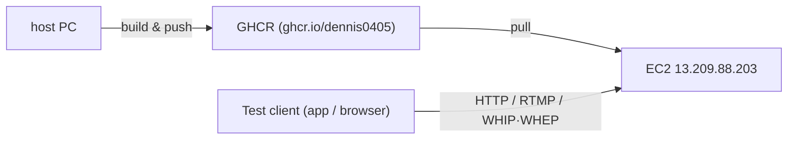

# EgoFlow Server Remote Test Guide

이 문서는 현재 운영 중인 AWS EC2 인스턴스를 대상으로 한 EgoFlow 서버 테스트 절차를 정리한 문서다. 
원격 서버에서 직접 이미지를 빌드하면 RAM이 부족해 서버가 죽기 때문에, **host PC에서 이미지 빌드 후 GHCR로 push → 서버에서 pull**하는 우회 경로를 사용한다.

## 1. 환경 개요

### 1.1 AWS EC2 인스턴스

- Region: `ap-northeast-2c` (Seoul)
- Public IPv4: `13.209.88.203`
- Open inbound ports
  - `22/tcp` — SSH
  - `80/tcp` — HTTP (Caddy proxy, dashboard / API / HLS / WHIP / WHEP)
  - `1935/tcp` — RTMP ingest
  - `1936/tcp` — RTMPS ingest
- OS: Ubuntu (Docker / Docker Compose plugin 설치 완료)
- 서버 리포지토리 위치: `/home/ubuntu/ego-flow-server`
- `config.json`, `.env`는 [`scripts/setup-server-config.sh`](../scripts/setup-server-config.sh)로 이미 생성되어 있음
- GitHub CLI(`gh`)로 GHCR private package에 접근할 수 있도록 이미 로그인되어 있음

> 참고: 현재 인스턴스 사양으로는 dashboard/backend 이미지 build가 메모리 부족으로 OOM되어 stack 전체가 죽는다. 따라서 서버에서는 절대로 `./scripts/run.sh up`을 직접 실행하지 않는다.

### 1.2 SSH 접속

host PC의 SSH key는 `~/.ssh/egoflow-server.pem`에 저장되어 있다.

```bash
ssh -i ~/.ssh/egoflow-server.pem ubuntu@13.209.88.203
```

key permission 문제가 발생하면 다음을 한 번 실행한다.

```bash
chmod 600 ~/.ssh/egoflow-server.pem
```

### 1.3 컴포넌트 분리

| 위치 | 역할 |
| --- | --- |
| host PC | 코드 빌드, Docker 이미지 빌드, GHCR push |
| GHCR (`ghcr.io/dennis0405`) | backend / dashboard image registry |
| EC2 인스턴스 | 이미지 pull, `docker compose` 기반 stack 운영, 트래픽 수신 |

## 2. 전체 테스트 플로우



1. host PC에서 최신 코드로 backend / dashboard 이미지 빌드 후 GHCR push.
2. EC2에 SSH 접속, 동일 태그(`latest`)로 이미지 pull + stack 기동.
3. 테스트 클라이언트(브라우저 dashboard, EgoFlow app, Python script)에서 `http://13.209.88.203` 또는 `rtmp://13.209.88.203:1935/live`로 접근.

## 3. Host PC — 이미지 빌드 & GHCR push

### 3.1 사전 확인

```bash
cd /home/dennis0405/ego-flow/ego-flow-server
docker --version
gh auth status
```

- Docker daemon이 살아 있어야 한다.
- `gh`는 GHCR에 push 가능한 권한(`write:packages`)을 가진 토큰으로 로그인되어 있어야 한다. `--login` flag가 내부적으로 `gh auth token | docker login ghcr.io`를 수행한다.

### 3.2 빌드 명령

표준 명령(현재 기준):

```bash
./scripts/build-registry-images.sh \
    --login \
    --tag latest \
    --no-latest \
    --public-origin http://13.209.88.203 \
    --vite-api-base-url /api/v1 \
    --vite-backend-origin http://13.209.88.203
```

flag 의미:

- `--login` — `gh auth token`으로 `ghcr.io`에 docker login.
- `--tag latest` — 이 빌드 산출물에 `:latest` 태그를 부여.
- `--no-latest` — 별도 latest alias를 추가로 push하지 않음 (이미 `--tag latest`라 중복 방지).
- `--public-origin http://13.209.88.203` — 서버의 외부 origin. 이미지 metadata 및 frontend 빌드의 default origin으로 사용.
- `--vite-api-base-url /api/v1` — dashboard 번들이 호출할 API base path. 같은 origin의 Caddy가 backend로 proxy.
- `--vite-backend-origin http://13.209.88.203` — dashboard SPA가 사용하는 backend origin. RTMP/WHEP URL 등 absolute URL 생성에 사용.

빌드/푸시되는 이미지:

```text
ghcr.io/dennis0405/ego-flow-server-backend:latest
ghcr.io/dennis0405/ego-flow-server-dashboard:latest
```

> worker는 별도 registry image를 사용하지 않는다. `compose.registry.yml`에서 backend image를 공유하고, service command만 `npm run worker:start`로 다르게 실행한다.

### 3.3 코드 변경 후 재배포

코드 변경 → 같은 명령을 다시 실행하면 된다. `latest` tag가 덮어쓰기되므로 서버 측 `IMAGE_TAG=latest`는 그대로 사용한다. 
단, `latest`만 사용하는 동안에는 디지스트 변경을 강제로 보장해야 서버가 새 이미지를 받는다 
— `./scripts/run-registry.sh up`이 항상 `docker pull`을 먼저 수행하므로 정상 흐름에서는 문제되지 않는다.

특정 버전을 핀하고 싶으면 `--tag main-YYYYMMDD` 등 별도 태그를 주고, 서버에서도 같은 `IMAGE_TAG`로 기동한다.

## 4. EC2 — Stack 기동

### 4.1 접속 및 위치

```bash
ssh -i ~/.ssh/egoflow-server.pem ubuntu@13.209.88.203
cd ~/ego-flow-server
```

### 4.2 최신 코드 동기화

`compose.yml`, `compose.registry.yml`, `Caddyfile`, `mediamtx.yml` 등 런타임 설정 파일이 바뀐 경우에는 서버에서도 pull이 필요하다.

```bash
git pull --ff-only
```

이미지만 새로 빌드한 경우(코드 변경이 backend/dashboard 안에만 있는 경우)에는 git pull 없이 4.3만 실행해도 된다.

### 4.3 GHCR pull + stack up

```bash
IMAGE_TAG=latest ./scripts/run-registry.sh up
```

`run-registry.sh up`이 수행하는 것:

1. `config.json` / `.env` 존재 확인 및 포트/`TARGET_DIRECTORY` 로드
2. `TARGET_DIRECTORY/{postgres,redis,raw,datasets}` 디렉터리 보장
3. `docker pull` — backend / worker / dashboard 이미지 GHCR에서 받기
4. `docker compose -f compose.yml -f compose.registry.yml pull` — postgres / redis / proxy / mediamtx base 이미지 갱신
5. `docker compose ... up -d --no-build --remove-orphans` (build 단계 없음 → OOM 우회)
6. postgres / redis / backend / dashboard / proxy healthy 대기, worker / mediamtx running 대기

`compose.registry.yml`이 `image:` 필드를 override해서 backend/worker/dashboard가 빌드 대신 GHCR 이미지를 사용하도록 강제한다. 따
라서 **서버에서는 절대 `./scripts/run.sh up`을 호출하지 않는다** — 그 경로는 build를 수행해 OOM을 유발한다.

### 4.4 GHCR private package 인증

이미지가 private이라면 EC2에서도 GHCR login이 필요하다. 인스턴스에는 이미 `gh`가 로그인되어 있으므로:

```bash
gh auth token | docker login ghcr.io -u dennis0405 --password-stdin
```

`docker pull`이 `denied`로 실패할 때만 다시 수행하면 된다.

## 5. 동작 확인

EC2 또는 host PC에서:

```bash
curl http://13.209.88.203/api/v1/health
curl -I http://13.209.88.203/api-docs
curl -I http://13.209.88.203/
```

- `/api/v1/health` — backend OK 응답
- `/api-docs` — Swagger UI (200)
- `/` — dashboard SPA (200)

브라우저 확인:

- Dashboard: `http://13.209.88.203`
- Swagger UI: `http://13.209.88.203/api-docs`

스트리밍 endpoint:

- RTMP ingest: `rtmp://13.209.88.203:1935/live`
- RTMPS ingest: `rtmps://13.209.88.203:1936/live`
- HLS playback: `http://13.209.88.203/hls/...`
- WHIP publish / WHEP play: `http://13.209.88.203/live/{repo}/{recordingSessionId}/whip|whep`

> WHIP/WHEP를 실제로 사용할 경우 ICE media용 UDP `8189`가 EC2 보안 그룹에 inbound로 열려 있어야 한다. 현재는 RTMP/RTMPS만 우선 검증 중이고, WHIP/WHEP 사용 시점에 보안 그룹과 `webrtcAdditionalHosts` 설정을 함께 점검한다. 자세한 내용은 [13. http_streaming.md](./13.%20http_streaming.md) §10 참고.

## 6. 로그 / 운영 명령 (EC2)

```bash
cd ~/ego-flow-server
./scripts/run-registry.sh ps
./scripts/run-registry.sh logs backend
./scripts/run-registry.sh logs mediamtx
./scripts/run-registry.sh logs proxy
./scripts/run-registry.sh down
```

전체 stack 한 번에 보고 싶을 때:

```bash
docker compose -f compose.yml -f compose.registry.yml logs -f backend mediamtx proxy dashboard
```

`compose.registry.yml`을 함께 넘기지 않으면 backend/dashboard service definition이 build 기반으로 해석되어 동작이 어긋날 수 있으니, 반드시 `run-registry.sh`(또는 동일한 `-f` 조합)를 사용한다.

## 7. 클라이언트 측 설정

### 7.1 EgoFlow App

- backend base URL: `http://13.209.88.203`
- API base path: `/api/v1`
- RTMP publish base: `rtmp://13.209.88.203:1935/live`
- HLS playback base: `http://13.209.88.203/hls`

로컬 실기기 테스트(`adb reverse`)와 달리, 원격 서버 테스트에서는 reverse port forwarding이 필요 없다. 디바이스가 외부망에서 직접 EC2 public IP로 붙으면 된다.

### 7.2 브라우저 dashboard

build 시점에 `VITE_BACKEND_ORIGIN=http://13.209.88.203`이 박혀 있으므로, 브라우저에서 `http://13.209.88.203`로 접속하면 그대로 동작한다. 동일 origin이라 CORS 이슈는 없다.

## 8. 트러블슈팅

| 증상 | 원인 / 해결 |
| --- | --- |
| `docker pull` `denied: denied` | EC2에서 GHCR 미인증 → `gh auth token | docker login ghcr.io -u dennis0405 --password-stdin` |
| `run.sh up` 호출 후 서버 응답 끊김 | build 트리거 → OOM. `docker ps`로 살아남은 컨테이너 정리 후 4.3 절차로 재기동 |
| dashboard에서 API 호출이 `localhost`로 감 | host PC에서 `--vite-backend-origin`을 EC2 origin으로 주고 다시 빌드/푸시 |
| RTMP publish 실패(`[rtmp-auth] denied`) | publish-ticket 만료 / repository 권한 / app이 조립한 RTMP URL의 host/path/ticket 확인 |
| HTTP 80은 열리는데 dashboard가 깨짐 | dashboard 이미지가 stale. host PC에서 재빌드/푸시 후 서버에서 `run-registry.sh up` 재실행 |
| backend가 healthy로 안 가고 hang | `./scripts/run-registry.sh logs backend`로 DB 마이그레이션/`.env` 누락 여부 확인 |

## 9. 빠른 체크리스트

**Host PC**

1. `cd ~/ego-flow/ego-flow-server`
2. 코드 최신화 (`git pull` 등)
3. `./scripts/build-registry-images.sh --login --tag latest --no-latest --public-origin http://13.209.88.203 --vite-api-base-url /api/v1 --vite-backend-origin http://13.209.88.203`

**EC2**

4. `ssh -i ~/.ssh/egoflow-server.pem ubuntu@13.209.88.203`
5. `cd ~/ego-flow-server && git pull --ff-only` (런타임 파일 변경 시)
6. `IMAGE_TAG=latest ./scripts/run-registry.sh up`
7. `curl http://13.209.88.203/api/v1/health`로 응답 확인

**클라이언트**

8. 브라우저: `http://13.209.88.203`
9. App: backend base URL `http://13.209.88.203`, RTMP `rtmp://13.209.88.203:1935/live`
