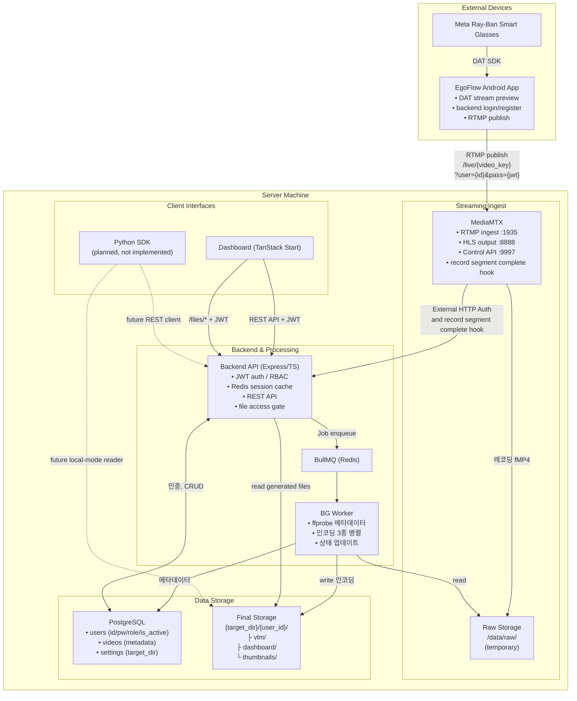
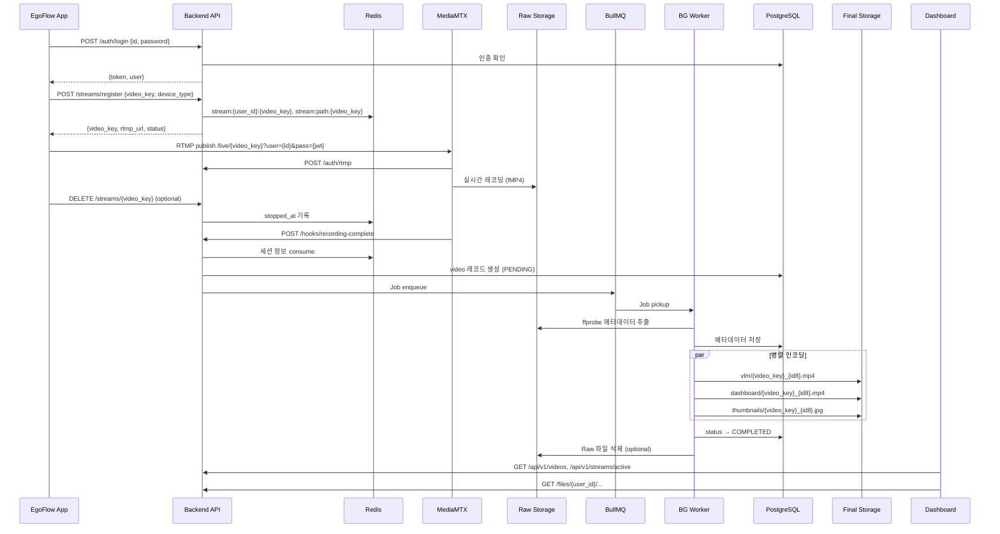

# EgoFlow — 구현 가이드

> RTMP 스트리밍 기반 1인칭 영상 데이터 수집·관리 파이프라인의 설계 참조 문서
>
> 구현 순서 및 태스크 분할은 `EgoFlow_TASK_ROADMAP.md`를 참조한다.

---

## 1. 기술 스택

| 영역 | 현재 구성 | 비고 |
|---|---|---|
| **App** | Android sample app (Kotlin) 중심 | `ego-flow-app` 레포. 현재 RTMP + EgoFlow backend session 등록 흐름은 Android sample이 기준이며 iOS RTMP 퍼블리시는 아직 미구현 |
| **Streaming Ingest** | MediaMTX | RTMP 수신, HLS 변환, record segment complete hook, Control API |
| **Backend** | Express 5 + TypeScript | 인증, 스트림 세션 관리, 영상/관리자 API, 파일 프록시 역할 |
| **ORM** | Prisma | PostgreSQL 스키마, 마이그레이션, seed |
| **Job Queue** | BullMQ + Redis | 후처리 enqueue, worker concurrency 제어 |
| **DB** | PostgreSQL | 사용자, 설정, 영상 메타데이터 저장 |
| **Cache / Session** | Redis | BullMQ backend + 스트림 세션 캐시 |
| **Dashboard** | TanStack Start + React 19 + TanStack Router + React Query | `frontend/` 패키지. 빌드 후 Node runtime wrapper로 제공 |
| **Styling / UI** | Tailwind CSS 4 + custom components | 대시보드 전용 UI |
| **요청 검증** | Zod | Backend request validation + TypeScript inference |

### 1.1 Backend 패키지

```
express, typescript, ts-node, nodemon
prisma, @prisma/client
jsonwebtoken, bcryptjs
bullmq, ioredis
fluent-ffmpeg, ffmpeg-static, ffprobe-static
cors, helmet, morgan, zod
```

### 1.2 Dashboard 패키지

```
@tanstack/react-start, @tanstack/react-router, @tanstack/react-query
react, react-dom, typescript, vite
tailwindcss, axios, hls.js, lucide-react, zod
```

---

## 2. 프로젝트 디렉토리 구조

```
ego-flow-server/
├── docker-compose.yml
├── mediamtx.yml
├── README.md
├── scripts/
│   ├── dev.sh
│   └── install-docker-ubuntu.sh
├── data/                                   # local bind mounts / volumes
│   ├── raw/
│   ├── datasets/
│   └── redis/
│
├── backend/
│   ├── package.json
│   ├── tsconfig.json
│   ├── Dockerfile
│   ├── prisma/
│   │   ├── schema.prisma
│   │   ├── seed.ts
│   │   ├── manual-indexes.sql
│   │   └── migrations/
│   └── src/
│       ├── index.ts                        # Express 엔트리포인트
│       ├── worker.ts                       # BullMQ Worker 엔트리포인트
│       ├── config/env.ts                   # 환경변수 (Zod 파싱)
│       ├── routes/
│       │   ├── auth.routes.ts              # 로그인, RTMP 인증
│       │   ├── streams.routes.ts           # 세션 등록, 활성 스트림 조회, 스트림 중지
│       │   ├── videos.routes.ts            # 영상 목록/상세/상태/삭제
│       │   ├── hooks.routes.ts             # MediaMTX webhook
│       │   ├── admin.routes.ts             # 사용자/설정 관리
│       │   └── users.routes.ts             # 내 비밀번호 변경
│       ├── middleware/
│       │   ├── auth.middleware.ts           # JWT 검증 + 갱신
│       │   ├── file-access.middleware.ts    # /files 접근 제어
│       │   ├── role.middleware.ts           # Admin/User 역할 체크
│       │   ├── validate.middleware.ts       # Zod 유효성 검증
│       │   └── error.middleware.ts          # 글로벌 에러 핸들러
│       ├── services/
│       │   ├── auth.service.ts
│       │   ├── stream.service.ts
│       │   ├── video.service.ts
│       │   ├── admin.service.ts
│       │   └── processing.service.ts       # Job enqueue
│       ├── workers/
│       │   ├── video-processing.worker.ts  # Job 핸들러
│       │   └── encoding.ts                 # ffmpeg 프리셋
│       ├── lib/
│       │   ├── prisma.ts                   # PrismaClient 싱글턴
│       │   ├── redis.ts                    # Redis 싱글턴
│       │   ├── jwt.ts                      # JWT sign/verify/shouldRefresh
│       │   ├── storage.ts                  # 파일 URL/상대경로 처리
│       │   ├── bullmq.ts                   # BullMQ 연결
│       │   └── ffprobe.ts                  # 메타데이터 추출
│       ├── schemas/                        # Zod 요청 스키마
│       │   ├── auth.schema.ts
│       │   ├── stream.schema.ts
│       │   ├── video.schema.ts
│       │   ├── admin.schema.ts
│       │   └── user.schema.ts
│       └── types/
│           ├── auth.ts
│           ├── express.d.ts
│           └── stream.ts
│
├── frontend/
│   ├── package.json
│   ├── vite.config.ts
│   ├── Dockerfile
│   ├── server.mjs                          # production runtime wrapper
│   └── src/
│       ├── router.tsx
│       ├── routeTree.gen.ts
│       ├── routes/                         # file-based routes
│       ├── api/                            # backend client adapters
│       ├── hooks/
│       ├── lib/
│       ├── components/
│       └── styles.css
│
├── guide/
│   ├── EgoFlow_API_SPEC.md
│   ├── EgoFlow_IMPLEMENTATION_GUIDE.md     # 이 문서
│   └── EgoFlow_TASK_ROADMAP.md
│
└── ../deploy/ec2/                          # parent repo 배포 자산
    ├── docker-compose.yml
    ├── mediamtx.yml
    ├── deploy.sh
    └── README.md
```

**설계 원칙:**
- backend API와 worker는 하나의 패키지에서 이미지/엔트리포인트만 분리한다
- frontend는 `frontend/` 패키지 하나로 개발/빌드/프로덕션 서빙을 모두 담당한다
- backend는 `routes → middleware → services → lib` 레이어 구조를 유지한다
- 모든 외부 입력은 Zod 스키마로 검증한다

---

## 3. 시스템 아키텍처



---

## 4. 전체 흐름



---

## 5. 인증/인가 구조

### 5.1 계정 체계

| 역할 | 설명 |
|---|---|
| **Admin** | 기본 시드 계정. Docker 부팅 시 `ADMIN_DEFAULT_PASSWORD` 환경변수로 초기 비밀번호를 설정한다. 전체 데이터 접근, 사용자 관리, `target_directory` 설정 권한을 가진다. |
| **일반 User** | Admin이 Dashboard에서 생성/관리한다. 본인 데이터와 본인 스트림에만 접근할 수 있다. |

- 계정은 `users` 테이블에 저장되며 `id`, `password_hash`, `role`, `is_active`를 가진다.
- `is_active = false`인 계정은 JWT가 있어도 신규 로그인과 인증된 API 접근이 거부된다.

### 5.2 JWT 정책

| 항목 | 설정 |
|---|---|
| 알고리즘 | HS256 |
| 유효 시간 | 24시간 |
| Payload | `{ userId, role }` |
| 기본 전달 | 일반 API는 `Authorization: Bearer <JWT>` |
| 파일 접근 전달 | `/files/*`는 `?token=<JWT>` 또는 `?access_token=<JWT>`도 허용 |
| 갱신 | 잔여 6시간 미만이거나 현재 사용자 role이 토큰 payload와 달라지면 응답 헤더 `X-Refreshed-Token`으로 자동 발급. 별도 갱신 API 없음 |

### 5.3 RTMP 인증

MediaMTX **External HTTP Auth**를 사용한다. App은 직접 RTMP URL을 조합하지 않고 Backend `POST /api/v1/streams/register`가 반환한 `rtmp_url`을 사용한다. 현재 반환 형식:

```text
rtmp://<host>:1935/live/{video_key}?user={user_id}&pass={jwt}
```

MediaMTX는 publish/read/playback 요청마다 Backend `/api/v1/auth/rtmp`로 검증을 요청한다.

```yaml
# mediamtx.yml
authMethod: http
authHTTPAddress: http://localhost:3000/api/v1/auth/rtmp
```

- Backend는 MediaMTX auth payload의 `password`, `token`, query string의 `pass`, `token` 중 하나에서 JWT를 읽는다.
- `user` 또는 query string의 `user`가 있으면 JWT의 `userId`와 일치해야 한다.
- 허용 action은 현재 `publish`, `read`, `playback`이다.

> ⚠️ FFmpeg 기반 RTMP 클라이언트는 password가 1024자를 초과하면 잘림. JWT payload 최소화 필요.

### 5.4 권한 분리

| 동작 | Admin | 일반 User |
|---|---|---|
| 본인 데이터 조회/재생/삭제 | ✅ | ✅ |
| 타 사용자 데이터 접근 | ✅ | ❌ |
| target_directory 설정 | ✅ | ❌ |
| 사용자 계정 관리 | ✅ | ❌ |
| RTMP 스트리밍 | ✅ | ✅ |
| 활성 스트림 조회 (`GET /streams/active`) | ✅ (전체) | ✅ (본인만) |
| 스트림 중지 (`DELETE /streams/:videoKey`) | ✅ (전체) | ✅ (본인만) |
| `/files/*` 접근 | ✅ (전체) | ✅ (본인 생성물만) |
| Python SDK 접근 모델 (planned) | ✅ (전체) | ✅ (본인만) |

### 5.5 스트림 시작 흐름

```
1. App → Backend: POST /auth/login → JWT 발급
2. App → Backend: POST /streams/register {video_key, device_type}
   → Backend가 Redis에 세션 캐싱
     - stream:{user_id}:{video_key}
     - stream:path:{video_key}
   → 세션 메타데이터: user_id, video_key, device_type, session_id, target_directory, registered_at
   → 응답으로 rtmp_url 반환
3. App → MediaMTX: RTMP publish to /live/{video_key}?user={user_id}&pass={jwt}
4. MediaMTX → Backend: POST /auth/rtmp → JWT 검증 + user 일치 + action 허용
5. Dashboard → Backend: GET /streams/active
   → Redis 세션 메타데이터 + MediaMTX Control API active paths 조합으로 live 세션 계산
6. App → Backend: DELETE /streams/{video_key} (선택적 explicit stop)
   → Redis 세션에 stopped_at만 기록, 세션 메타데이터는 hook 처리용으로 유지
7. MediaMTX: record segment complete hook → Backend /hooks/recording-complete
   → path, recording_path 전달 → Redis 세션 consume → videos PENDING 생성 → BullMQ enqueue
8. Worker: raw 메타데이터 추출 → VLM/dashboard/thumbnail 생성 → COMPLETED 또는 FAILED
9. Dashboard/API: 생성물은 /files/<target_dir-relative-path>로 노출, JWT 인증 + user_id 파일 권한 검사
```

---

## 6. DB 스키마 (Prisma)

`backend/prisma/schema.prisma`:

```prisma
generator client {
  provider = "prisma-client-js"
}

datasource db {
  provider = "postgresql"
  url      = env("DATABASE_URL")
}

enum UserRole {
  admin
  user
}

model User {
  id           String   @id @db.VarChar(64)
  passwordHash String   @map("password_hash") @db.VarChar(255)
  role         UserRole @default(user)
  isActive     Boolean  @default(true) @map("is_active")
  displayName  String?  @map("display_name") @db.VarChar(255)
  createdAt    DateTime @default(now()) @map("created_at")
  updatedAt    DateTime @updatedAt @map("updated_at")
  videos       Video[]
  @@map("users")
}

model Setting {
  key       String   @id @db.VarChar(255)
  value     String   @db.Text
  updatedAt DateTime @updatedAt @map("updated_at")
  @@map("settings")
}

enum VideoStatus {
  PENDING
  PROCESSING
  COMPLETED
  FAILED
}

model Video {
  id                    String      @id @default(uuid()) @db.Uuid
  videoKey              String      @map("video_key") @db.VarChar(64)
  userId                String      @map("user_id") @db.VarChar(64)
  user                  User        @relation(fields: [userId], references: [id])
  rawRecordingPath      String      @map("raw_recording_path") @db.VarChar(1024)
  streamPath            String?     @map("stream_path") @db.VarChar(255)
  deviceType            String?     @map("device_type") @db.VarChar(100)
  sessionId             String?     @map("session_id") @db.VarChar(255)
  streamedAt            DateTime    @default(now()) @map("streamed_at")

  durationSec           Float?      @map("duration_sec")
  resolutionWidth       Int?        @map("resolution_width")
  resolutionHeight      Int?        @map("resolution_height")
  fps                   Float?
  codec                 String?     @db.VarChar(50)
  recordedAt            DateTime?   @map("recorded_at")

  vlmVideoPath          String?     @map("vlm_video_path") @db.VarChar(1024)
  dashboardVideoPath    String?     @map("dashboard_video_path") @db.VarChar(1024)
  thumbnailPath         String?     @map("thumbnail_path") @db.VarChar(1024)

  clipSegments          Json?       @map("clip_segments")
  actionLabels          Json?       @map("action_labels")
  videoTextAlignment    Json?       @map("video_text_alignment")
  sceneSummary          String?     @map("scene_summary") @db.Text

  status                VideoStatus @default(PENDING)
  errorMessage          String?     @map("error_message") @db.Text
  processingStartedAt   DateTime?   @map("processing_started_at")
  processingCompletedAt DateTime?   @map("processing_completed_at")
  createdAt             DateTime    @default(now()) @map("created_at")
  updatedAt             DateTime    @updatedAt @map("updated_at")

  @@index([status])
  @@index([videoKey], map: "idx_videos_video_key")
  @@index([userId], map: "idx_videos_user_id")
  @@index([recordedAt], map: "idx_videos_recorded_at")
  @@index([sessionId], map: "idx_videos_session")
  @@map("videos")
}
```

JSONB GIN 인덱스는 `backend/prisma/manual-indexes.sql`로 관리:
```sql
CREATE INDEX idx_videos_clip_segments ON videos USING GIN (clip_segments);
CREATE INDEX idx_videos_action_labels ON videos USING GIN (action_labels);
```

---

## 7. 로컬 스토리지 구조 & 네이밍

### 7.1 디렉토리 레이아웃

```
/data/raw/                                   # MediaMTX raw recording root
└── live/{video_key}/
    └── {record_segment_timestamp}           # mediamtx.yml: /data/raw/%path/%Y-%m-%d_%H-%M-%S-%f

{target_directory}/                          # Admin 설정값, 기본값 /data/datasets
├── alice/                                   # user_id
│   ├── vlm/
│   │   ├── cooking_pasta_a1b2c3d4.mp4
│   │   └── cooking_pasta_e5f6g7h8.mp4
│   ├── dashboard/
│   │   └── cooking_pasta_a1b2c3d4.mp4
│   └── thumbnails/
│       └── cooking_pasta_a1b2c3d4.jpg
└── bob/
    └── ...
```

- Raw 파일은 MediaMTX가 `/data/raw` 아래에 기록하며 후처리 대상 입력으로 사용된다
- Generated 파일은 worker가 `{target_directory}/{user_id}/...` 아래에 생성한다
- DB에는 절대경로로 저장한다
- 외부 API는 generated 파일만 `/files/<target_dir-relative-path>` 형태로 노출한다

### 7.2 파일명 컨벤션

```
{video_key}_{video_id_short8}.{ext}

glob 패턴: cooking_pasta_*.mp4 → 해당 그룹 전체 매칭
```

### 7.3 인코딩 포맷

| 용도 | 코덱 | 비고 |
|---|---|---|
| **Raw** | MediaMTX fMP4 output | `/data/raw`, `DELETE_RAW_AFTER_PROCESSING=true`면 후처리 후 삭제 |
| **VLM 학습용** | H.264 Baseline + AAC | `libx264`, `yuv420p`, `+faststart` |
| **Dashboard** | H.264 Main + AAC | 브라우저 프로그레시브 재생, `libx264`, `yuv420p`, `+faststart` |
| **썸네일** | JPEG | `-vf scale=320:-1`, 중간 지점 1프레임 |

### 7.4 video_key 규칙

- 지정 주체: App (RTMP publish path)
- 서버 검증: `^[a-z0-9_]+$`, 최대 64자
- Redis 세션 key, MediaMTX live path, 생성 파일 prefix에 그대로 사용

---

## 8. API 명세

전체 API 명세(17개 엔드포인트, 요청/응답 스키마, Zod 검증, 에러 코드, 엣지 케이스)는 **`EgoFlow_API_SPEC.md`**를 참조한다.

---

## 9. Dashboard (TanStack Start)

현재 dashboard는 `frontend/` 패키지의 TanStack Start 앱이다.

| 기능 | 설명 |
|---|---|
| 라우팅 | TanStack Router file-based routes (`/login`, `/videos`, `/videos/:videoId`, `/live`, `/admin/*`, `/profile`) |
| 로그인 | id/password → JWT 저장 |
| 영상 목록 | 필터/정렬 기반 processed video 목록 |
| 상세 재생 | dashboard MP4, thumbnail, 처리 상태 polling |
| 라이브 모니터링 | `GET /streams/active` + HLS playback (`hls.js`) |
| Admin users | 사용자 생성, 비밀번호 초기화, 비활성화 |
| Admin settings | `target_directory` 조회/변경 |
| Profile | 현재 로그인 사용자 확인 및 로그아웃 |

- generated video/thumbnail은 backend `/files/*`를 통해 접근한다
- live HLS 재생 시에도 인증 토큰을 함께 전달한다
- production에서는 `frontend/server.mjs`가 정적 자산과 TanStack Start server bundle을 함께 서빙한다

---

## 10. Python SDK (Planned)

현재 메인 브랜치 기준으로 별도 Python SDK 패키지는 아직 구현되어 있지 않다. 현재 실제 제공 범위:

- REST API: backend가 제공하는 영상/상태/관리자 API
- 로컬 파일 구조: `{target_directory}/{user_id}/vlm|dashboard|thumbnails`

향후 SDK 추가 시 목표: 서버 모드(로그인 후 API 접근), Admin 모드(전체 데이터), 로컬 모드(디렉토리 직접 스캔), 학습 친화 인터페이스(frame extraction, PyTorch Dataset/DataLoader 호환)

---

## 11. 반정형 메타데이터 (Next Step)

초기 PoC에서는 DB 컬럼(JSONB)과 GIN 인덱스만 미리 준비한다. 실제 추출은 이후 확장.

| 필드 | 내용 |
|---|---|
| `clip_segments` | 시간 구간별 NL description + action label |
| `action_labels` | 행동 레이블 목록 |
| `video_text_alignment` | 영상-텍스트 정렬 |
| `scene_summary` | 전체 요약 |

추출 방식: **AI 자동**(Qwen2.5-VL-7B 등) / **수동 Annotation** / **하이브리드**. BG Worker에 플러그인 구조로 확장 가능하게 설계한다.

---

## 12. 구현 태스크 로드맵

별도 문서 참조: **`EgoFlow_TASK_ROADMAP.md`**

현재 `main` 기준 상태:

| Phase | 상태 | 내용 |
|---|---|---|
| 0 | ✅ 완료 | backend / worker / frontend 기본 구조 |
| 1 | ✅ 완료 | 로그인, JWT 검증/재발급, RTMP auth |
| 2 | ✅ 완료 | `/streams/register`, `/streams/active`, explicit stop |
| 3 | ✅ 완료 | BullMQ enqueue + worker 후처리 |
| 4 | ✅ 완료 | `/videos`, `/videos/:id`, `/videos/:id/status`, 삭제 |
| 5 | ✅ 완료 | admin users/settings API, 내 비밀번호 변경 |
| 6 | ✅ 완료 | dashboard login/videos/live/admin/profile |
| 7 | ✅ 완료 | local Docker stack + EC2 deployment workflow |

---

## 13. PoC 확정 사항

| 항목 | 확정 |
|---|---|
| MediaMTX 레코딩 단위 | `recordSegmentDuration: 1h` 기준 segment 파일. 짧은 세션은 사실상 1개 raw 파일 |
| RTMP 인증 방식 | Backend가 반환한 query-bearing `rtmp_url` 사용 |
| 스트림 세션 캐시 | Redis `stream:{user_id}:{video_key}` + `stream:path:{video_key}` |
| 활성 스트림 계산 | Redis 메타데이터 + MediaMTX Control API active paths 조합 |
| User 관리 | Admin이 생성/비밀번호 재설정/비활성화 |
| 토큰 블랙리스트 | 미구현. 만료 또는 role drift 시 재로그인/자동 재발급으로 대응 |
| VLM 인코딩 | H.264 Baseline + AAC |
| Dashboard 인코딩 | H.264 Main + AAC + faststart |
| 스토리지 관리 | 자동 정책 없음. raw 삭제는 env flag, generated 삭제는 API 수동 |
| Python SDK | 미구현 |

---

## 14. Next Step (PoC 이후)

- **스트리밍**: iOS RTMP 퍼블리시, reconnect/retry 정책 정교화
- **인증**: JWT payload 최소화 유지, 필요 시 blacklist/revoke 전략 추가
- **영상 처리**: worker 수평 확장, 재시도/관찰성 보강, raw 정리 정책 고도화
- **메타데이터**: AI 추출 파이프라인 및 annotation workflow 추가
- **Dashboard**: 라이브 vs processed UX 분리, profile 비밀번호 변경 UI 추가
- **운영**: reverse proxy + TLS + domain routing, mutable image tag 제거
- **Python SDK**: 실제 패키지 구현 및 배포

---

## 15. 추후 구현 방향

### 전송 방식 전환: 실시간 스트리밍 → 로컬 저장 후 업로드

현재 RTMP 스트리밍 방식은 A/V 싱크, 영상 품질, 불필요한 실시간성 등의 한계가 있다. 이상적 방향:

```
Glass 로컬 저장 → App 다운로드 → HTTP 업로드 → Server
```

현재 Meta DAT SDK에서 Glass 로컬 파일 접근 API가 없어 직접 구현 불가. 현실적 대안으로 Meta AI 앱의 Auto Import를 활용할 수 있으나, Glass→Phone 구간을 제어할 수 없는 한계가 있다. SDK 지원이 확대되면 전환을 검토한다.

### 서버 배포

로컬 Docker Compose 스택과 별도로, parent repo에는 GHCR + GitHub Actions + EC2 기반 배포 경로가 이미 추가되어 있다. 남은 과제:

- raw port 노출 대신 reverse proxy / TLS / domain 구성
- production env 관리 체계 정리
- MediaMTX image tag pinning
- 운영 규모에 맞는 instance sizing

---

*이 문서는 EgoFlow의 설계 참조 문서이며, 구현 순서는 `EgoFlow_TASK_ROADMAP.md`를 따른다.*