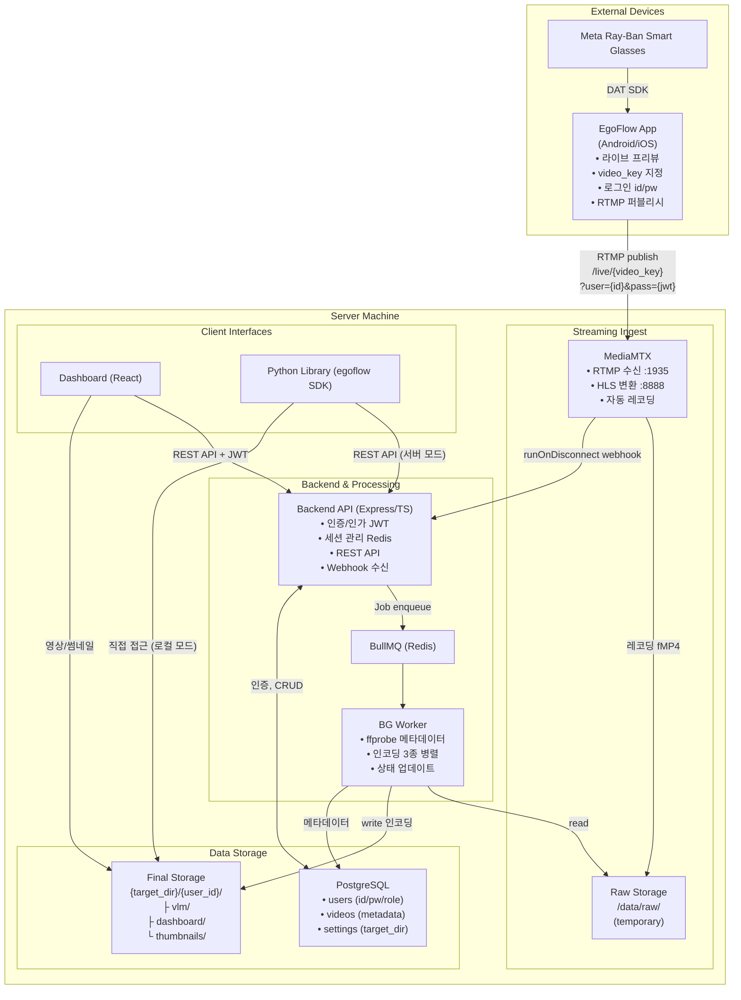
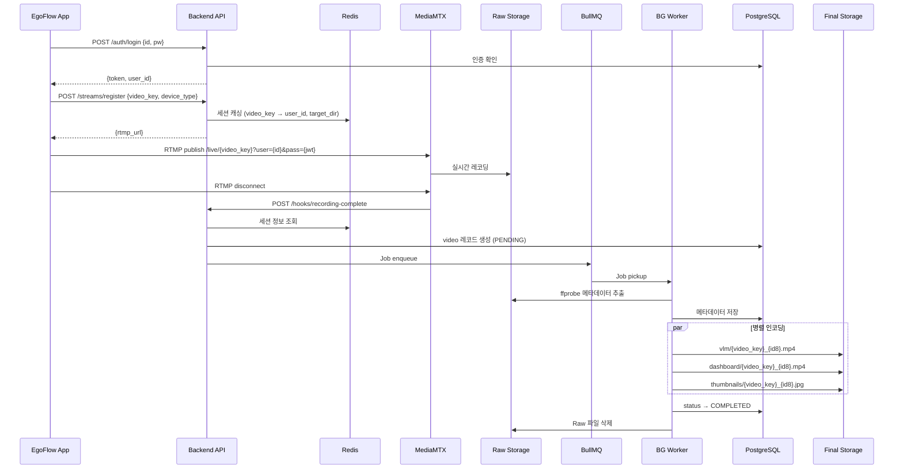

# EgoFlow — 구현 가이드

> RTMP 스트리밍 기반 1인칭 영상 데이터 수집·관리 파이프라인의 설계 참조 문서
>
> 구현 순서 및 태스크 분할은 `EgoFlow_TASK_ROADMAP.md`를 참조한다.

---

## 1. 기술 스택

| 영역 | 선정 | 비고 |
|---|---|---|
| **App** | Android (Kotlin) + iOS (Swift) | ego-flow-app 레포. Meta DAT SDK + RTMP 퍼블리시 |
| **Streaming Ingest** | MediaMTX | RTMP 수신, HLS 변환, 자동 레코딩 |
| **Backend** | Express + TypeScript | API 서버. 인증, 세션 관리, REST API |
| **ORM** | Prisma | 선언적 스키마, 자동 타입 생성, 마이그레이션 내장 |
| **Job Queue** | BullMQ (Redis) | 후처리 Worker. 병렬도 지정, 재시도 내장 |
| **DB** | PostgreSQL | JSONB으로 반정형 메타데이터 저장 |
| **Cache** | Redis | BullMQ 백엔드 + 스트림 세션 캐싱 |
| **Dashboard** | React + TypeScript + Vite | SPA, TailwindCSS |
| **요청 검증** | Zod | 런타임 스키마 검증 + TS 타입 추론 |

### 1.1 Backend 패키지

```
express, typescript, ts-node, @types/express
prisma, @prisma/client
jsonwebtoken, @types/jsonwebtoken, bcryptjs, @types/bcryptjs
bullmq, ioredis
fluent-ffmpeg, @types/fluent-ffmpeg, ffmpeg-static, ffprobe-static
uuid, @types/uuid, cors, helmet, morgan, dotenv, zod, chokidar
```

### 1.2 Dashboard 패키지

```
react, react-dom, typescript, vite
react-router-dom, @tanstack/react-query
tailwindcss, axios, hls.js
```

---

## 2. 프로젝트 디렉토리 구조

```
ego-flow-server/
├── docker-compose.yml
├── mediamtx.yml
├── .env.example
│
├── backend/
│   ├── package.json
│   ├── tsconfig.json
│   ├── Dockerfile
│   ├── prisma/
│   │   ├── schema.prisma
│   │   ├── seed.ts
│   │   └── migrations/
│   └── src/
│       ├── index.ts                        # Express 엔트리포인트
│       ├── worker.ts                       # BullMQ Worker 엔트리포인트
│       ├── config/env.ts                   # 환경변수 (Zod 파싱)
│       ├── routes/
│       │   ├── auth.routes.ts              # 로그인, RTMP 인증
│       │   ├── streams.routes.ts           # 세션 등록, 활성 스트림 조회
│       │   ├── videos.routes.ts            # 영상 목록/상태/삭제
│       │   ├── hooks.routes.ts             # MediaMTX webhook
│       │   └── admin.routes.ts             # 사용자/설정 관리
│       ├── middleware/
│       │   ├── auth.middleware.ts           # JWT 검증 + 갱신
│       │   ├── role.middleware.ts           # Admin/User 역할 체크
│       │   ├── validate.middleware.ts       # Zod 유효성 검증
│       │   └── error.middleware.ts          # 글로벌 에러 핸들러
│       ├── services/
│       │   ├── auth.service.ts
│       │   ├── stream.service.ts
│       │   ├── video.service.ts
│       │   ├── admin.service.ts
│       │   └── processing.service.ts       # Job enqueue
│       ├── workers/
│       │   ├── video-processing.worker.ts  # Job 핸들러
│       │   └── encoding.ts                 # ffmpeg 프리셋
│       ├── lib/
│       │   ├── prisma.ts                   # PrismaClient 싱글턴
│       │   ├── redis.ts                    # Redis 싱글턴
│       │   ├── jwt.ts                      # JWT sign/verify/shouldRefresh
│       │   └── ffprobe.ts                  # 메타데이터 추출
│       ├── schemas/                        # Zod 요청 스키마
│       │   ├── auth.schema.ts
│       │   ├── stream.schema.ts
│       │   ├── video.schema.ts
│       │   └── admin.schema.ts
│       └── types/index.ts
│
├── dashboard/
│   ├── package.json, tsconfig.json, vite.config.ts, Dockerfile
│   └── src/
│       ├── main.tsx, App.tsx
│       ├── api/client.ts                   # axios + JWT 인터셉터
│       ├── hooks/useAuth.ts
│       ├── pages/
│       │   ├── LoginPage.tsx
│       │   ├── VideosPage.tsx
│       │   ├── VideoDetailPage.tsx
│       │   ├── LivePage.tsx
│       │   └── admin/ (UsersPage, SettingsPage)
│       └── components/
│           ├── VideoCard.tsx, VideoPlayer.tsx
│           ├── HlsPlayer.tsx, Layout.tsx
│
├── data/                                   # Docker volume (gitignore)
│   ├── raw/                                # MediaMTX 레코딩 (temporary)
│   └── datasets/                           # Final Storage
│
└── docs/
    ├── EgoFlow_PROJECT_GUIDE.md
    ├── EgoFlow_IMPLEMENTATION_GUIDE.md     # 이 문서
    └── EgoFlow_TASK_ROADMAP.md
```

**설계 원칙:**
- Backend + Worker는 하나의 패키지, 실행 엔트리포인트만 분리 (`index.ts` vs `worker.ts`)
- `routes → middleware → services → lib` 레이어 구조
- Zod 스키마(`schemas/`)로 모든 API 요청 유효성 검증

---

## 3. 시스템 아키텍처



---

## 4. 전체 흐름



---

## 5. 인증/인가 구조

### 5.1 계정 체계

| 역할 | 설명 |
|---|---|
| **Admin** | 단일 계정. Docker 부팅 시 `ADMIN_DEFAULT_PASSWORD` 환경변수로 pw 설정. 모든 데이터 접근 + 설정 관리 |
| **일반 User** | Admin이 Dashboard에서 생성 (승인 방식). 본인 데이터 full access |

### 5.2 JWT 정책

| 항목 | 설정 |
|---|---|
| 알고리즘 | HS256 |
| 유효 시간 | 24시간 |
| Payload | `{ userId, role }` |
| 갱신 | 잔여 6시간 미만 시 응답 헤더 `X-Refreshed-Token`으로 자동 발급. 별도 갱신 API 없음 |

### 5.3 RTMP 인증

MediaMTX **External HTTP Auth**를 사용한다. App이 RTMP URL에 `?user={user_id}&pass={jwt}` 쿼리 파라미터로 인증 정보를 전달하면, MediaMTX가 Backend `/api/v1/auth/rtmp`로 검증을 요청한다.

```yaml
# mediamtx.yml
authMethod: http
authHTTPAddress: http://localhost:3000/api/v1/auth/rtmp
```

> ⚠️ FFmpeg 기반 RTMP 클라이언트는 password가 1024자를 초과하면 잘림. JWT payload 최소화 필요.

### 5.4 권한 분리

| 동작 | Admin | 일반 User |
|---|---|---|
| 본인 데이터 조회/재생/삭제 | ✅ | ✅ |
| 타 사용자 데이터 접근 | ✅ | ❌ |
| target_directory 설정 | ✅ | ❌ |
| 사용자 계정 관리 | ✅ | ❌ |
| RTMP 스트리밍 | ✅ | ✅ |
| Python Library 접근 | ✅ (전체) | ✅ (본인만) |

### 5.5 스트림 시작 흐름

```
1. App → Backend: POST /auth/login → JWT 발급
2. App → Backend: POST /streams/register {video_key, device_type}
   → Backend가 Redis에 세션 캐싱 (video_key → user_id, target_dir)
   → 응답으로 rtmp_url 반환
3. App → MediaMTX: RTMP publish (JWT 인증)
4. 스트리밍 지속...
5. MediaMTX: 스트림 종료 → runOnDisconnect webhook → Backend
   → Redis에서 세션 조회 → DB 생성 → BG Job enqueue
```

---

## 6. DB 스키마 (Prisma)

`backend/prisma/schema.prisma`:

```prisma
generator client {
  provider = "prisma-client-js"
}

datasource db {
  provider = "postgresql"
  url      = env("DATABASE_URL")
}

enum UserRole {
  admin
  user
}

model User {
  id            String   @id @db.VarChar(64)
  passwordHash  String   @map("password_hash") @db.VarChar(255)
  role          UserRole @default(user)
  displayName   String?  @map("display_name") @db.VarChar(255)
  createdAt     DateTime @default(now()) @map("created_at")
  updatedAt     DateTime @updatedAt @map("updated_at")
  videos        Video[]
  @@map("users")
}

model Setting {
  key       String   @id @db.VarChar(255)
  value     String   @db.Text
  updatedAt DateTime @updatedAt @map("updated_at")
  @@map("settings")
}

enum VideoStatus {
  PENDING
  PROCESSING
  COMPLETED
  FAILED
}

model Video {
  id                    String      @id @default(uuid()) @db.Uuid
  videoKey              String      @map("video_key") @db.VarChar(64)
  userId                String      @map("user_id") @db.VarChar(64)
  user                  User        @relation(fields: [userId], references: [id])
  rawRecordingPath      String      @map("raw_recording_path") @db.VarChar(1024)
  streamPath            String?     @map("stream_path") @db.VarChar(255)
  deviceType            String?     @map("device_type") @db.VarChar(100)
  sessionId             String?     @map("session_id") @db.VarChar(255)
  streamedAt            DateTime    @default(now()) @map("streamed_at")

  // Technical metadata (Phase 1)
  durationSec           Float?      @map("duration_sec")
  resolutionWidth       Int?        @map("resolution_width")
  resolutionHeight      Int?        @map("resolution_height")
  fps                   Float?
  codec                 String?     @db.VarChar(50)
  recordedAt            DateTime?   @map("recorded_at")

  // File paths
  vlmVideoPath          String?     @map("vlm_video_path") @db.VarChar(1024)
  dashboardVideoPath    String?     @map("dashboard_video_path") @db.VarChar(1024)
  thumbnailPath         String?     @map("thumbnail_path") @db.VarChar(1024)

  // Semantic metadata — Next Step (JSONB)
  clipSegments          Json?       @map("clip_segments")
  actionLabels          Json?       @map("action_labels")
  videoTextAlignment    Json?       @map("video_text_alignment")
  sceneSummary          String?     @map("scene_summary") @db.Text

  // Status
  status                VideoStatus @default(PENDING)
  errorMessage          String?     @map("error_message") @db.Text
  processingStartedAt   DateTime?   @map("processing_started_at")
  processingCompletedAt DateTime?   @map("processing_completed_at")
  createdAt             DateTime    @default(now()) @map("created_at")
  updatedAt             DateTime    @updatedAt @map("updated_at")

  @@index([status])
  @@index([videoKey], map: "idx_videos_video_key")
  @@index([userId], map: "idx_videos_user_id")
  @@index([recordedAt], map: "idx_videos_recorded_at")
  @@index([sessionId], map: "idx_videos_session")
  @@map("videos")
}
```

마이그레이션 후 JSONB GIN 인덱스 수동 추가:
```sql
CREATE INDEX idx_videos_clip_segments ON videos USING GIN (clip_segments);
CREATE INDEX idx_videos_action_labels ON videos USING GIN (action_labels);
```

---

## 7. 로컬 스토리지 구조 & 네이밍

### 7.1 디렉토리 레이아웃

```
/data/raw/                                   # MediaMTX 레코딩 (temporary)
└── live/{video_key}/{timestamp}.mp4

{target_directory}/                          # Admin이 설정 (예: /data/datasets)
├── alice/                                   # user_id
│   ├── vlm/
│   │   ├── cooking_pasta_a1b2c3d4.mp4
│   │   └── cooking_pasta_e5f6g7h8.mp4
│   ├── dashboard/
│   │   └── cooking_pasta_a1b2c3d4.mp4
│   └── thumbnails/
│       └── cooking_pasta_a1b2c3d4.jpg
└── bob/
    └── ...
```

### 7.2 파일명 컨벤션

```
{video_key}_{video_id_short8}.{ext}

전체 경로: {target_dir}/{user_id}/vlm/{video_key}_{video_id_short8}.mp4
glob 패턴: cooking_pasta_*.mp4 → 해당 그룹 전체 매칭
```

### 7.3 인코딩 포맷

| 용도 | 코덱 | 비고 |
|---|---|---|
| **Raw** | 원본 (fMP4) | temporary, 후처리 후 삭제 |
| **VLM 학습용** | H.264 Baseline/Main | torchvision, decord 호환 |
| **Dashboard** | H.264 + faststart | 브라우저 프로그레시브 재생 |
| **썸네일** | JPEG, 320px | 중간 프레임 추출 |

### 7.4 video_key 규칙

- 지정 주체: App (RTMP publish path)
- 허용 문자: `[a-z0-9_]`, 최대 64자

---

## 8. API 명세

전체 API 명세(17개 엔드포인트, 요청/응답 스키마, Zod 검증, 에러 코드, 엣지 케이스)는 **`EgoFlow_API_SPEC.md`**를 참조한다.

---

## 9. Dashboard (React)

Hugging Face Datasets Viewer 스타일 UX. 로그인한 사용자에 맞는 영상 데이터를 탐색·재생·관리.

| 기능 | 설명 |
|---|---|
| 로그인 | id/pw → JWT 저장 |
| 영상 브라우징 | video_key별 그루핑, 그리드/리스트, 썸네일 |
| 영상 재생 | Dashboard용 MP4 브라우저 재생 |
| 필터/정렬 | video_key, duration, 촬영 시점 |
| 라이브 모니터링 | HLS 실시간 재생 (hls.js) |
| 처리 상태 | PENDING/PROCESSING/COMPLETED/FAILED |
| 영상 삭제 | 본인 데이터 삭제 (Admin은 전체) |
| Admin 관리 | 사용자 CRUD, target_directory 설정 |

---

## 10. Python Library (egoflow SDK)

```python
from egoflow import EgoFlowClient

# 서버 모드
client = EgoFlowClient(server_url="http://server:3000", user_id="alice", password="pw")
dataset = client.load_dataset(video_key="cooking_pasta", min_duration=10)
for video in dataset:
    frames = video.load_frames(fps=1)  # numpy array

# Admin은 타 사용자 접근 가능
admin = EgoFlowClient(server_url="...", user_id="admin", password="...")
bob_data = admin.load_dataset(user_id="bob")

# 로컬 모드 (서버 불필요)
from egoflow import EgoFlowDataset
dataset = EgoFlowDataset.from_directory(path="/data/datasets/alice/vlm", video_key="cooking_pasta")
```

핵심 기능: 인증(id/pw), 사용자별 권한, 서버/로컬 이중 모드, 필터링, 프레임 추출(decord), PyTorch Dataset/DataLoader 호환

---

## 11. 반정형 메타데이터 (Next Step)

초기 PoC에서는 DB 컬럼(JSONB)과 GIN 인덱스만 미리 준비한다. 실제 추출은 이후 확장.

| 필드 | 내용 |
|---|---|
| `clip_segments` | 시간 구간별 NL description + action label |
| `action_labels` | 행동 레이블 목록 |
| `video_text_alignment` | 영상-텍스트 정렬 |
| `scene_summary` | 전체 요약 |

추출 방식: **AI 자동**(Qwen2.5-VL-7B 등) / **수동 Annotation** / **하이브리드**. BG Worker에 플러그인 구조(`MetadataExtractor` 인터페이스)로 확장 가능하게 설계한다.

---

## 12. 구현 태스크 로드맵

별도 문서 참조: **`EgoFlow_TASK_ROADMAP.md`**

| Phase | 내용 | 태스크 수 |
|---|---|---|
| 0 | 프로젝트 초기 세팅 | 4 |
| 1 | 인증/인가 | 5 |
| 2 | 스트리밍 세션 관리 | 3 |
| 3 | BG Worker | 3 |
| 4 | 영상 조회 API | 3 |
| 5 | Admin API | 2 |
| 6 | Dashboard | 7 |
| 7 | Docker 통합 배포 | 3 |

---

## 13. PoC 확정 사항

이전 미확정 항목 중 PoC 범위에서 확정된 내용:

| 항목 | 확정 |
|---|---|
| MediaMTX 레코딩 세그먼트 | **단일 파일** (세그먼트 분할 안 함). 학습용 clip 단위 영상이라 용량이 크지 않다는 전제 |
| User pw 변경 API | **PoC에 포함** |
| video_key 충돌 방지 | **user별 격리** — 같은 video_key 허용, 다른 user면 OK. 활성 스트림 충돌은 `user_id + video_key` 조합으로 판별 |
| 토큰 블랙리스트 | **PoC에서는 미구현**. 토큰 만료(24시간) 시 재로그인 |
| VLM 인코딩 파라미터 | **원본 해상도 유지 + H.264 Baseline** |
| 스토리지 용량 관리 | **수동 관리**. Admin이 Dashboard에서 직접 삭제 |

---

## 14. Next Step (PoC 이후)

**스트리밍**: iOS RTMP 퍼블리시 / 네트워크 끊김 재연결 / LAN 외부 접근 (서버 배포로 해결)

**인증**: JWT payload 최소화 (RTMP 1024자 제한, 실제 문제 발생 시 대응) / 토큰 블랙리스트

**영상 처리**: Worker 수평 확장 / 자동 스토리지 정리 정책

**메타데이터**: AI 자동 추출 (Qwen2.5-VL 등) / 수동 Annotation UI / 하이브리드 워크플로우

**Dashboard**: 라이브 vs 레코딩 UX 분리 / Admin UI 상세 / 메타데이터 시각화

**Python Library**: PyPI 배포 / PyTorch DataLoader / 로컬 모드 메타데이터 접근 / CLI 도구

---

## 15. 추후 구현 방향

### 전송 방식 전환: 실시간 스트리밍 → 로컬 저장 후 업로드

현재 RTMP 스트리밍 방식은 A/V 싱크, 영상 품질, 불필요한 실시간성 등의 한계가 있다. 이상적 방향:

```
Glass 로컬 저장 → App 다운로드 → HTTP 업로드 → Server
```

현재 Meta DAT SDK에서 Glass 로컬 파일 접근 API가 없어 직접 구현 불가. 현실적 대안으로 Meta AI 앱의 Auto Import를 활용할 수 있으나, Glass→Phone 구간을 제어할 수 없는 한계가 있다. SDK 지원이 확대되면 전환을 검토한다.

### 서버 배포

현재 로컬 서버 + ngrok 구조에서, 클라우드/온프레미스 배포로 전환하여 고정 URL을 확보한다.

---

*이 문서는 EgoFlow의 설계 참조 문서이며, 구현 순서는 `EgoFlow_TASK_ROADMAP.md`를 따른다.*
