# EgoFlow — 구현 태스크 로드맵

> AI 에이전트(Claude Code, Codex CLI)가 순차적으로 실행할 수 있는 구현 단위 분할
>
> 각 태스크는 독립적으로 완료·검증 가능하며, 의존하는 선행 태스크를 명시한다.
>
> 상세 설계는 `EgoFlow_IMPLEMENTATION_GUIDE.md`를 참조한다.

---

## Phase 0: 프로젝트 초기 세팅

### Task 0-1: Backend 프로젝트 초기화

**선행:** 없음

**작업:**
- `backend/` 디렉토리 생성
- `npm init`, TypeScript 설정 (`tsconfig.json`)
- Express + 기본 패키지 설치
- `src/index.ts` — Express 앱 기본 세팅 (cors, helmet, morgan, json parser)
- 헬스체크 엔드포인트: `GET /api/v1/health` → `{ status: "ok" }`
- `nodemon` 개발 스크립트 설정

**생성 파일:**
```
backend/
├── package.json
├── tsconfig.json
├── src/
│   ├── index.ts
│   └── config/
│       └── env.ts
```

**완료 조건:** `npm run dev`로 서버 기동 → `GET /api/v1/health` → 200 응답

---

### Task 0-2: Prisma 설정 + DB 마이그레이션

**선행:** Task 0-1

**작업:**
- Prisma 설치, `prisma init`
- `prisma/schema.prisma` 작성 (구현 가이드 섹션 7의 스키마 그대로)
- `prisma/seed.ts` 작성 (Admin 계정 + 기본 settings)
- `prisma migrate dev` 실행하여 마이그레이션 생성
- `src/lib/prisma.ts` — PrismaClient 싱글턴 모듈
- JSONB GIN 인덱스 수동 추가 SQL

**생성 파일:**
```
backend/prisma/
├── schema.prisma
├── seed.ts
└── migrations/          # 자동 생성
backend/src/lib/
└── prisma.ts
```

**완료 조건:** `npx prisma migrate dev` 성공 + `npx prisma db seed` 후 admin 계정이 DB에 존재

---

### Task 0-3: Redis 연결 + 환경변수 구조

**선행:** Task 0-1

**작업:**
- `ioredis` 설치
- `src/lib/redis.ts` — Redis 연결 싱글턴
- `src/config/env.ts` — 모든 환경변수를 Zod로 파싱하여 타입 안전하게 관리
- `.env.example` 작성 (DATABASE_URL, REDIS_URL, JWT_SECRET, ADMIN_DEFAULT_PASSWORD 등)

**생성 파일:**
```
backend/src/lib/redis.ts
backend/src/config/env.ts
.env.example
```

**완료 조건:** 서버 기동 시 Redis 연결 성공 로그 출력

---

### Task 0-4: Docker Compose 기본 구성

**선행:** Task 0-2, 0-3

**작업:**
- `docker-compose.yml` 작성 (PostgreSQL, Redis, MediaMTX)
- `mediamtx.yml` 작성 (RTMP ingest + 자동 레코딩 + runOnDisconnect webhook)
- Backend는 아직 Docker화하지 않음 (로컬 개발 모드)
- `data/raw/`, `data/datasets/` 디렉토리 볼륨 마운트

**생성 파일:**
```
docker-compose.yml
mediamtx.yml
```

**완료 조건:** `docker compose up -d` → PostgreSQL, Redis, MediaMTX 모두 정상 기동. ffmpeg로 RTMP 테스트 스트림 전송 → `data/raw/` 디렉토리에 레코딩 파일 생성 확인

---

## Phase 1: 인증/인가

### Task 1-1: JWT 유틸 + 비밀번호 해싱 유틸

**선행:** Task 0-2

**작업:**
- `src/lib/jwt.ts` — sign, verify, shouldRefresh (잔여 6시간 미만 판단) 함수
- bcryptjs를 활용한 비밀번호 해싱/검증 (auth.service 내에서 사용)
- JWT payload 타입 정의: `{ userId: string, role: 'admin' | 'user' }`

**생성 파일:**
```
backend/src/lib/jwt.ts
```

**완료 조건:** 단위 테스트 또는 수동 테스트로 JWT 생성 → 검증 → 갱신 판단 로직 동작 확인

---

### Task 1-2: 인증 미들웨어

**선행:** Task 1-1

**작업:**
- `src/middleware/auth.middleware.ts` — Bearer 토큰 검증, `req.user`에 userId/role 주입, 잔여 6시간 미만 시 응답 헤더 `X-Refreshed-Token` 추가
- `src/middleware/role.middleware.ts` — `requireRole('admin')` 미들웨어
- `src/middleware/error.middleware.ts` — 글로벌 에러 핸들러 (Zod 에러, 인증 에러 등)

**생성 파일:**
```
backend/src/middleware/
├── auth.middleware.ts
├── role.middleware.ts
└── error.middleware.ts
```

**완료 조건:** 인증 없는 요청 → 401, 잘못된 토큰 → 401, 유효한 토큰 → `req.user` 주입됨

---

### Task 1-3: 로그인 API

**선행:** Task 1-2

**작업:**
- `src/schemas/auth.schema.ts` — Zod: `{ id: string, password: string }`
- `src/middleware/validate.middleware.ts` — Zod 스키마 기반 범용 유효성 검증 미들웨어
- `src/services/auth.service.ts` — 로그인 로직 (DB 조회, 비밀번호 검증, JWT 발급)
- `src/routes/auth.routes.ts` — `POST /api/v1/auth/login`

**생성 파일:**
```
backend/src/schemas/auth.schema.ts
backend/src/middleware/validate.middleware.ts
backend/src/services/auth.service.ts
backend/src/routes/auth.routes.ts
```

**완료 조건:** admin/changeme123으로 로그인 → JWT 반환. 잘못된 비밀번호 → 401

---

### Task 1-4: RTMP 인증 엔드포인트

**선행:** Task 1-3

**작업:**
- `POST /api/v1/auth/rtmp` — MediaMTX External HTTP Auth용 엔드포인트
- MediaMTX가 보내는 `{ user, password, action, path, protocol }` 수신
- password에서 JWT 검증, user에서 user_id 확인
- action이 "publish"이면 스트리밍 허용/거부 판단
- `mediamtx.yml`에 `authMethod: http`, `authHTTPAddress` 설정 추가

**완료 조건:** MediaMTX에 인증된 RTMP 스트림 → 성공. 인증 없는 스트림 → 거부

---

### Task 1-5: User 비밀번호 변경 API

**선행:** Task 1-3

**작업:**
- `PUT /api/v1/users/me/password` — 본인 비밀번호 변경
- currentPassword 검증 후 newPassword로 업데이트
- API Spec 섹션 6.1 참조

**완료 조건:** 기존 비밀번호 입력 → 변경 성공. 기존 비밀번호 불일치 → 401

---

## Phase 2: 스트리밍 세션 관리

### Task 2-1: 스트림 세션 등록 API

**선행:** Task 1-3, Task 0-3

**작업:**
- `src/schemas/stream.schema.ts` — Zod: `{ video_key: string, device_type?: string }`
- `src/services/stream.service.ts` — Redis에 세션 캐싱 (`stream:{userId}:{video_key}` → `{ userId, targetDir, ... }`)
- `src/routes/streams.routes.ts` — `POST /api/v1/streams/register` (인증 필수)
- video_key는 user별 격리: 같은 video_key라도 다른 user면 충돌 아님
- target_directory는 DB settings에서 조회

**생성 파일:**
```
backend/src/schemas/stream.schema.ts
backend/src/services/stream.service.ts
backend/src/routes/streams.routes.ts
```

**완료 조건:** 인증된 사용자가 세션 등록 → Redis에 세션 정보 저장 → rtmp_url 반환

---

### Task 2-2: 활성 스트림 조회 API

**선행:** Task 2-1

**작업:**
- `GET /api/v1/streams/active` — Redis에서 활성 세션 목록 조회
- 각 세션에 HLS URL 포함하여 반환
- 일반 User는 본인 세션만, Admin은 전체 세션 조회

**완료 조건:** 활성 스트림이 있을 때 HLS URL 포함 목록 반환

---

### Task 2-3: MediaMTX Webhook 수신 + Job Enqueue

**선행:** Task 2-1, Task 0-4

**작업:**
- `src/routes/hooks.routes.ts` — `POST /api/v1/hooks/recording-complete`
- 수신 시: RTMP path에서 video_key 파싱 → Redis에서 세션 정보 조회 → DB에 video 레코드 생성 (PENDING) → BullMQ Job enqueue
- `src/services/processing.service.ts` — BullMQ 큐에 Job 추가 로직
- Job data: `{ videoId, videoKey, userId, rawRecordingPath, targetDirectory }`

**생성 파일:**
```
backend/src/routes/hooks.routes.ts
backend/src/services/processing.service.ts
```

**완료 조건:** MediaMTX에서 스트림 종료 → webhook 수신 → DB에 PENDING 레코드 생성 → BullMQ에 Job 존재 확인

---

## Phase 3: BG Worker (영상 후처리)

### Task 3-1: Worker 기본 구조 + 메타데이터 추출

**선행:** Task 2-3

**작업:**
- `src/worker.ts` — BullMQ Worker 엔트리포인트, concurrency 환경변수 지정
- `src/lib/ffprobe.ts` — fluent-ffmpeg로 메타데이터 추출 (duration, width, height, fps, codec)
- `src/workers/video-processing.worker.ts` — Job 핸들러 Phase 1: ffprobe → DB 업데이트 (PROCESSING → 메타데이터 저장)

**생성 파일:**
```
backend/src/worker.ts
backend/src/lib/ffprobe.ts
backend/src/workers/video-processing.worker.ts
```

**완료 조건:** Worker 프로세스 실행 → Job pickup → Raw 파일에서 메타데이터 추출 → DB에 duration/fps 등 저장됨

---

### Task 3-2: 인코딩 + 파일 저장

**선행:** Task 3-1

**작업:**
- `src/workers/encoding.ts` — ffmpeg 인코딩 프리셋 정의
  - `vlm`: H.264 Baseline/Main, 원본 해상도
  - `dashboard`: H.264 + faststart moov atom
  - `thumbnail`: JPEG, 중간 프레임, 320px 리사이즈
- Worker에 Phase 2 추가: 3종 병렬 인코딩 (Promise.all) → `{targetDir}/{userId}/vlm|dashboard|thumbnails/` 저장
- 파일명: `{videoKey}_{videoIdShort8}.{ext}`
- DB에 경로 업데이트 + status → COMPLETED
- Raw 파일 삭제 (환경변수로 제어)

**생성 파일:**
```
backend/src/workers/encoding.ts
```

**완료 조건:** Job 완료 → Final Storage에 vlm/dashboard/thumbnails 3종 파일 존재 + DB status=COMPLETED + Raw 파일 삭제됨

---

### Task 3-3: Worker 에러 처리 + 재시도

**선행:** Task 3-2

**작업:**
- Job 실패 시 DB status → FAILED, error_message 저장
- BullMQ 재시도 설정 (attempts: 3, backoff: exponential)
- 진행률 보고 (`job.updateProgress`)

**완료 조건:** ffmpeg 실패 시뮬레이션 → FAILED 상태 → 자동 재시도 → 최종 실패 시 error_message 저장됨

---

## Phase 4: 영상 조회 API

### Task 4-1: 영상 목록 조회

**선행:** Task 3-2

**작업:**
- `src/schemas/video.schema.ts` — 쿼리 파라미터 Zod 스키마 (video_key, status, page, limit, user_id)
- `src/services/video.service.ts` — Prisma 쿼리 (필터링, 페이지네이션, 정렬)
- `src/routes/videos.routes.ts` — `GET /api/v1/videos`
- 일반 User: 자동으로 본인 user_id 필터 적용
- Admin: 전체 조회 또는 user_id 파라미터로 특정 사용자 필터

**생성 파일:**
```
backend/src/schemas/video.schema.ts
backend/src/services/video.service.ts
backend/src/routes/videos.routes.ts
```

**완료 조건:** 인증된 사용자가 영상 목록 조회 → 본인 데이터만 반환됨. Admin은 전체 반환

---

### Task 4-2: 영상 상태 조회 + 정적 파일 서빙

**선행:** Task 4-1

**작업:**
- `GET /api/v1/videos/:videoId/status` — 처리 상태 + 진행률 조회
- 정적 파일 서빙: `express.static`으로 `{targetDir}/` 하위 파일 서빙 (인증 미들웨어 적용, 사용자별 접근 제어)
- Dashboard용 영상 URL, 썸네일 URL이 실제로 접근 가능하도록

**완료 조건:** 영상 상태 API 동작 + 썸네일/Dashboard 영상 파일 HTTP 접근 가능 (본인 데이터만)

---

### Task 4-3: 영상 삭제 API

**선행:** Task 4-1

**작업:**
- `DELETE /api/v1/videos/:videoId` — 영상 삭제
- 일반 User: 본인 영상만 삭제 가능
- Admin: 모든 영상 삭제 가능
- DB 레코드 삭제 + Final Storage에서 vlm/dashboard/thumbnails 파일 삭제

**완료 조건:** 삭제 요청 → DB 레코드 삭제 + 파일 삭제 확인. 타인 영상 삭제 시도 → 403

---

## Phase 5: Admin API

### Task 5-1: 사용자 관리 API

**선행:** Task 1-3

**작업:**
- `src/schemas/admin.schema.ts` — Zod 스키마
- `src/services/admin.service.ts` — 사용자 CRUD
- `src/routes/admin.routes.ts`:
  - `POST /api/v1/admin/users` — 사용자 생성 (Admin Only)
  - `GET /api/v1/admin/users` — 사용자 목록
  - `DELETE /api/v1/admin/users/:userId` — 사용자 비활성화
  - `PUT /api/v1/admin/users/:userId/reset-password` — 비밀번호 초기화

**생성 파일:**
```
backend/src/schemas/admin.schema.ts
backend/src/services/admin.service.ts
backend/src/routes/admin.routes.ts
```

**완료 조건:** Admin이 사용자 생성 → 해당 사용자로 로그인 가능. 일반 User가 Admin API 호출 → 403

---

### Task 5-2: 설정 관리 API

**선행:** Task 5-1

**작업:**
- `PUT /api/v1/admin/settings/target-directory` — target_directory 변경
- `GET /api/v1/admin/settings` — 현재 설정 조회

**완료 조건:** target_directory 변경 → 이후 새 스트리밍 세션에서 변경된 경로 사용됨

---

## Phase 6: Dashboard

### Task 6-1: Dashboard 프로젝트 초기화

**선행:** Phase 4 완료

**작업:**
- `dashboard/` 디렉토리 생성
- Vite + React + TypeScript 세팅
- TailwindCSS 설정
- `src/api/client.ts` — axios 인스턴스 + JWT 인터셉터 (요청 시 토큰 첨부, 응답 X-Refreshed-Token 처리)
- `src/hooks/useAuth.ts` — 로그인 상태 관리

**생성 파일:**
```
dashboard/
├── package.json
├── tsconfig.json
├── vite.config.ts
├── tailwind.config.js
├── index.html
└── src/
    ├── main.tsx
    ├── App.tsx
    ├── api/client.ts
    └── hooks/useAuth.ts
```

**완료 조건:** `npm run dev` → 빈 React 앱 기동

---

### Task 6-2: 로그인 페이지

**선행:** Task 6-1

**작업:**
- `src/pages/LoginPage.tsx` — id/pw 입력 → 로그인 API 호출 → JWT 저장 → 메인 페이지 리다이렉트
- 라우팅 설정 (react-router-dom)

**완료 조건:** 로그인 성공 → 메인 페이지 이동. 실패 → 에러 메시지 표시

---

### Task 6-3: 영상 목록 페이지

**선행:** Task 6-2

**작업:**
- `src/pages/VideosPage.tsx` — 영상 목록 그리드 뷰 (썸네일 + video_key + duration + 상태)
- `src/components/VideoCard.tsx` — 개별 영상 카드
- @tanstack/react-query로 API 데이터 패칭
- video_key 필터, 정렬 UI

**완료 조건:** 로그인 후 본인 영상 목록이 썸네일과 함께 표시됨

---

### Task 6-4: 영상 상세 + 재생 페이지

**선행:** Task 6-3

**작업:**
- `src/pages/VideoDetailPage.tsx` — 영상 재생 (HTML5 video) + 메타데이터 표시
- `src/components/VideoPlayer.tsx` — Dashboard용 MP4 재생 컴포넌트
- 처리 상태 표시 (PENDING/PROCESSING/COMPLETED/FAILED)

**완료 조건:** 영상 클릭 → 상세 페이지에서 재생 가능 + 메타데이터(duration, fps 등) 표시

---

### Task 6-5: 라이브 스트림 모니터링 페이지

**선행:** Task 6-3

**작업:**
- `src/pages/LivePage.tsx` — 활성 스트림 목록 + HLS 재생
- `src/components/HlsPlayer.tsx` — hls.js 기반 라이브 플레이어

**완료 조건:** 활성 스트림이 있을 때 브라우저에서 실시간 영상 확인 가능

---

### Task 6-6: Admin 페이지 (사용자 관리 + 설정)

**선행:** Task 6-3, Phase 5

**작업:**
- `src/pages/admin/UsersPage.tsx` — 사용자 목록, 생성, 비밀번호 초기화
- `src/pages/admin/SettingsPage.tsx` — target_directory 설정
- Admin이 아닌 사용자는 Admin 메뉴 숨김

**완료 조건:** Admin 로그인 → 사용자 생성 → 설정 변경 가능. 일반 User → Admin 메뉴 미표시

---

### Task 6-7: 영상 삭제 기능

**선행:** Task 6-4, Task 4-3

**작업:**
- VideoDetailPage에 삭제 버튼 추가
- 삭제 확인 모달
- Admin: 모든 영상 삭제 가능
- 일반 User: 본인 영상만 삭제 가능

**완료 조건:** 영상 삭제 → 목록에서 사라짐 + 서버 파일 삭제됨

---

## Phase 7: Docker 통합 배포

### Task 7-1: Backend + Worker Dockerfile

**선행:** Phase 5 완료

**작업:**
- `backend/Dockerfile` — 멀티스테이지 빌드 (build → production)
- docker-compose.yml에 backend, worker 서비스 추가
- Worker는 같은 이미지, 다른 command (`node dist/worker.js`)

**완료 조건:** `docker compose up -d` → 전체 서비스 기동 (MediaMTX + PostgreSQL + Redis + Backend + Worker)

---

### Task 7-2: Dashboard Dockerfile

**선행:** Phase 6 완료

**작업:**
- `dashboard/Dockerfile` — Vite 빌드 → nginx 서빙
- docker-compose.yml에 dashboard 서비스 추가

**완료 조건:** `docker compose up -d` → Dashboard가 `http://localhost:8088`에서 접근 가능

---

### Task 7-3: End-to-End 통합 테스트

**선행:** Task 7-1, 7-2

**작업:**
- ffmpeg로 RTMP 테스트 스트림 전송 → 레코딩 → 후처리 → Dashboard에서 확인
- 전체 흐름 검증: 로그인 → 세션 등록 → RTMP 스트리밍 → 스트림 종료 → 후처리 완료 → Dashboard에서 영상 재생

**완료 조건:** 전체 파이프라인이 Docker Compose 한 스택으로 동작

---

## Phase 요약

```mermaid
gantt
    title EgoFlow 구현 로드맵
    dateFormat X
    axisFormat %s

    section Phase 0: 초기 세팅
    Backend 초기화           :t01, 0, 1
    Prisma + DB              :t02, after t01, 1
    Redis 연결               :t03, after t01, 1
    Docker Compose           :t04, after t02, 1

    section Phase 1: 인증
    JWT 유틸                 :t11, after t02, 1
    인증 미들웨어             :t12, after t11, 1
    로그인 API               :t13, after t12, 1
    RTMP 인증                :t14, after t13, 1
    User pw 변경             :t15, after t13, 1

    section Phase 2: 스트리밍
    세션 등록 API             :t21, after t13, 1
    활성 스트림 조회           :t22, after t21, 1
    Webhook + Job Enqueue    :t23, after t21, 1

    section Phase 3: Worker
    Worker + 메타데이터       :t31, after t23, 1
    인코딩 + 저장             :t32, after t31, 1
    에러 처리 + 재시도        :t33, after t32, 1

    section Phase 4: 영상 API
    영상 목록 조회             :t41, after t32, 1
    상태 조회 + 파일 서빙      :t42, after t41, 1
    영상 삭제                 :t43, after t41, 1

    section Phase 5: Admin
    사용자 관리               :t51, after t13, 1
    설정 관리                 :t52, after t51, 1

    section Phase 6: Dashboard
    프로젝트 초기화            :t61, after t41, 1
    로그인 페이지              :t62, after t61, 1
    영상 목록                  :t63, after t62, 1
    영상 상세 + 재생           :t64, after t63, 1
    라이브 모니터링            :t65, after t63, 1
    Admin 페이지              :t66, after t63, 1
    영상 삭제 기능             :t67, after t64, 1

    section Phase 7: 배포
    Backend Dockerfile        :t71, after t52, 1
    Dashboard Dockerfile      :t72, after t67, 1
    E2E 통합 테스트           :t73, after t72, 1
```



---

## 에이전트 사용 가이드

각 태스크를 에이전트에 제시할 때는 다음 형식을 권장한다:

```
다음 태스크를 구현해줘.

## 참조 문서
- 전체 설계: EgoFlow_IMPLEMENTATION_GUIDE.md
- 현재 태스크: Task {번호}

## 태스크 내용
{태스크 설명 복사}

## 선행 태스크에서 이미 구현된 것
{이전 태스크에서 만든 파일/구조 설명}

## 완료 조건
{완료 조건 복사}
```

이렇게 하면 에이전트가 문맥을 정확히 파악하고, 선행 코드와 일관된 구현을 생성할 수 있다.

---

*이 로드맵은 EgoFlow 구현 가이드와 함께 사용되며, 태스크 진행에 따라 업데이트된다.*
